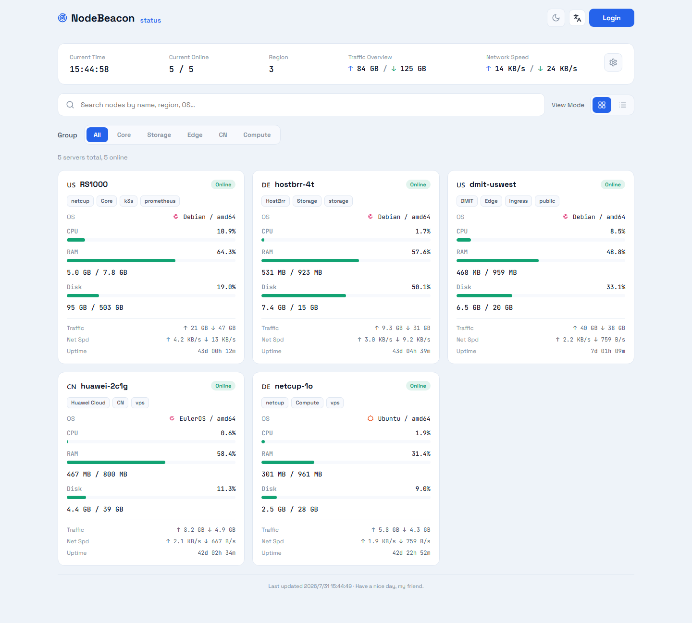
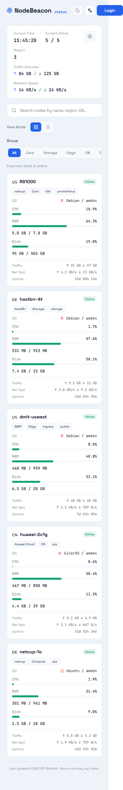
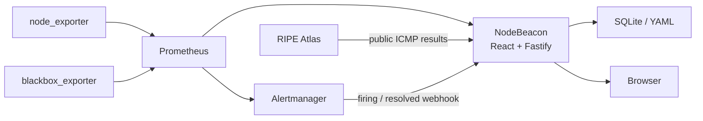

# NodeBeacon

**English** | [简体中文](README.md)

[](https://github.com/xljya/NodeBeacon/actions/workflows/ci.yml)


NodeBeacon is a lightweight, self-hosted monitoring and operations platform for
personal servers, homelabs, and small infrastructure fleets. It uses Prometheus
as its metrics source and combines a React interface with a Fastify BFF to
present host resources, service availability, incidents, and multi-vantage
network latency in one place.

[Live site](https://monitor.liucf.com) ·
[Production deployment](infra/README.md) ·
[Architecture decisions](docs/adr/) ·
[Troubleshooting](docs/troubleshooting.md)

> NodeBeacon 1.0 is running in production. The web app and API ship as one
> container on k3s, while Prometheus credentials and PromQL capabilities remain
> strictly server-side.



## Why NodeBeacon

Prometheus, Grafana, and Alertmanager provide a complete monitoring foundation,
but a small fleet still benefits from one focused place to check node health,
network quality, and recent incidents. NodeBeacon adds that status and
management layer while leaving collection, alerting, and long-term metrics to
standard monitoring components.

NodeBeacon does not replace Prometheus, Grafana, or Alertmanager. It acts as a
Backend for Frontend between browsers and monitoring infrastructure, handling
query adaptation, caching, access control, and user-facing status views.

## Highlights

- **Node monitoring:** CPU, memory, disk, load, network traffic, connections,
  and uptime.
- **Availability probes:** HTTP, HTTPS, TCP, and ICMP checks through
  `blackbox_exporter`.
- **Node details:** live metrics plus 1h/4h/24h/7d trend and load views.
- **Network quality:** RIPE Atlas measurements from four Internet vantage
  points, including latency, loss, percentiles, and variation.
- **Incident lifecycle:** active Alertmanager alerts and SQLite-backed
  firing/resolved history.
- **Owner control plane:** node configuration and ordering, session revocation,
  audit history, notification settings, and runtime status.
- **Responsive and localized:** Simplified Chinese, Traditional Chinese, and
  English, with light/dark themes and desktop/mobile layouts.
- **Production operations:** immutable releases, health checks, backup
  freshness monitoring, off-site backups, and restore drills.

<details>
<summary>View the mobile layout</summary>

<br>



</details>

## Architecture



Production traffic path:

```text
Browser
  -> Cloudflare
  -> nginx
  -> k3s Service / NodePort
  -> NodeBeacon (React + Fastify)
  -> Prometheus / Alertmanager / SQLite
```

Security boundaries:

- Browsers never receive Prometheus credentials or arbitrary PromQL access.
- Authentication, sessions, audit events, and incidents live in SQLite; the
  node registry uses writable YAML.
- Runtime secrets are injected through Kubernetes Secrets and never committed.
- Public HTML, APIs, hashed assets, and authentication routes use separate
  caching and rate-limit policies.
- `/metrics`, the Alertmanager webhook, and admin APIs are not publicly exposed.

## Technology

| Layer | Stack |
| --- | --- |
| Frontend | React 19, TypeScript, Vite, React Router, i18next |
| Backend | Node.js 20, Fastify 5, TypeScript |
| Metrics and alerts | Prometheus, Alertmanager, node_exporter, blackbox_exporter |
| Network measurement | RIPE Atlas |
| State | SQLite, YAML, k3s PersistentVolume |
| Delivery | Docker, k3s / Kubernetes, nginx, Cloudflare |
| Quality | Vitest, Playwright, GitHub Actions |

## Data cadence

Browser refresh rates are independent from source sampling rates:

| Data path | Production cadence |
| --- | ---: |
| Host CPU, memory, disk, load, network, and connections | Prometheus scrape every 5 seconds |
| Fleet status summary | Browser refresh every 20 seconds |
| Incidents | Browser refresh every 60 seconds |
| RIPE Atlas latency | One measurement every 300 seconds per probe and target |
| RIPE latest-result ingestion | NodeBeacon polls every 60 seconds |

The detail page can request a latency chart every five seconds without treating
repeated Prometheus queries as new RIPE measurements. See
[RIPE Atlas latency](docs/ripe-atlas-latency.md) for the full data path,
statistical definitions, and cost constraints.

## Local development

### Requirements

- Node.js `>= 20.19`
- pnpm `>= 9`
- Optional: Prometheus and Alertmanager

The application still starts without `PROMETHEUS_URL` and displays the node
registry. Endpoints that require live time series return their documented
degraded responses.

```powershell
pnpm install
pnpm dev
```

Default addresses:

- Fastify API and the built React 19 shell: <http://localhost:3001>
- Isolated React 19 Vite server: `pnpm dev:web` (defaults to <http://localhost:5173>)

See [`.env.example`](.env.example) for configuration. The API reads
`process.env` directly and does not load `.env` files automatically. To try the
Owner login and admin interface locally, set `COOKIE_SECRET`,
`INITIAL_OWNER_EMAIL`, and `INITIAL_OWNER_PASSWORD` in the same terminal before
starting `pnpm dev`. Node editing also requires `NODEBEACON_NODE_CONFIG` to
point at a writable YAML file; do not edit the example configuration directly.

## Tests and release gates

```powershell
pnpm lint
pnpm typecheck
pnpm test
pnpm build
pnpm exec playwright test --project=chromium
```

GitHub Actions runs type checking, unit tests, the production build, deployment
plan tests, and isolated Chromium end-to-end tests on pushes to `main` and pull
requests. Production releases additionally perform:

1. Version and image-tag consistency checks.
2. Immutable image builds tied to the full Git SHA.
3. k3s rollout, readiness, and smoke checks.
4. Public API, authentication boundary, caching, security-header, backup, and
   Prometheus rule acceptance.
5. A release record with the version, deployed SHA, Deployment revision, and
   rollback procedure.

Recent production acceptance records are available under
[`docs/releases/`](docs/releases/).

## Deployment

Production uses a single container: Fastify serves `/api/*` and the built React
bundle. SQLite and the runtime node registry are stored on a k3s PVC.

```sh
./scripts/deploy.sh --plan
./scripts/deploy.sh
./scripts/verify-production.sh
```

See the [production operations guide](infra/README.md) for deployment, backup,
restore, and rollback procedures. Never use the example Secret in production
or deploy a `latest` image.

## Repository layout

```text
apps/status-web   Vendored React 19 public, detail, and Owner shell
apps/api          Fastify API, auth, Prometheus queries, and SQLite
packages/shared   Shared web/API types and contracts
e2e               Playwright end-to-end tests
infra             k3s, Prometheus, Cloudflare, and nginx configuration
scripts           Release, acceptance, backup, and restore scripts
docs              ADRs, API docs, plans, troubleshooting, and release records
```

## Design reference

The dashboard layout and interaction direction are inspired by
[Komari Monitor](https://github.com/komari-monitor/komari). NodeBeacon uses a
Prometheus-native collection path and server-side BFF; it does not reuse
Komari's agent or remote-control model.

Key decisions are recorded as ADRs:

- [ADR-0001: Use RS1000 k3s for production](docs/adr/0001-use-rs1000-k3s.md)
- [ADR-0002: Use Fastify as the BFF](docs/adr/0002-use-fastify-bff.md)
- [ADR-0003: Query Prometheus only from the server](docs/adr/0003-query-prometheus-server-side.md)
- [ADR-0004: Use SQLite first](docs/adr/0004-use-sqlite-first.md)
- [ADR-0005: Ship web and API in one container](docs/adr/0005-single-container-first.md)

## License

This public repository is currently provided for portfolio presentation and
technical discussion. No open-source license has been granted yet; do not
redistribute the code or use it commercially without permission.
