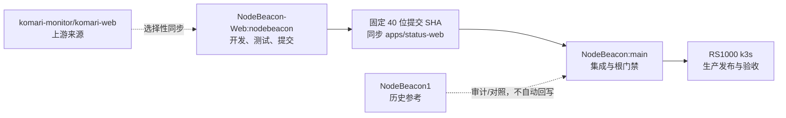
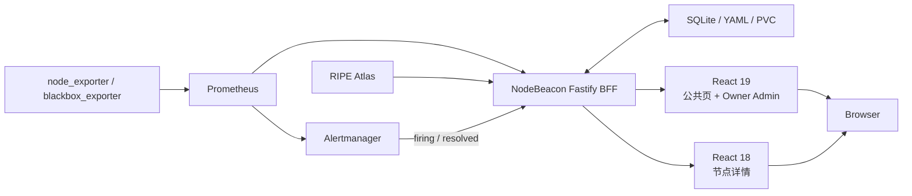

# NodeBeacon

[](https://github.com/xljya/NodeBeacon/actions/workflows/ci.yml)


NodeBeacon 是一个面向个人服务器、Homelab 和小型基础设施的自托管监控与运维平台。
它以 Prometheus 和 Alertmanager 为监控数据面，以 Fastify 作为安全 BFF，并用 React
提供公共状态页、节点详情和 Owner 管理后台。

[在线站点](https://monitor.liucf.com) ·
[生产运维](infra/README.md) ·
[架构决策](docs/adr/) ·
[API 文档](docs/api/) ·
[故障处理](docs/troubleshooting.md)

> **NodeBeacon 是三个仓库中的主要项目，也是唯一的产品与部署单元。**
> `NodeBeacon-Web` 和 `NodeBeacon1` 都是为本项目服务的辅助仓库，不是与它并列运行的
> 应用。你的机器、服务器和域名上只部署本仓库构建出的 NodeBeacon；另外两个仓库没有
> 作为独立项目部署到你的任何机器，也没有绑定或单独服务你的任何域名。

需要精确区分：`NodeBeacon-Web` 的部分源码会被固定提交引入本仓库，并成为 NodeBeacon
镜像中的 React 19 前端；这是 **NodeBeacon 使用辅助仓源码**，不是部署
`NodeBeacon-Web` 仓库。`NodeBeacon1` 仅提供历史参考，其代码和基础设施均不参与当前部署。

## 30 秒理解这个仓库

| 问题 | 答案 |
| --- | --- |
| 这是什么？ | NodeBeacon 当前可运行的完整产品仓库 |
| 在三仓中是什么地位？ | **主要项目**；另外两个仓库只为它提供前端源码或历史参考 |
| 负责什么？ | API、认证、数据契约、双前端装配、测试、k3s 基础设施和生产发布 |
| 默认分支 | `main` |
| 是否直接发布生产？ | 是，只有本仓库可以发布 `monitor.liucf.com` |
| React 19 前端在哪里开发？ | 辅助仓 `xljya/NodeBeacon-Web:nodebeacon`，完成后固定提交引入主项目 |
| `NodeBeacon1` 是什么？ | 为主项目保留迁移前实现的历史辅助仓，不参与当前部署 |
| 实际部署了哪些仓库？ | 只部署 NodeBeacon；另外两个仓库没有独立部署到任何机器或域名 |

如果你是 AI 或第一次参与项目，请按这个顺序开始：

1. 完整阅读本 README，先确认项目身份和三仓边界。
2. 阅读根目录 [`AGENTS.md`](AGENTS.md)，遵守分支、测试、同步和生产发布规则。
3. 再阅读与任务直接相关的 ADR、API、infra 或发布记录，不要只靠文件名猜行为。

## 项目来历

NodeBeacon 最初是一套独立实现的 Prometheus-first 监控产品：React 18 前端负责公共页、
节点详情和管理界面，Fastify 在服务端查询 Prometheus/Alertmanager，并用 SQLite 与 YAML
保存会话、审计、事故和节点注册信息。迁移前的完整代码与基础设施历史保存在
[`xljya/NodeBeacon1`](https://github.com/xljya/NodeBeacon1)。

为了采用 Komari Web 成熟的布局、组件、主题和响应式体验，项目随后从
[`komari-monitor/komari-web`](https://github.com/komari-monitor/komari-web) fork 出
[`xljya/NodeBeacon-Web`](https://github.com/xljya/NodeBeacon-Web)，并在 `nodebeacon`
分支把它改造成只调用 NodeBeacon REST 契约的 React 19 前端。这个过程复用的是前端外壳，
不是 Komari Server、Agent 或 RPC2 数据面。

本仓库是最终集成点：它将经过审核的 `NodeBeacon-Web` 精确提交固定到
`apps/status-web`，与现有 Fastify、React 18 节点详情、Prometheus、SQLite 和 k3s 发布
流程装配成一个产品。架构决策与来源说明见
[`ADR 0014`](docs/adr/0014-komari-web-public-shell.md)。

## 一主两辅：三个仓库怎样配合

这不是三个独立产品组成的分布式部署。`NodeBeacon` 是中心和最终交付物，其他两个仓库只在
开发与历史追溯阶段为它服务：

| 仓库 | 定位 | 日常修改入口 | 能否发布生产 |
| --- | --- | --- | --- |
| [`xljya/NodeBeacon`](https://github.com/xljya/NodeBeacon) | **主要项目**：当前产品、后端、契约、基础设施和发布仓库 | `main` | **可以，且仅此仓库可以** |
| [`xljya/NodeBeacon-Web`](https://github.com/xljya/NodeBeacon-Web) | **辅助项目**：为主项目维护 Komari-derived React 19 源码 | `nodebeacon` | 不可以；仓库本身未部署，源码须由主项目固定提交引入 |
| [`xljya/NodeBeacon1`](https://github.com/xljya/NodeBeacon1) | **辅助项目**：为主项目保留迁移前 NodeBeacon/infra 历史 | `main`，仅历史审计或明确授权修复 | 不可以；未部署到任何机器或域名 |

React 19 前端改动的唯一正确交付链路是：



最终只有 `NodeBeacon` 产出的单一镜像和 Kubernetes 资源会进入你的运行环境并响应域名。
不要只修改 `apps/status-web` 的 vendored 副本；也不要从 `NodeBeacon1` 直接部署或把历史
代码自动回写当前产品。

## 当前产品边界

### 路由归属

| 路由 | 实现 |
| --- | --- |
| `/` | `apps/status-web`，React 19 Komari-derived 公共壳 |
| `/instance/*` | Fastify 308 到 `/nodes/:id` |
| `/login`, `/admin/*` | `apps/status-web`，React 19 NodeBeacon Owner 壳 |
| `/login-v2`, `/admin-v2/*` | 永久重定向到正式路径 |
| `/nodes/*` | `apps/web`，保留的 React 18 节点详情 |
| `/api/*` | `apps/api`，Fastify BFF |

两套前端共享同一套 Fastify API、Owner Cookie、Prometheus 查询和 SQLite 数据，但保持独立
依赖图：根 pnpm workspace 使用 React 18；`apps/status-web` 使用自己的 npm lock 与
React 19。构建时静态资源会隔离装配，避免 React runtime 和文件名冲突。

### 安全与数据边界

- 浏览器不能获得 Prometheus 凭据，也不能提交任意 PromQL。
- Komari-derived 前端只能调用 NodeBeacon 明确提供的 REST 契约。
- 不实现 `/api/rpc2`、Komari Agent、Metric Store、WebSSH、插件市场、任意命令或可执行主题。
- 公共 `/api/status` 不包含私有 IP、Prometheus labels、账单、Owner 备注或管理配置。
- 登录、会话、审计和事故记录保存在 SQLite；节点注册表使用运行时可写 YAML。
- Secret 由生产环境注入，不能写入 Git、日志、截图或发布记录。

## 系统架构



生产流量路径为：

```text
Browser -> Cloudflare -> nginx -> k3s Service / NodePort
        -> NodeBeacon single container
        -> Prometheus / Alertmanager / SQLite / YAML
```

## 主要能力

- 节点 CPU、内存、磁盘、负载、网络流量、运行时间和在线状态。
- HTTP、HTTPS、TCP、ICMP 可用性探测与 Prometheus 趋势查询。
- 1h/4h/24h/7d 节点详情和 RIPE Atlas 多地域网络质量。
- Alertmanager 活跃告警与 SQLite-backed firing/resolved 事故历史。
- Owner 登录、TOTP/GitHub OAuth、节点配置、会话撤销、审计、通知和告警规则管理。
- 简体中文、繁体中文、英文等多语言，明暗主题与桌面/移动响应式布局。
- 不可变镜像、健康检查、备份新鲜度、恢复和生产验收记录。


## 仓库结构

```text
apps/status-web   从 NodeBeacon-Web 固定提交引入的 React 19 源码；独立 npm lock
apps/web          React 18 节点详情与待清理的旧壳源码
apps/api          Fastify API、认证、Prometheus、Alertmanager、SQLite、节点注册表
packages/shared   Web/API 共用类型和显式 REST 契约
e2e               Playwright 浏览器回归
docs              ADR、API、实现计划、故障处理和发布验收记录
infra             k3s、Prometheus、Cloudflare、nginx 与生产运维
scripts           构建装配、部署、生产验收、备份与恢复
config            本地/种子配置；不是生产运行时事实来源
```

## 本地开发

### 环境要求

- Node.js `>= 20.19`
- pnpm（以 `package.json#packageManager` 固定版本为准）
- npm（用于隔离构建 `apps/status-web`）
- Chromium（运行完整 Playwright 门禁时需要）

安装并启动 API 与 React 18 开发入口：

```powershell
pnpm install
pnpm dev
```

- Web 开发服务器：<http://localhost:5173>
- Fastify API：<http://localhost:3001>
- 未配置 Prometheus/Alertmanager 时应用仍能启动；依赖实时时序的接口会返回明确的降级响应。
- API 只读取 `process.env`，不会自动加载 `.env`。
- 本地演示 Owner 功能需要显式设置 Owner 凭据，并让
  `NODEBEACON_NODE_CONFIG` 指向一份可写的 YAML；不要直接修改示例配置。

开发 React 19 公共/Admin 壳时，应进入 `NodeBeacon-Web` 仓库；不要在 vendored 副本里建立
长期分叉。

## 测试与质量门禁

```powershell
pnpm lint
pnpm typecheck
pnpm test
pnpm build
pnpm exec playwright test --project=chromium
git diff --check
```

根构建会分别安装和构建两套前端，并扫描 React 19 产物中是否出现禁用接口。GitHub
Actions 在 `main` push 和 Pull Request 上执行类型检查、单测、构建、部署计划测试和隔离
Chromium E2E。

## 引入 NodeBeacon-Web 改动

1. 在 `NodeBeacon-Web:nodebeacon` 完成源码改动。
2. 运行 `npm ci`、lint、test、build、forbidden scan 和相关 UI 验证。
3. 提交并推送 Web 仓库，记录完整 40 位 SHA。
4. 将该精确提交的完整相关改动同步到 `apps/status-web`。
5. 更新 [`apps/status-web/NODEBEACON_WEB_COMMIT`](apps/status-web/NODEBEACON_WEB_COMMIT)。
6. 在本仓库运行完整根门禁；需要上线时再升版本、发布和生产验收。

指针声称的提交必须与 vendored 源码一致，不能只挑部分文件却记录完整上游 SHA。

## 生产发布

生产位于 RS1000 的 `nodebeacon` namespace，使用单容器和不可变 Git SHA 镜像。完整流程、
备份、恢复与回滚说明见 [`infra/README.md`](infra/README.md)。标准入口是：

```sh
./scripts/deploy.sh --plan
./scripts/deploy.sh
./scripts/verify-production.sh
```

发布必须从干净的精确 Git 提交执行，经过本地门禁、计划、部署、生产专项验收和真实浏览器
检查后，才能更新 `/root/deploy/nodebeacon-current` 并撰写 `docs/releases/v<version>.md`。
不要使用 `latest` 镜像，也不要从 `NodeBeacon-Web` 或 `NodeBeacon1` 直接部署。

## 文档导航

| 任务 | 先读 |
| --- | --- |
| 了解架构选择 | [`docs/adr/`](docs/adr/) |
| 了解 Web fork、来源和双壳边界 | [`ADR 0014`](docs/adr/0014-komari-web-public-shell.md) |
| 修改 API 或数据结构 | [`docs/api/`](docs/api/) 与 `packages/shared` |
| 修改生产、备份、恢复或回滚 | [`infra/README.md`](infra/README.md) |
| 排查线上故障 | [`docs/troubleshooting.md`](docs/troubleshooting.md) |
| 查看实际上线版本和证据 | [`docs/releases/`](docs/releases/) |
| 处理跨平台/换行问题 | [`docs/cross-platform-sync.md`](docs/cross-platform-sync.md) |

## 来源、致谢与许可

NodeBeacon 的监控数据面、Fastify BFF、SQLite 状态和生产基础设施是 NodeBeacon 项目自身的
实现。React 19 外壳来源于 `NodeBeacon-Web` 对 Komari Web 的 fork 与适配；仓库、固定提交
和 ADR 保留了技术来源。Komari Web 在采用时未展示许可证文件，因此这些来源说明不是对
再分发权利的法律判断。

本仓库当前公开用于项目展示和技术交流，尚未授予开源许可证。在正式选择许可证前，请勿
将代码用于再分发或商业用途。
