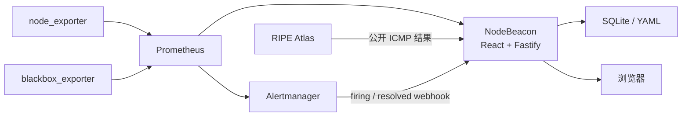

# NodeBeacon

[English](README.en.md) | **简体中文**

[](https://github.com/xljya/NodeBeacon/actions/workflows/ci.yml)


NodeBeacon 是一个面向个人服务器、Homelab 和小型基础设施的轻量级自托管监控与运维平台。
它以 Prometheus 为指标数据源，通过 React 管理界面与 Fastify BFF，统一展示服务器资源、
网站可用性、告警事件和多地域网络延迟。

[在线体验](https://monitor.liucf.com) ·
[生产部署](infra/README.md) ·
[架构决策](docs/adr/) ·
[故障处理](docs/troubleshooting.md)

> NodeBeacon 1.0 已在生产环境持续运行。Web 与 API 使用单容器交付至 k3s，
> Prometheus 凭据和 PromQL 查询能力始终保留在服务端。


## 为什么做 NodeBeacon

Prometheus、Grafana 和 Alertmanager 提供了完整的监控能力，但对个人服务器和小型环境来说，
日常查看节点状态、网络质量与近期事故仍需要在多个界面之间切换。NodeBeacon 在这些基础设施
之上提供一个专注的状态页和管理入口，同时保持数据采集、告警和长期指标仍由标准监控组件负责。

NodeBeacon 不替代 Prometheus、Grafana 或 Alertmanager。它是浏览器与监控基础设施之间的
Backend for Frontend（BFF），负责查询适配、缓存、权限控制和面向用户的状态展示。

## 核心能力

- **节点监控**：展示 CPU、内存、磁盘、负载、网络流量、连接数和运行时间。
- **可用性探测**：通过 `blackbox_exporter` 检查 HTTP、HTTPS、TCP 和 ICMP 目标。
- **节点详情**：提供实时指标、1h/4h/24h/7d 趋势和负载视图。
- **网络质量**：接入 RIPE Atlas 四个互联网视角，展示延迟、丢包、分位数和波动。
- **告警闭环**：读取 Alertmanager 活跃告警，并在 SQLite 中保存 firing/resolved 事故历史。
- **Owner 管理后台**：支持节点配置与排序、会话撤销、审计日志、通知和运行状态查看。
- **多语言与响应式**：支持简体中文、繁体中文、英文，以及明暗主题、桌面端和移动端布局。
- **生产运维**：包含不可变镜像发布、健康检查、备份新鲜度监控、异地备份和恢复演练。

<details>
<summary>查看移动端截图</summary>

<br>


</details>

## 系统架构



生产流量路径：

```text
Browser
  -> Cloudflare
  -> nginx
  -> k3s Service / NodePort
  -> NodeBeacon (React + Fastify)
  -> Prometheus / Alertmanager / SQLite
```

关键安全边界：

- 浏览器不会获得 Prometheus 凭据，也不能执行任意 PromQL。
- 登录、会话、审计和事故记录保存在 SQLite 中，节点注册表使用可写 YAML。
- 运行时 Secret 通过 Kubernetes Secret 注入，不提交到仓库。
- 公共页面、API、静态资源和认证接口使用不同的缓存与限速策略。
- 生产环境不向公网暴露 `/metrics`、Alertmanager webhook 或管理 API。

## 技术栈

| 层级 | 技术 |
| --- | --- |
| 前端 | React 18、TypeScript、Vite、React Router、i18next |
| 后端 | Node.js 20、Fastify 5、TypeScript |
| 指标与告警 | Prometheus、Alertmanager、node_exporter、blackbox_exporter |
| 网络测量 | RIPE Atlas |
| 状态存储 | SQLite、YAML、k3s PersistentVolume |
| 交付 | Docker、k3s / Kubernetes、nginx、Cloudflare |
| 质量保障 | Vitest、Playwright、GitHub Actions |

## 数据更新策略

页面刷新频率和数据源采样频率彼此独立：

| 数据链路 | 生产频率 |
| --- | ---: |
| 主机 CPU、内存、磁盘、负载、网络和连接数 | Prometheus 每 5 秒抓取 |
| 全局状态摘要 | 浏览器每 20 秒刷新 |
| 事故记录 | 浏览器每 60 秒刷新 |
| RIPE Atlas 延迟 | 每个探针到目标每 300 秒测量 |
| RIPE Atlas 最新结果采集 | NodeBeacon 每 60 秒轮询 |

节点详情页可以每 5 秒请求延迟曲线，但不会把重复的 Prometheus 查询当作新的 RIPE 测量。
完整数据链路、统计口径和成本限制见
[RIPE Atlas 延迟说明](docs/ripe-atlas-latency.md)。

## 本地运行

### 环境要求

- Node.js `>= 20.19`
- pnpm `>= 9`
- 可选：Prometheus 和 Alertmanager

未设置 `PROMETHEUS_URL` 时，应用仍可启动并展示节点注册表；依赖实时序列的接口会按预期
返回降级状态。

```powershell
pnpm install
pnpm dev
```

默认地址：

- Web 开发服务器：<http://localhost:5173>
- Fastify API：<http://localhost:3001>

环境变量示例位于 [`.env.example`](.env.example)。API 只读取 `process.env`，
不会自动加载 `.env` 文件。若要在本地体验 Owner 登录和管理后台，请在启动 `pnpm dev`
的同一终端中显式设置 `COOKIE_SECRET`、`INITIAL_OWNER_EMAIL` 和
`INITIAL_OWNER_PASSWORD`。节点编辑还需要把 `NODEBEACON_NODE_CONFIG` 指向一份
可写的 YAML 文件，不要直接修改示例配置。

## 测试与质量门禁

```powershell
pnpm lint
pnpm typecheck
pnpm test
pnpm build
pnpm exec playwright test --project=chromium
```

GitHub Actions 会在推送到 `main` 和 Pull Request 时执行类型检查、单元测试、生产构建、
部署计划测试和隔离 Chromium 端到端测试。生产发布还会执行：

1. 版本与镜像标签一致性检查。
2. 基于完整 Git SHA 的不可变镜像构建。
3. k3s rollout、readiness 和 smoke checks。
4. 公网 API、认证边界、缓存、安全响应头、备份及 Prometheus 规则验收。
5. 带版本、部署 SHA、Deployment revision 和回滚方式的发布记录。

最近的生产验收记录位于 [`docs/releases/`](docs/releases/)。

## 部署

生产环境使用单容器交付：Fastify 提供 `/api/*`，并托管构建后的 React 静态资源。
SQLite 与运行时节点配置存放在 k3s PVC 中。

```sh
./scripts/deploy.sh --plan
./scripts/deploy.sh
./scripts/verify-production.sh
```

部署、备份、恢复与回滚步骤见 [生产运维文档](infra/README.md)。请勿将示例 Secret
直接用于生产环境，也不要使用 `latest` 镜像。

## 仓库结构

```text
apps/web          React/Vite 公共状态页、节点详情页和管理后台
apps/api          Fastify API、认证、Prometheus 查询和 SQLite
packages/shared   Web 与 API 共用类型和契约
e2e               Playwright 端到端测试
infra             k3s、Prometheus、Cloudflare 和 nginx 配置
scripts           发布、验收、备份和恢复脚本
docs              ADR、API、实现计划、故障处理和发布记录
```

## 设计与致谢

NodeBeacon 的仪表盘布局和交互方向参考了
[Komari Monitor](https://github.com/komari-monitor/komari)。NodeBeacon 使用
Prometheus 标准采集链路和服务端 BFF，不复用 Komari 的 Agent 或远程控制模型。

关键技术选择记录在 ADR 中：

- [ADR-0001：生产环境使用 RS1000 k3s](docs/adr/0001-use-rs1000-k3s.md)
- [ADR-0002：使用 Fastify BFF](docs/adr/0002-use-fastify-bff.md)
- [ADR-0003：仅由服务端查询 Prometheus](docs/adr/0003-query-prometheus-server-side.md)
- [ADR-0004：SQLite First](docs/adr/0004-use-sqlite-first.md)
- [ADR-0005：Web 与 API 单容器交付](docs/adr/0005-single-container-first.md)

## 许可说明

本仓库当前公开用于项目展示和技术交流，尚未授予开源许可证。在正式选择许可证前，
请勿将代码用于再分发或商业用途。
