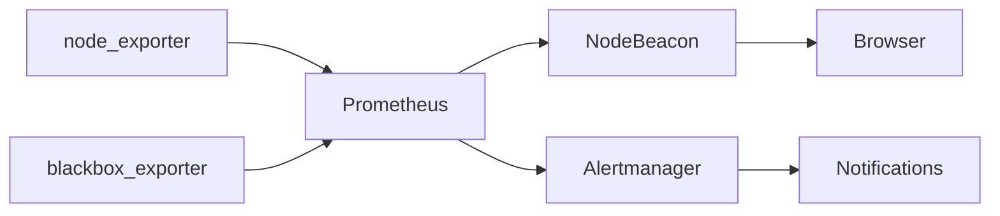
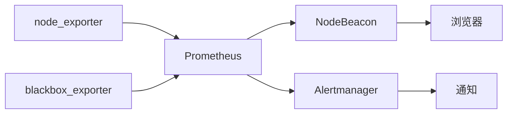

# NodeBeacon

**English** | [中文](#中文)

UI reference: [Komari Monitor](https://github.com/komari-monitor/komari). NodeBeacon's dashboard layout and interaction direction are inspired by Komari Monitor, while the backend design is Prometheus-based and does not reuse Komari's agent or remote-control model.

NodeBeacon is a lightweight self-hosted node monitoring and uptime dashboard powered by Prometheus.

It collects host metrics from `node_exporter`, probes service availability through `blackbox_exporter`, and presents a clean status view for VPS, homelab, small teams, and personal infrastructure.

> Status: early development. This repository currently contains the product design prototype, Prometheus data-mapping notes, deployment decisions, and architecture documentation.

## Features

- Server node monitoring
- Website and API uptime probing
- CPU, memory, disk, load, network traffic, and uptime metrics
- HTTP, HTTPS, TCP, and ICMP availability checks
- Prometheus HTTP API integration
- Grafana-compatible monitoring stack
- Node detail page with load and latency views
- Light and dark theme support
- Grid and table view modes
- Group filtering by region or provider
- Server-side metric adapter to avoid exposing Prometheus to browsers
- Suitable for self-hosted infrastructure and personal SRE dashboards

## Architecture



NodeBeacon does not replace Prometheus, Grafana, or Alertmanager. It acts as a focused status dashboard and backend-for-frontend layer for small self-hosted environments.

## Deployment Direction

The first production target is:

```text
Cloudflare
  -> RS1000 nginx
  -> k3s Service / NodePort 31003
  -> NodeBeacon Deployment
  -> Prometheus / Alertmanager / SQLite
```

The backend is planned to run on RS1000 k3s as a Kubernetes Deployment. The first version will ship the web UI and Fastify API in one container.

The public domain is currently reserved and intentionally serves no content until NodeBeacon is ready.

## Tech Stack

- Frontend: planned React / TypeScript implementation based on the current HTML prototype
- Backend: Node.js, TypeScript, Fastify
- Metrics: Prometheus HTTP API
- Exporters: node_exporter, blackbox_exporter
- State: SQLite first, stored on k3s persistent storage
- Deployment: Docker image running as a k3s Deployment

## Repository Contents

- [`Status Page.dc.html`](Status%20Page.dc.html): high-fidelity HTML prototype
- [`monitoring-setup.md`](monitoring-setup.md): Prometheus metric mapping and data-plumbing notes
- [`docs/development-plan.md`](docs/development-plan.md): current development plan
- [`docs/adr/`](docs/adr): architecture decision records
- [`docs/reference/legacy-monitor-status/`](docs/reference/legacy-monitor-status): reference copy of the previous lightweight monitor page
- [`screenshots/`](screenshots): UI reference screenshots

## Documentation

Important project decisions are recorded as ADRs:

- [ADR-0001: Use RS1000 k3s for Production Deployment](docs/adr/0001-use-rs1000-k3s.md)
- [ADR-0002: Use Fastify as the Backend-for-Frontend API](docs/adr/0002-use-fastify-bff.md)
- [ADR-0003: Query Prometheus Only from the Server Side](docs/adr/0003-query-prometheus-server-side.md)
- [ADR-0004: Use SQLite First for NodeBeacon State](docs/adr/0004-use-sqlite-first.md)
- [ADR-0005: Ship Web and API in One Container First](docs/adr/0005-single-container-first.md)

## Security Model

- Prometheus is queried only by the NodeBeacon backend.
- Browsers never receive Prometheus credentials or arbitrary PromQL access.
- Runtime secrets should be stored in Kubernetes Secrets or environment-specific secret stores.
- Public APIs should be cached and rate-limited where appropriate.
- Authentication endpoints should not be cached by CDN or reverse proxies.

## 中文

UI 参考：[Komari Monitor](https://github.com/komari-monitor/komari)。NodeBeacon 的仪表盘布局和交互方向参考 Komari Monitor，但后端设计基于 Prometheus，不复用 Komari 的 agent 或远程控制模型。

NodeBeacon 是一个基于 Prometheus 的轻量级自托管节点监控与可用性状态页。

它通过 `node_exporter` 获取服务器主机指标，通过 `blackbox_exporter` 探测服务可用性，并为 VPS、Homelab、小团队和个人基础设施提供清晰的状态展示页面。

> 当前状态：早期开发阶段。本仓库目前包含产品设计原型、Prometheus 指标映射说明、部署决策和架构文档。

## 功能特性

- 服务器节点监控
- 网站和 API 可用性探测
- CPU、内存、磁盘、负载、网络流量和 uptime 指标
- HTTP、HTTPS、TCP、ICMP 可用性检查
- Prometheus HTTP API 接入
- 兼容 Grafana / Prometheus 监控栈
- 节点详情页，包含负载和延迟视图
- 明暗主题
- 卡片视图和表格视图
- 按地区或服务商分组过滤
- 后端统一适配指标，避免浏览器直接暴露 Prometheus
- 适合自托管基础设施和个人 SRE 状态页

## 架构



NodeBeacon 不替代 Prometheus、Grafana 或 Alertmanager。它的定位是面向小型自托管环境的状态页，以及前端和 Prometheus 之间的后端适配层。

## 部署方向

第一版生产部署目标：

```text
Cloudflare
  -> RS1000 nginx
  -> k3s Service / NodePort 31003
  -> NodeBeacon Deployment
  -> Prometheus / Alertmanager / SQLite
```

后端计划运行在 RS1000 k3s 中，由 Kubernetes Deployment 管理。第一版 Web UI 和 Fastify API 会放在同一个容器中交付。

当前公开域名已预留，NodeBeacon 完成前会暂时保持无内容响应。

## 技术栈

- 前端：计划使用 React / TypeScript，基于当前 HTML 原型实现
- 后端：Node.js、TypeScript、Fastify
- 指标：Prometheus HTTP API
- 采集器：node_exporter、blackbox_exporter
- 状态存储：优先使用 SQLite，存放在 k3s 持久化存储中
- 部署：Docker 镜像，以 k3s Deployment 运行

## 仓库内容

- [`Status Page.dc.html`](Status%20Page.dc.html)：高保真 HTML 原型
- [`monitoring-setup.md`](monitoring-setup.md)：Prometheus 指标映射和数据接入说明
- [`docs/development-plan.md`](docs/development-plan.md)：当前开发计划
- [`docs/adr/`](docs/adr)：架构决策记录
- [`docs/reference/legacy-monitor-status/`](docs/reference/legacy-monitor-status)：旧轻量状态页的参考副本
- [`screenshots/`](screenshots)：UI 参考截图

## 文档

关键技术决策记录在 ADR 中：

- [ADR-0001: Use RS1000 k3s for Production Deployment](docs/adr/0001-use-rs1000-k3s.md)
- [ADR-0002: Use Fastify as the Backend-for-Frontend API](docs/adr/0002-use-fastify-bff.md)
- [ADR-0003: Query Prometheus Only from the Server Side](docs/adr/0003-query-prometheus-server-side.md)
- [ADR-0004: Use SQLite First for NodeBeacon State](docs/adr/0004-use-sqlite-first.md)
- [ADR-0005: Ship Web and API in One Container First](docs/adr/0005-single-container-first.md)

## 安全模型

- Prometheus 只由 NodeBeacon 后端查询。
- 浏览器不会拿到 Prometheus 凭据，也不能执行任意 PromQL。
- 运行时密钥应存放在 Kubernetes Secret 或环境专用的 secret store 中。
- 公开 API 应按需缓存和限速。
- 登录相关接口不应被 CDN 或反向代理缓存。
