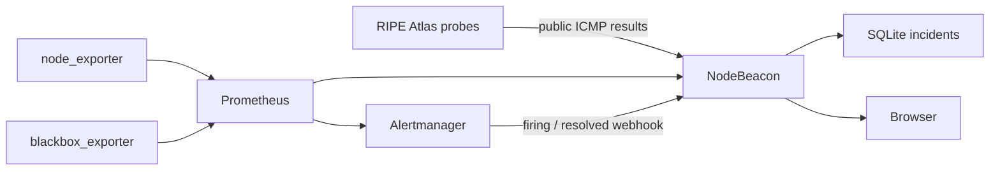
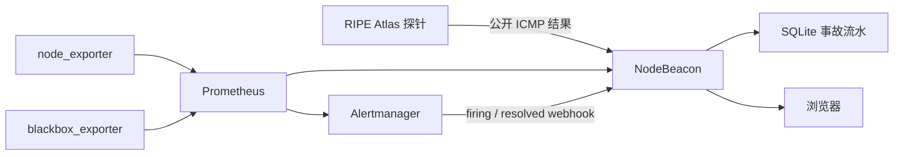

# NodeBeacon

**English** | [中文](#中文)

UI reference: [Komari Monitor](https://github.com/komari-monitor/komari). NodeBeacon's dashboard layout and interaction direction are inspired by Komari Monitor, while the backend design is Prometheus-based and does not reuse Komari's agent or remote-control model.

NodeBeacon is a lightweight self-hosted node monitoring and uptime dashboard powered by Prometheus.

It collects host metrics from `node_exporter`, probes service availability through `blackbox_exporter`, and presents a clean status view for VPS, homelab, small teams, and personal infrastructure.

> Status: NodeBeacon 1.0 is the stable production release. It provides an
> owner-operated, self-hosted status page and Prometheus BFF with traceable
> immutable deployments, component readiness, monitored off-site backups,
> isolated browser CI, and explicit security boundaries.

## Features

- Server node monitoring
- Website and API uptime probing
- CPU, memory, disk, load, network traffic, and uptime metrics
- HTTP, HTTPS, TCP, and ICMP availability checks
- Prometheus HTTP API integration
- Grafana-compatible monitoring stack
- Node detail page with load and latency views
- Four-vantage RIPE Atlas latency with on-demand 24-hour packet statistics
- Light and dark theme support
- Grid and table view modes
- Group filtering by region or provider
- Server-side metric adapter to avoid exposing Prometheus to browsers
- Active Alertmanager alerts and SQLite-backed firing/resolved incident history
- Prometheus rules and ServiceMonitor coverage for NodeBeacon itself
- Suitable for self-hosted infrastructure and personal SRE dashboards

## Architecture



NodeBeacon does not replace Prometheus, Grafana, or Alertmanager. It acts as a focused status dashboard and backend-for-frontend layer for small self-hosted environments.

## Data Freshness

The node detail page refreshes current metrics and real-time chart requests every
5 seconds while the tab is visible. That request frequency is not the sampling
frequency of every source:

| Data path | Production cadence | Why |
| --- | ---: | --- |
| Host CPU, memory, disk, load, network and connections | Prometheus `node-detail-fast` scrape every 5 seconds | Direct `node_exporter` telemetry supports responsive operational charts at low local cost. |
| Status summary | Browser refresh every 20 seconds | Reduces duplicate whole-fleet queries on a per-node page. |
| Incidents | Browser refresh every 60 seconds | Incident state does not need chart-rate polling. |
| RIPE Atlas latency | One public ICMP measurement every 300 seconds per probe and target | Four independent Internet vantage points consume RIPE credits; a slower cadence controls cost and external load. |
| RIPE chart ingestion | NodeBeacon polls the RIPE `latest` endpoint every 60 seconds | Detects each new 300-second measurement without exposing RIPE directly to browsers. RIPE documents that `latest` responses may be cached for up to 5 minutes. |
| Latency information panel | Loaded on demand from the last 24 hours of raw RIPE results; cached by NodeBeacon for 5 minutes | Packet loss, percentiles and variation are calculated from actual RIPE measurement executions and packet RTTs, not repeated Prometheus scrapes. |

Therefore, a latency chart can be requested every 5 seconds without receiving a
new RIPE sample every 5 seconds. See
[`docs/ripe-atlas-latency.md`](docs/ripe-atlas-latency.md) for the data path,
statistic definitions, and operational limits.

## Deployment Direction

The first production target is:

```text
Cloudflare
  -> RS1000 nginx
  -> k3s Service / NodePort 31003
  -> NodeBeacon Deployment
  -> Prometheus / Alertmanager / SQLite
```

The backend runs on RS1000 k3s as a Kubernetes Deployment. The web UI and Fastify API ship in one container, with persistent SQLite/YAML state on a PVC.

## Tech Stack

- Frontend: React / TypeScript
- Backend: Node.js, TypeScript, Fastify
- Metrics: Prometheus HTTP API
- Exporters: node_exporter, blackbox_exporter
- State: SQLite first, stored on k3s persistent storage
- Deployment: Docker image running as a k3s Deployment

## Repository Contents

- [`Status Page.dc.html`](Status%20Page.dc.html): high-fidelity HTML prototype
- [`monitoring-setup.md`](monitoring-setup.md): Prometheus metric mapping and data-plumbing notes
- [`infra/cloudflare.md`](infra/cloudflare.md): production cache, security-header, HSTS, and login rate-limit policy
- [`docs/cross-platform-sync.md`](docs/cross-platform-sync.md): Windows/macOS/Linux Git setup and line-ending troubleshooting
- [`docs/troubleshooting.md`](docs/troubleshooting.md): production diagnosis, rollback, backup, and recovery runbook
- [`docs/development-plan.md`](docs/development-plan.md): current development plan
- [`docs/ripe-atlas-latency.md`](docs/ripe-atlas-latency.md): RIPE Atlas latency data path, cadence, and real-statistics semantics
- [`docs/adr/`](docs/adr): architecture decision records
- [`docs/reference/legacy-monitor-status/`](docs/reference/legacy-monitor-status): reference copy of the previous lightweight monitor page
- [`screenshots/`](screenshots): UI reference screenshots

## Documentation

Important project decisions are recorded as ADRs:

- [ADR-0001: Use RS1000 k3s for Production Deployment](docs/adr/0001-use-rs1000-k3s.md)
- [ADR-0002: Use Fastify as the Backend-for-Frontend API](docs/adr/0002-use-fastify-bff.md)
- [ADR-0003: Query Prometheus Only from the Server Side](docs/adr/0003-query-prometheus-server-side.md)
- [ADR-0004: Use SQLite First for NodeBeacon State](docs/adr/0004-use-sqlite-first.md)
- [ADR-0005: Ship Web and API in One Container First](docs/adr/0005-single-container-first.md)

## Security Model

- Prometheus is queried only by the NodeBeacon backend.
- Browsers never receive Prometheus credentials or arbitrary PromQL access.
- Runtime secrets should be stored in Kubernetes Secrets or environment-specific secret stores.
- Public APIs should be cached and rate-limited where appropriate.
- Authentication endpoints should not be cached by CDN or reverse proxies.

## 中文

UI 参考：[Komari Monitor](https://github.com/komari-monitor/komari)。NodeBeacon 的仪表盘布局和交互方向参考 Komari Monitor，但后端设计基于 Prometheus，不复用 Komari 的 agent 或远程控制模型。

NodeBeacon 是一个基于 Prometheus 的轻量级自托管节点监控与可用性状态页。

它通过 `node_exporter` 获取服务器主机指标，通过 `blackbox_exporter` 探测服务可用性，并为 VPS、Homelab、小团队和个人基础设施提供清晰的状态展示页面。

> 当前状态：NodeBeacon 1.0 为稳定生产版本，定位为 Owner 自用的轻量级
> 自托管状态页与 Prometheus BFF。不可变发布、组件级 readiness、异地备份
> 新鲜度监控、隔离浏览器 CI、Cloudflare 缓存与分层登录限速均已生效。

## 功能特性

- 服务器节点监控
- 网站和 API 可用性探测
- CPU、内存、磁盘、负载、网络流量和 uptime 指标
- HTTP、HTTPS、TCP、ICMP 可用性检查
- Prometheus HTTP API 接入
- 兼容 Grafana / Prometheus 监控栈
- 节点详情页，包含负载和延迟视图
- RIPE Atlas 四视角真实延迟，以及按需加载的最近 24 小时包级统计
- 明暗主题
- 卡片视图和表格视图
- 按地区或服务商分组过滤
- 后端统一适配指标，避免浏览器直接暴露 Prometheus
- Alertmanager 活跃告警与 SQLite firing/resolved 事故历史
- NodeBeacon 自身 Prometheus 规则和 ServiceMonitor 覆盖
- 适合自托管基础设施和个人 SRE 状态页

## 架构



NodeBeacon 不替代 Prometheus、Grafana 或 Alertmanager。它的定位是面向小型自托管环境的状态页，以及前端和 Prometheus 之间的后端适配层。

## 数据更新频率

节点详情页在标签页可见时，每 5 秒刷新当前指标和实时图表请求；这个“页面请求频率”
不等于每个数据源都每 5 秒产生一个新样本：

| 数据链路 | 生产频率 | 原因 |
| --- | ---: | --- |
| CPU、内存、磁盘、负载、网络和连接数 | Prometheus `node-detail-fast` 每 5 秒抓取一次 | `node_exporter` 是服务器直采，局域监控成本较低，需要较灵敏的运维图表。 |
| 全局状态摘要 | 浏览器每 20 秒刷新 | 节点详情页无需每 5 秒重复查询整组服务器。 |
| 事故记录 | 浏览器每 60 秒刷新 | 事故状态不需要与实时曲线同频。 |
| RIPE Atlas 延迟 | 每个探针到每个目标每 300 秒执行一次公开 ICMP 测量 | 四个独立互联网视角会消耗 RIPE credits，较慢周期用于控制积分和外部负载。 |
| RIPE 图表采集 | NodeBeacon 每 60 秒轮询一次 RIPE `latest` 接口 | 能及时发现新的 300 秒测量结果，同时不让浏览器直接访问 RIPE；RIPE 官方说明 `latest` 最多可能缓存 5 分钟。 |
| 延迟信息面板 | 点击信息图标时读取最近 24 小时 RIPE 原始结果，NodeBeacon 缓存 5 分钟 | 丢包、分位数和波动均由真实测量次数与真实包 RTT 计算，不把 Prometheus 的重复抓取当成新样本。 |

所以页面即使每 5 秒请求一次延迟曲线，也不会每 5 秒产生一条新的 RIPE 测量结果。
数据链路、统计口径和运维限制见
[`docs/ripe-atlas-latency.md`](docs/ripe-atlas-latency.md)。

## 部署方向

第一版生产部署目标：

```text
Cloudflare
  -> RS1000 nginx
  -> k3s Service / NodePort 31003
  -> NodeBeacon Deployment
  -> Prometheus / Alertmanager / SQLite
```

后端运行在 RS1000 k3s 中，由 Kubernetes Deployment 管理。Web UI 和 Fastify API 使用单容器交付，SQLite/YAML 状态持久化到 PVC。

## 技术栈

- 前端：React / TypeScript
- 后端：Node.js、TypeScript、Fastify
- 指标：Prometheus HTTP API
- 采集器：node_exporter、blackbox_exporter
- 状态存储：优先使用 SQLite，存放在 k3s 持久化存储中
- 部署：Docker 镜像，以 k3s Deployment 运行

## 仓库内容

- [`Status Page.dc.html`](Status%20Page.dc.html)：高保真 HTML 原型
- [`monitoring-setup.md`](monitoring-setup.md)：Prometheus 指标映射和数据接入说明
- [`infra/cloudflare.md`](infra/cloudflare.md)：生产缓存、安全响应头、HSTS 与登录限速策略
- [`docs/cross-platform-sync.md`](docs/cross-platform-sync.md)：Windows/macOS/Linux Git 配置和换行符排查
- [`docs/development-plan.md`](docs/development-plan.md)：当前开发计划
- [`docs/ripe-atlas-latency.md`](docs/ripe-atlas-latency.md)：RIPE Atlas 四视角延迟接入与续接手册
- [`docs/adr/`](docs/adr)：架构决策记录
- [`docs/reference/legacy-monitor-status/`](docs/reference/legacy-monitor-status)：旧轻量状态页的参考副本
- [`screenshots/`](screenshots)：UI 参考截图

## 文档

关键技术决策记录在 ADR 中：

- [ADR-0001: Use RS1000 k3s for Production Deployment](docs/adr/0001-use-rs1000-k3s.md)
- [ADR-0002: Use Fastify as the Backend-for-Frontend API](docs/adr/0002-use-fastify-bff.md)
- [ADR-0003: Query Prometheus Only from the Server Side](docs/adr/0003-query-prometheus-server-side.md)
- [ADR-0004: Use SQLite First for NodeBeacon State](docs/adr/0004-use-sqlite-first.md)
- [ADR-0005: Ship Web and API in One Container First](docs/adr/0005-single-container-first.md)

## 安全模型

- Prometheus 只由 NodeBeacon 后端查询。
- 浏览器不会拿到 Prometheus 凭据，也不能执行任意 PromQL。
- 运行时密钥应存放在 Kubernetes Secret 或环境专用的 secret store 中。
- 公开 API 应按需缓存和限速。
- 登录相关接口不应被 CDN 或反向代理缓存。
