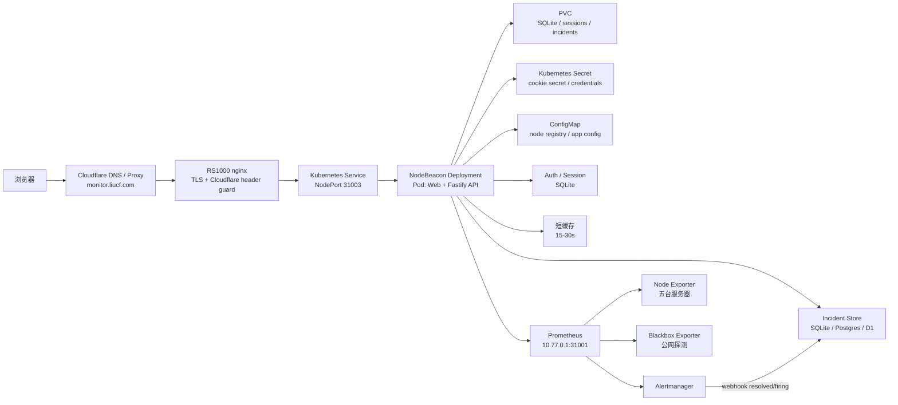
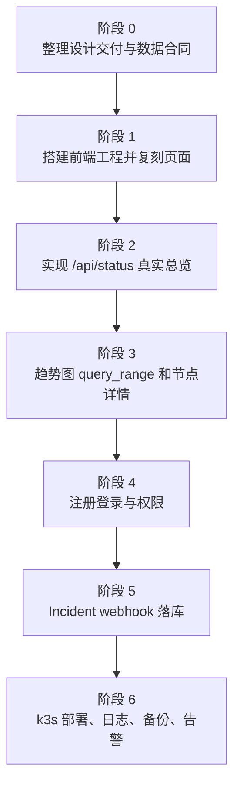

# NodeBeacon 开发文档

最后更新：2026-07-03

## 决策记录

本文件描述 NodeBeacon 当前设计。关键技术选择的原因记录在 ADR 中：

- [ADR-0001: Use RS1000 k3s for Production Deployment](adr/0001-use-rs1000-k3s.md)
- [ADR-0002: Use Fastify as the Backend-for-Frontend API](adr/0002-use-fastify-bff.md)
- [ADR-0003: Query Prometheus Only from the Server Side](adr/0003-query-prometheus-server-side.md)
- [ADR-0004: Use SQLite First for NodeBeacon State](adr/0004-use-sqlite-first.md)
- [ADR-0005: Ship Web and API in One Container First](adr/0005-single-container-first.md)

## 1. 项目定位

NodeBeacon 是给当前五台服务器使用的自托管监控状态页。它不重新发明采集系统，而是复用已经部署好的 Prometheus / Node Exporter / Blackbox Exporter / Alertmanager，把原型里的假数据替换成真实指标，并补上注册登录、权限、缓存和故障事件历史。

当前目标服务器：

| 节点 | 角色 | WireGuard / 指标来源 |
| --- | --- | --- |
| RS1000 | k3s + Prometheus + Grafana + Alertmanager | Prometheus 内部 node-exporter target |
| dmit-uswest | 公网入口 + 被监控节点 | `10.77.0.2:9100` |
| hostbrr-4t | 被监控节点 | `10.77.0.3:9100` |
| netcup-1o | 被监控节点 | `10.77.0.4:9100` |
| huawei-2c1g | 被监控节点 | `10.77.0.5:9100` |

生产入口计划：

- 域名：`https://monitor.liucf.com/`
- 已选部署位置：RS1000 k3s，使用 Kubernetes Pod / Deployment 管理。
- Namespace：建议新建 `nodebeacon`，和已有 `sre-lab` 学习服务隔离；如果想先替换旧状态页，也可以短期沿用 `sre-lab`。
- 入口链路：Cloudflare 橙云代理 -> RS1000 nginx -> RS1000 k3s。
- 当前源站：Cloudflare `monitor.liucf.com` 的 IPv4 源站指向 RS1000；dmit-uswest 不再承载 monitor 入口。
- 第一版目标：替换当前轻量 `monitor-status` 应用，保留现有域名和 Cloudflare 安全边界。

## 2. 总体架构



关键原则：

- 前端不直接访问 Prometheus，避免暴露 Prometheus 地址、Basic Auth、PromQL 查询能力和 CORS 面。
- 后端只开放固定 API，不接受任意 PromQL。所有查询走白名单和服务端参数校验。
- Prometheus 继续负责采集和时序存储，NodeBeacon 后端只做数据适配、缓存、鉴权和业务聚合。
- 五台服务器的元数据放在配置文件或数据库里，不从指标里猜测展示名、区域、国旗、供应商。

## 3. 后端开发方向

推荐第一版后端：`Node.js + TypeScript + Fastify`。

原因：

- API 轻，Fastify 足够快，结构清楚。
- 很适合做 Prometheus BFF：批量请求、缓存、格式化、鉴权。
- 后续可以同时部署到 VPS/k3s、容器平台，或改造成 Cloudflare Worker 版本。

建议模块：

| 模块 | 职责 |
| --- | --- |
| `prometheusClient` | 封装 `/api/v1/query` 和 `/api/v1/query_range` |
| `metricsService` | 把 CPU、内存、磁盘、网络、uptime 等 PromQL 聚合成节点数据 |
| `nodeRegistry` | 管理五台服务器的展示名、分组、区域、标签和 Prometheus label 映射 |
| `authService` | 注册、登录、退出、会话校验、密码 hash |
| `incidentService` | 读取当前告警和历史故障事件 |
| `cacheService` | 给总览接口加 15-30 秒缓存，避免前端刷新打爆 Prometheus |
| `config` | 管理 Prometheus URL、密钥、cookie secret、是否允许注册等配置 |

## 4. API 草案

| API | 用途 | 登录要求 |
| --- | --- | --- |
| `GET /api/status` | 五台服务器总览，替换前端卡片假数据 | 可选，公开状态页可不登录 |
| `GET /api/nodes` | 节点列表和元数据 | 可选 |
| `GET /api/nodes/:id` | 单台服务器详情 | 可选或登录 |
| `GET /api/nodes/:id/range?metric=cpu&range=4h` | 单指标趋势图 | 可选或登录 |
| `GET /api/latency` | blackbox 公网探测结果 | 可选 |
| `GET /api/incidents` | 故障事件时间线 | 建议登录 |
| `POST /api/auth/register` | 注册 | 默认关闭或邀请码 |
| `POST /api/auth/login` | 登录 | 公开 |
| `POST /api/auth/logout` | 退出 | 登录 |
| `GET /api/auth/me` | 当前用户 | 登录 |

总览接口返回的数据应该接近前端原型的数据结构，但字段改成稳定 JSON：

```json
{
  "generatedAt": "2026-07-03T10:30:00+08:00",
  "summary": {
    "total": 5,
    "online": 5,
    "regions": 3
  },
  "nodes": [
    {
      "id": "dmit-uswest",
      "name": "dmit-uswest",
      "online": true,
      "group": "HK",
      "provider": "DMIT",
      "cpu": { "percent": 12.3 },
      "memory": { "percent": 48.1, "usedBytes": 1024, "totalBytes": 2048 },
      "disk": { "percent": 37.9, "usedBytes": 1024, "totalBytes": 4096 },
      "network": { "rxBytesPerSecond": 12345, "txBytesPerSecond": 6789 },
      "uptimeSeconds": 1234567,
      "load1": 0.21
    }
  ]
}
```

## 5. 注册登录策略

这个项目面向个人监控系统，不建议开放自由注册。第一版建议：

- 默认 `ALLOW_REGISTER=false`。
- 管理员通过环境变量创建初始账号，或使用一次性邀请码。
- 密码使用 `argon2id` hash，不保存明文。
- 会话使用 `httpOnly + Secure + SameSite=Lax` cookie。
- 角色先做两个：`owner` 和 `viewer`。
- 公开状态页可展示基础在线状态；敏感信息如完整流量、故障历史、服务器详细配置需要登录。

## 6. Prometheus 数据适配方向

第一版只做必需指标：

| 页面字段 | 数据来源 |
| --- | --- |
| 在线状态 | `up` 或 `probe_success` |
| CPU | `node_cpu_seconds_total` |
| 内存 | `node_memory_MemTotal_bytes` / `node_memory_MemAvailable_bytes` |
| 磁盘 | `node_filesystem_size_bytes` / `node_filesystem_free_bytes` |
| uptime | `node_time_seconds - node_boot_time_seconds` |
| load | `node_load1` |
| 网络速度 | `rate(node_network_receive_bytes_total[1m])` / `rate(node_network_transmit_bytes_total[1m])` |
| 入口延迟 | `probe_duration_seconds` |
| HTTP 状态码 | `probe_http_status_code` |

注意事项：

- RS1000 的 Prometheus target 需要稳定 label，避免展示层依赖 Pod IP。
- 磁盘口径建议继续使用 `free_bytes / size_bytes`，更接近 `df -h /`。
- 所有查询要按节点配置生成，不允许用户把任意 PromQL 传给后端执行。
- `/api/status` 做短缓存，趋势接口按 range 做更长缓存。

## 7. 推荐代码结构

```text
NodeBeacon/
  apps/
    web/                 # 前端应用，复刻 Status Page.dc.html
    api/                 # Fastify API / Prometheus BFF
  config/
    nodes.example.yaml   # 五台服务器展示配置示例，不放密钥
  docs/
    development-plan.md
  infra/
    k8s/                 # RS1000 k3s 部署清单
    nginx/               # RS1000 nginx 入口配置示例
```

如果想先快跑，也可以第一版做成一个服务：后端托管静态前端文件，同时提供 `/api/*`。等 UI 稳定后再拆 `apps/web` 和 `apps/api`。

## 8. 开发阶段规划



优先级建议：

1. 先把静态原型变成真实前端工程。
2. 再只接 `/api/status`，让五台机器总览变成真数据。
3. 然后补趋势图和详情页。
4. 最后补登录、事件历史、管理后台。

这样每一步都有可见结果，不会一开始就在账号系统和部署细节里打转。

## 9. 部署决策：RS1000 k3s

生产部署已经确定采用 **RS1000 k3s Pod / Deployment**。Docker 镜像只是交付格式，真正的运行和管理交给 k3s。

| 运行方式 | 结论 | 原因 |
| --- | --- | --- |
| RS1000 k3s Pod / Deployment | 采用 | 最适合学习和长期管理；日志、重启、Secret、ConfigMap、PVC、Service 都标准化 |
| Docker Compose | 不采用生产 | 可用于临时验证镜像，但会和现有 k3s 形成两套部署系统 |
| RS1000 本机裸跑 | 不采用 | systemd、日志、环境变量、升级和回滚会分散，后续排查成本高 |
| Cloudflare / Vercel | 不作为第一版生产后端 | 很适合前端预览或后续拆分，但访问私有 Prometheus 和 Alertmanager webhook 不如 k3s 直接 |

第一阶段：部署在 RS1000 k3s，并继续使用 `https://monitor.liucf.com/` 作为生产入口。

```text
monitor.liucf.com
  -> Cloudflare Proxied
  -> RS1000 nginx :443
  -> http://10.77.0.1:31003
  -> RS1000 k3s Service nodebeacon NodePort 31003
  -> Deployment nodebeacon
  -> Prometheus / Alertmanager / SQLite
```

原因：

- 你的 Prometheus、Alertmanager、Loki 都已经在 RS1000 附近，NodeBeacon 放这里最短路径。
- 后端可以直接查 `10.77.0.1:31001` 或集群内 Prometheus service，不需要把 Prometheus API 暴露给公网。
- Alertmanager webhook 可以直接打到 NodeBeacon 的集群内服务，incident 历史更容易做。
- 现有 `monitor.liucf.com` 入口已经切到 Cloudflare -> RS1000 nginx -> RS1000 k3s，替换旧状态页即可。

### Cloudflare 配置判断

当前 `monitor.liucf.com` 已经在 Cloudflare 开启橙云代理，并把 IPv4 源站切到 RS1000。dmit-uswest 上的 monitor Caddy 反代已经移除。第一版只需要让 RS1000 nginx 继续把 `monitor.liucf.com` 反代到 k3s 服务即可。

| 项目 | 当前建议 | 是否需要改 |
| --- | --- | --- |
| DNS 记录 | `monitor.liucf.com` 继续代理到 RS1000 `152.53.171.134` | 已切换 |
| Proxy 状态 | 继续开启橙云代理 | 不需要 |
| Origin 链路 | RS1000 nginx 反代到 `http://10.77.0.1:31003` | 不需要，除非 NodeBeacon 换端口 |
| Cloudflare Header Guard | RS1000 nginx 要求 `CF-Connecting-IP`，直连源站返回 404 | 保持 |
| TLS / 证书 | RS1000 nginx 使用 Let’s Encrypt `monitor.liucf.com` 证书 | 保持自动续期 |
| 缓存规则 | `/api/*`、`/auth/*` 不缓存；HTML 短缓存或不缓存；静态资源可长缓存 | 建议补充 |
| WAF / Rate Limit | 对 `/api/auth/login` 做限速，保护登录接口 | 建议补充 |

需要改的场景：

- 如果 NodeBeacon 不复用 `31003`，只需要改 RS1000 的 nginx upstream，例如从 `http://10.77.0.1:31003` 改到新的 NodePort 或 Cluster 入口；Cloudflare DNS 仍不用动。
- 如果前端以后迁到 Cloudflare Pages，才需要新增 Pages 项目和可能的 `api.monitor.liucf.com`，主站 DNS/路由策略才会变化。
- 如果将来让 Cloudflare Worker 直接访问私有 Prometheus，则需要重新设计网络接入，例如 Workers VPC、Tunnel 或受保护的内部 API；第一版不建议这样做。

第二阶段可选：前端拆到 Cloudflare Pages，API 仍留在 RS1000 k3s。

```text
静态前端: Cloudflare Pages
API: api.monitor.liucf.com -> RS1000 nginx -> RS1000 k3s
```

这种方案兼顾前端访问速度和后端私网安全。Cloudflare Worker 也可以做一层轻代理，但真正查 Prometheus 的 BFF 仍固定在 RS1000 k3s 内侧。

第三阶段：如果想完全 Cloudflare 化，再评估 Workers VPC / D1 / Worker API。

这会让部署更云原生，但网络接入复杂度会比直接放 RS1000 高。当前项目只有五台机器，先不值得为了平台形态牺牲简单性。

## 10. 安全要求

- 不提交任何真实密码、Token、chat_id、WireGuard private key。
- 所有密钥放 Kubernetes Secret、`.env` 或平台 secret manager。
- 后端不开放任意 PromQL 查询接口。
- 登录 cookie 必须 `httpOnly`，生产环境必须 `Secure`。
- 对 `/api/auth/login` 做限速。
- 对公开接口做缓存，避免刷新页面时连续打 Prometheus。
- RS1000 nginx 继续保留 Cloudflare header guard，防止绕过 Cloudflare 直连源站。
- Prometheus Basic Auth 只在服务端使用，不出现在浏览器和前端 bundle。
- Cloudflare 侧不要缓存 `/api/*` 和 `/auth/*`，避免状态页、登录态和故障信息出现过期数据。

## 11. 运维要求

- NodeBeacon 自身暴露 `/healthz` 和 `/readyz`。
- NodeBeacon 自身日志进入 Loki。
- 为 API 添加基础指标：请求量、错误率、Prometheus 查询耗时、缓存命中率。
- SQLite 需要定期备份；如果 incident 历史变重要，升级到 PostgreSQL。
- 部署文件放 `infra/k8s/`，至少包含 Deployment、Service、Secret 示例和 RS1000 nginx 入口说明。

## 12. 官方资料参考

- Cloudflare Workers: https://developers.cloudflare.com/workers/
- Cloudflare Pages Functions: https://developers.cloudflare.com/pages/functions/
- Cloudflare D1: https://developers.cloudflare.com/d1/get-started/
- Cloudflare Workers VPC: https://developers.cloudflare.com/workers-vpc/
- Vercel Functions: https://vercel.com/docs/functions
- Vercel Node.js Runtime: https://vercel.com/docs/functions/runtimes/node-js
- Vercel Networking / Secure Compute: https://vercel.com/docs/networking
