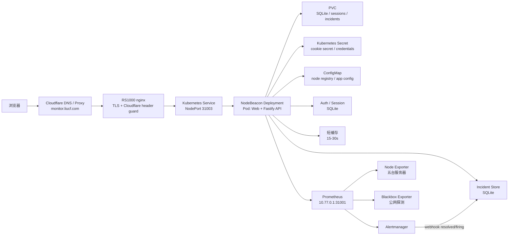
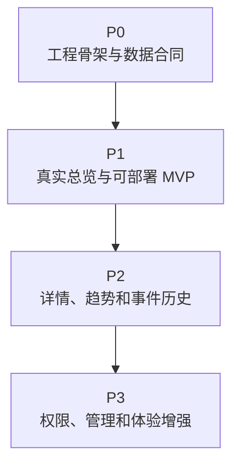

# NodeBeacon 开发文档

最后更新：2026-07-15

节点详情页 V2 的当前实现状态、真实生产 target 核验、逐 gate 发布命令、测试标准和
回滚步骤见 [Node Detail V2 实施方案](node-detail-v2-implementation-plan.md)。

## 决策记录

本文件描述 NodeBeacon 当前设计。关键技术选择的原因记录在 ADR 中：

- [ADR-0001: Use RS1000 k3s for Production Deployment](adr/0001-use-rs1000-k3s.md)
- [ADR-0002: Use Fastify as the Backend-for-Frontend API](adr/0002-use-fastify-bff.md)
- [ADR-0003: Query Prometheus Only from the Server Side](adr/0003-query-prometheus-server-side.md)
- [ADR-0004: Use SQLite First for NodeBeacon State](adr/0004-use-sqlite-first.md)
- [ADR-0005: Ship Web and API in One Container First](adr/0005-single-container-first.md)

## 1. 项目定位

NodeBeacon 是给当前五台服务器使用的自托管监控状态页。它不重新发明采集系统，而是复用已经部署好的 Prometheus / Node Exporter / Blackbox Exporter / Alertmanager，把原型里的假数据替换成真实指标，并补上注册登录、权限、缓存和故障事件历史。

当前目标服务器：

| 节点 | 角色 | WireGuard / 指标来源 |
| --- | --- | --- |
| RS1000 | k3s + Prometheus + Grafana + Alertmanager | Prometheus 内部 node-exporter target |
| dmit-uswest | 公网入口 + 被监控节点 | `10.77.0.2:9100` |
| hostbrr-4t | 被监控节点 | `10.77.0.3:9100` |
| netcup-1o | 被监控节点 | `10.77.0.4:9100` |
| huawei-2c1g | 被监控节点 | `10.77.0.5:9100` |

生产入口计划：

- 域名：`https://monitor.liucf.com/`
- 已选部署位置：RS1000 k3s，使用 Kubernetes Pod / Deployment 管理。
- Namespace：`nodebeacon`，和已有 `sre-lab` 学习服务隔离。
- 入口链路：Cloudflare 橙云代理 -> RS1000 nginx -> RS1000 k3s。
- 当前源站：Cloudflare `monitor.liucf.com` 的 IPv4 源站指向 RS1000；dmit-uswest 不再承载 monitor 入口。
- 当前状态（2026-07-15）：NodeBeacon `1.0.7`（不可变镜像 `nodebeacon:git-4ef7e93c726c`，Deployment revision `43`）已发布。节点详情 V2、五节点 5 秒 fast scrape、registry detail 迁移与 Prometheus retention `90d/40GB` 已完成；生产运行基线、回滚路径和未完成的长时观察记录见 [Node Detail V2 实施方案](node-detail-v2-implementation-plan.md)。
- 第一版目标（已达成）：替换当前轻量 `monitor-status` 应用，保留现有域名和 Cloudflare 安全边界。

## 2. 总体架构



关键原则：

- 前端不直接访问 Prometheus，避免暴露 Prometheus 地址、Basic Auth、PromQL 查询能力和 CORS 面。
- 后端只开放固定 API，不接受任意 PromQL。所有查询走白名单和服务端参数校验。
- Prometheus 继续负责采集和时序存储，NodeBeacon 后端只做数据适配、缓存、鉴权和业务聚合。
- 五台服务器的元数据放在配置文件或数据库里，不从指标里猜测展示名、区域、国旗、供应商。

## 3. 后端开发方向

推荐第一版后端：`Node.js + TypeScript + Fastify`。

原因：

- API 轻，Fastify 足够快，结构清楚。
- 很适合做 Prometheus BFF：批量请求、缓存、格式化、鉴权。
- 与当前 k3s 部署、单容器交付和 Prometheus BFF 方向一致。

建议模块：

| 模块 | 职责 |
| --- | --- |
| `prometheusClient` | 封装 `/api/v1/query` 和 `/api/v1/query_range` |
| `metricsService` | 把 CPU、内存、磁盘、网络、uptime 等 PromQL 聚合成节点数据 |
| `nodeRegistry` | 管理五台服务器的展示名、分组、区域、标签和 Prometheus label 映射 |
| `authService` | 注册、登录、退出、会话校验、密码 hash |
| `adminService` | 管理后台数据聚合、节点展示配置、手动分组和系统设置写入 |
| `incidentService` | 读取当前告警和历史故障事件 |
| `cacheService` | 给总览接口加 15-30 秒缓存，避免前端刷新打爆 Prometheus |
| `config` | 管理 Prometheus URL、密钥、cookie secret、是否允许注册等配置 |

## 4. API 草案

| API | 用途 | 登录要求 |
| --- | --- | --- |
| `GET /api/status` | 五台服务器总览，替换前端卡片假数据 | 公开 |
| `GET /api/nodes` | 节点列表和元数据 | 公开 |
| `GET /api/nodes/:id` | 单台服务器详情 | 登录 |
| `GET /api/nodes/:id/range?metric=cpu&range=4h` | 单指标趋势图（`metric ∈ cpu/memory/disk/network/load`，`range ∈ 1h/4h/24h/7d`） | 登录 |
| `GET /api/latency` | blackbox 公网探测结果 | 公开 |
| `GET /api/incidents` | 脱敏故障事件时间线 | 公开 |
| `POST /api/auth/register` | 注册 | 关闭 |
| `POST /api/auth/login` | 登录 | 公开 |
| `POST /api/auth/logout` | 退出 | 登录 |
| `GET /api/auth/me` | 当前用户 | 登录 |
| `GET /api/admin/summary` | 管理后台总览：节点配置、用户、系统状态摘要 | `owner` |
| `GET /api/admin/nodes` | 管理端节点列表，包含展示配置和 Prometheus label 映射 | `owner` |
| `POST /api/admin/nodes` | 新增节点展示配置和 Prometheus label 映射 | `owner` |
| `PATCH /api/admin/nodes/:id` | 修改节点展示名、手动分组、区域、标签、排序和可见性 | `owner` |
| `DELETE /api/admin/nodes/:id` | 删除节点展示配置 | `owner` |
| `GET /api/admin/users` | 用户和角色列表 | `owner` |

总览接口返回的数据应该接近前端原型的数据结构，但字段改成稳定 JSON：

```json
{
  "generatedAt": "2026-07-03T10:30:00+08:00",
  "summary": {
    "total": 5,
    "online": 5,
    "regions": 3
  },
  "nodes": [
    {
      "id": "dmit-uswest",
      "name": "dmit-uswest",
      "online": true,
      "group": "HK",
      "provider": "DMIT",
      "cpu": { "percent": 12.3 },
      "memory": { "percent": 48.1, "usedBytes": 1024, "totalBytes": 2048 },
      "disk": { "percent": 37.9, "usedBytes": 1024, "totalBytes": 4096 },
      "network": { "rxBytesPerSecond": 12345, "txBytesPerSecond": 6789 },
      "uptimeSeconds": 1234567,
      "load1": 0.21
    }
  ]
}
```

## 5. 注册登录策略

这个项目面向个人监控系统，第一版关闭自由注册：

- 默认 `ALLOW_REGISTER=false`。
- 管理员通过环境变量创建初始账号。
- 密码使用 `argon2id` hash，不保存明文。
- 会话使用 `httpOnly + Secure + SameSite=Lax` cookie。
- 角色先做两个：`owner` 和 `viewer`。
- 公开状态页可展示基础在线状态；敏感信息如完整流量、故障历史、服务器详细配置需要登录。

## 6. Prometheus 数据适配方向

第一版只做必需指标：

| 页面字段 | 数据来源 |
| --- | --- |
| 在线状态 | `up` 或 `probe_success` |
| CPU | `node_cpu_seconds_total` |
| 内存 | `node_memory_MemTotal_bytes` / `node_memory_MemAvailable_bytes` |
| 磁盘 | `node_filesystem_size_bytes` / `node_filesystem_free_bytes` |
| uptime | `node_time_seconds - node_boot_time_seconds` |
| load | `node_load1` |
| 网络速度 | `rate(node_network_receive_bytes_total[1m])` / `rate(node_network_transmit_bytes_total[1m])` |
| 入口延迟 | `probe_duration_seconds` |
| HTTP 状态码 | `probe_http_status_code` |

注意事项：

- RS1000 的 Prometheus target 需要稳定 label，避免展示层依赖 Pod IP。
- 磁盘口径建议继续使用 `free_bytes / size_bytes`，更接近 `df -h /`。
- 所有查询要按节点配置生成，不允许用户把任意 PromQL 传给后端执行。
- `/api/status` 做短缓存，趋势接口按 range 做更长缓存。

## 7. 推荐代码结构

```text
NodeBeacon/
  apps/
    web/                 # 前端应用，复刻 Status Page.dc.html
    api/                 # Fastify API / Prometheus BFF
  config/
    nodes.example.yaml   # 五台服务器展示配置示例，不放密钥
  docs/
    development-plan.md
    reference/            # 旧 monitor-status 的参考副本
  infra/
    k8s/                 # RS1000 k3s 部署清单
    nginx/               # RS1000 nginx 入口配置示例
```

第一版保持 `apps/web` 和 `apps/api` 的源码边界，但交付为一个服务：后端托管静态前端文件，同时提供 `/api/*`。

## 8. 开发阶段规划与优先级清单

第一版开发目标不是一次性做完整监控平台，而是尽快把当前 HTML 原型变成可部署、可访问真实 Prometheus 数据的状态页。优先级按“能否阻塞 MVP 上线”排序：

| 优先级 | 定义 | 处理原则 |
| --- | --- | --- |
| P0 | 基础工程和数据合同，缺失会阻塞所有后续开发 | 先做，必须有清晰交付物 |
| P1 | MVP 上线必需能力，完成后可以替换旧状态页 | 第一轮开发主线 |
| P2 | 让产品从“能看”变成“好用”的核心增强 | MVP 稳定后连续推进 |
| P3 | 管理、扩展和长期体验优化 | 不阻塞第一版上线 |



### P0：工程骨架与数据合同

| 状态 | 任务 | 交付标准 | 备注 |
| --- | --- | --- | --- |
| 已完成 | 初始化前端工程 `apps/web` | React + TypeScript 项目可本地启动；能承载当前状态页原型 | 优先复刻真实页面，不做营销首页 |
| 已完成 | 初始化后端工程 `apps/api` | Fastify + TypeScript 项目可本地启动；暴露 `/healthz` | 第一版后端同时托管静态前端 |
| 已完成 | 定义 `/api/status` 数据合同 | 有 TypeScript 类型、示例 JSON、错误格式和字段说明 | 前后端先围绕这一个接口对齐 |
| 已完成 | 建立节点配置 `config/nodes.example.yaml` | 包含五台节点的 `id/name/provider/group/labels/displayOrder` 示例 | `group` 作为手动展示分组，不从指标自动猜测；不写入任何真实密钥 |
| 已完成 | 建立环境变量样例 `.env.example` | 覆盖 `PROMETHEUS_URL`、cookie secret、注册开关、缓存 TTL | 真实值只放部署环境 |
| 已完成 | 从 HTML 原型拆出 UI 结构 | 明确布局、主题、节点卡片、表格视图、筛选项和状态色 | 以复用当前视觉为主 |
| 已完成 | 配好基础脚本 | 至少有 `dev`、`build`、`typecheck`、`lint` | 没有测试框架前先保证类型检查 |

P0 完成判定：前端和后端都能独立启动，`/api/status` 的返回结构冻结到第一版，后续开发不再围绕字段名反复改动。

P0 验证记录：2026-07-03 已通过 `pnpm install`、`pnpm typecheck`、`pnpm build`、`pnpm lint`；编译后的 API 已验证 `/healthz`、`/api/status` 和静态前端托管；浏览器验证网格卡片、表格视图和主题切换可用；前端首页当前直接承载 `Status Page.dc.html` 原型文件，保证浅色主题、统计条、搜索区、分组切换和节点卡片布局 1:1 呈现，后续再逐步把原型假数据替换成 `/api/status` 数据。

### P1：MVP 上线必需能力

| 状态 | 任务 | 交付标准 | 备注 |
| --- | --- | --- | --- |
| 已完成 | 实现 Prometheus client | 只封装白名单查询；支持超时、错误分类和基础日志 | 不开放任意 PromQL；支持可选 Basic Auth / Bearer Token |
| 已完成 | 实现 `metricsService` | 聚合在线状态、CPU、内存、磁盘、uptime、load、网络速率 | 第一版只服务 `/api/status`；节点指标缺失时降级为 degraded 或 unknown |
| 已完成 | 实现 `/api/status` | 返回五台节点真实数据；单节点失败不拖垮整页 | 配置 `PROMETHEUS_URL` 时走真实 Prometheus；不可用时优先 stale 缓存，冷失败返回 `unknown` + 零指标；fixture 仅供未配置 Prometheus 的本地开发 |
| 已完成 | 增加短缓存 | 总览接口缓存 15-30 秒；返回 `generatedAt` | 防止刷新页面打爆 Prometheus；过期缓存可作为 stale 降级返回 |
| 已完成 | 复刻状态页主界面 | 卡片视图、表格视图、分组筛选、明暗主题可用 | 当前通过高保真原型 iframe 保持 1:1 外观；后续再做组件化收敛 |
| 已完成 | 分组筛选接入节点配置 | 首页分组选项从节点手动分组生成；支持 `All` 和自定义分组 | 已通过 `/api/status` + `config/nodes.example.yaml` 驱动原型分组；Prometheus 真指标接入仍单独推进 |
| 已完成 | 接入真实 API 状态 | 前端有 loading、empty、error、stale 数据状态 | 运行页显示 Live/Loading/Fallback/Stale/No data 状态，并保留空节点和筛选无结果反馈 |
| 已完成 | 单容器构建 | API 托管前端静态产物；镜像能本地运行 | 符合 ADR-0005；多阶段 `Dockerfile`，pnpm workspace 构建后裁剪 devDependencies |
| 已完成 | k3s 基础部署清单 | Deployment、Service、Secret/ConfigMap 示例、PVC 占位 | 已部署到 RS1000 `nodebeacon` namespace，`kubectl apply -k infra/k8s` |
| 已完成 | RS1000 nginx 接入说明 | 明确把 `monitor.liucf.com` upstream 指到 NodePort | 已上线：nginx 从 `204 No Content` 切到反代 `10.77.0.1:31003` |

P1 完成判定：`monitor.liucf.com` 可以展示真实五台节点总览；Prometheus 不暴露给浏览器；前端刷新、后端重启和单节点异常都有可接受表现。

P1 进展记录：2026-07-03 已将 `Status Page.dc.html` 原型副本接入 `/api/status`，节点卡片、在线数、更新时间、流量/速率摘要和分组筛选可以从 API 合同数据渲染；浏览器验证可见节点为 `config/nodes.example.yaml` 中的 5 台服务器，旧原型假节点不再显示。

P1 进展记录：2026-07-03 已完成 Prometheus client、`metricsService`、`/api/status` 真实指标适配和短缓存。后端只在服务端生成白名单 PromQL，覆盖 `up`、CPU、内存、根分区磁盘、load、uptime 和网络速率；单节点指标缺失会降级为 `degraded` 或 `unknown`。`0.9.0` 起 Prometheus 整体不可用时优先返回过期缓存；没有缓存则把注册表节点标为 `unknown` 并将指标归零，不再向生产返回 fixture。fixture 只保留给未配置 Prometheus 的本地开发。

P1 进展记录：2026-07-04 已补齐前端 API 状态反馈。状态页在 `/api/status` 加载中、请求失败并使用 fallback、后端返回 `cache.stale=true`、API 返回空节点列表、分组或搜索无结果时都会显示对应状态；正常数据路径显示 `Live data`。同时将运行页 iframe 版本号升级，避免浏览器继续使用旧原型缓存。

P1 进展记录：2026-07-06 已完成单容器构建、k3s 部署和 nginx 上线，P1 全部收尾，MVP 正式对外。

- **单容器**：新增多阶段 `Dockerfile`（node:20-slim + 固定 pnpm@10.15.0）和 `.dockerignore`。构建 shared → api → web 后保留已构建 workspace，运行时 API 在 `:3001` 同时托管 `/api/*` 和 `apps/web/dist`。
- **部署清单**：新增 `infra/k8s/`（namespace、node registry ConfigMap、Secret 示例、Deployment、NodePort 31003 Service、SQLite 占位 PVC、kustomization）。Deployment 走只读根文件系统、非 root、就绪/存活探针，`PROMETHEUS_URL` 指向集群内 `monitoring-kube-prometheus-prometheus.monitoring.svc:9090`。
- **Prometheus label 修正**（关键）：核对线上 Prometheus 后发现旧 `config/nodes.example.yaml` 的 `instance: 10.77.0.x:9100` 与真实抓取标签不符，会导致 `/api/status` 全部拿不到真实数据。真实映射：RS1000 = `{job="node-exporter"}`（集群内 DaemonSet，单节点），四台 VPS = `{job="external-vps-node", instance=<名字>}`。已同步修正示例配置和 ConfigMap。
- **镜像交付**：在 RS1000 上 `docker build` 后 `docker save | k3s ctr images import`，Deployment 用 `imagePullPolicy: Never`，不依赖外部 registry。
- **上线切换**：RS1000 nginx 从 `location / { return 204; }` 切换为反代 `http://10.77.0.1:31003`（切换前已备份为 `*.bak.pre-golive-*`）。已验证 `https://monitor.liucf.com/` 返回 200，`/api/status` 返回 `stale=false` 的真实五节点数据（5/5 在线，含真实 CPU/内存/磁盘/负载/网络速率/uptime）。
- 部署与回滚步骤见 [`infra/README.md`](../infra/README.md)。

P1 验证记录：2026-07-06 已用浏览器在 `https://monitor.liucf.com/` 端到端验证（经 Cloudflare）：状态页渲染真实数据，顶部统计 5/5 在线、Region 3，节点卡片展示真实 CPU/内存/磁盘/流量/uptime，分组筛选、搜索、明暗主题、卡片/表格切换均正常，控制台无报错。

### 当前主线（P1 之后）：管理员登录 + Komari 风格可写管理后台

第一轮（P0+P1）已交付上线。根据实际需要，把原 P3 的**登录会话**、**初始管理员创建**、**管理后台入口与布局**提前为当前主线，并在 `0.6.0` 补齐节点注册表写回：

- 登录/登出真实可用；`owner` 账号由环境变量创建；本轮用**无状态签名 Cookie** 会话，暂不引入 SQLite（符合 P1「先不启用 SQLite 写入」）。
- `/admin` 仅 `owner` 可访问，首屏改为 Komari 风格 Server / Node list；侧栏包含 Settings、Notification、Remote Exec、Latency、Sessions、Account、Logs、About、Documentation、Home、Default Theme Settings。
- 节点展示配置支持写回：新增、编辑、删除、排序、公开/隐藏、标签、区域、分组、私有备注、账单元数据、IP / client version 展示字段和 Prometheus labels。
- 生产暂不把节点写入 SQLite，而是采用 **ConfigMap seed + PVC YAML**：`/config/nodes.yaml` 作为只读初始配置，运行态写入 `/data/nodes.yaml`，后续 SQLite/审计/CSRF 阶段再迁移。

进展记录：2026-07-06 已完成登录 + GitHub OAuth + 只读后台，并部署到生产 `0.2.3`。公开状态页保持不登录可访问，`/login` 同时显示密码登录和「使用 GitHub 登录」，`/admin/*` 由 `owner` 会话保护。

- **后端**：新增 `@fastify/cookie` 签名 Cookie 会话 + `@node-rs/argon2`（argon2id）；`owner` 由 `INITIAL_OWNER_*` 环境变量创建。新增 `services/authService`、`plugins/authGuard`（`request.user` + `requireOwner` 守卫）、`routes/auth`（`POST /api/auth/login` 限速、`/logout`、`/me`、`/register` 关闭）、`routes/admin`（owner-only 只读 `GET /api/admin/summary|nodes|users`）。`config/env` 增加 cookie/owner/注册相关配置。本地已验证：错误密码 401、正确登录下发 Cookie、`/me` 与 `/api/admin/*` 需登录、无 Cookie 401。
- **GitHub OAuth 登录**：新增 `GET /api/auth/config`（公开，返回可用登录方式）、`GET /api/auth/github`（带签名 state Cookie 防 CSRF，跳转 GitHub 授权）、`GET /api/auth/github/callback`（校验 state → 交换 code → 取 GitHub 用户）。只有 `login === GITHUB_OWNER_LOGIN`（`xljya`）被认作 owner 并登录，其他 GitHub 账号跳回 `/login?error=github_unbound` 并提示「please log in and bind your external account first.」。生产已验证 config 标志、授权跳转参数、state 缺失/不符时的拒绝路径；真实 owner 授权需由本人在浏览器完成。
- **前端**：引入 `react-router-dom`；`/` 保持 iframe 状态页，新增 `/login` 与 `/admin/*`（`AuthProvider` + `ProtectedRoute` 守卫）。登录页参考 Komari 布局（账号 + 密码 + Login + 使用 GitHub 登录），风格延续本站。后台为手写 React+CSS：侧栏（总览/节点/用户/设置）+ 顶栏（主题切换/登出）+ 内容区；总览卡片、节点紧凑表格 + 只读编辑抽屉（写回占位）、用户表、只读设置卡片。明暗主题延续状态页设计语言。
- **公开页登录入口修复**：`/` 当前仍通过高保真原型 iframe 展示公开状态页。原型顶部 `Login` 按钮最初是静态按钮，没有 `href` 或真实事件，点击不会进入 React 登录页；`0.2.3` 在 `PrototypePage` 加了 iframe 点击桥接，点击原型 `button[title="Login"]` 会跳到 `/login`。
- **部署清单**：`infra/k8s/deployment.yaml` 镜像升到 `0.2.3` 并同步 `APP_VERSION=0.2.3`；Secret 已由生产集群的 `nodebeacon-secrets` 提供 `COOKIE_SECRET`、`INITIAL_OWNER_EMAIL/PASSWORD`、`GITHUB_CLIENT_ID/SECRET`。
- **Docker 构建修复**：`0.2.1`/`0.2.2` 试滚动时发现镜像缺 `packages/shared/dist/index.js`，新 Pod 因 `ERR_MODULE_NOT_FOUND` 崩溃，但旧 `0.2.0` Pod 继续接流量。根因是宿主机 `packages/shared/tsconfig.tsbuildinfo` 进入 Docker context，TypeScript 增量构建误判 shared 已构建而跳过 emit；同时 `pnpm install --prod` 会清掉 workspace build 输出。`0.2.3` 修复为 `.dockerignore` 排除 `**/*.tsbuildinfo`，Docker build 前 `find . -name '*.tsbuildinfo' -delete`，并保留构建后的 workspace。
- **生产验证**：`0.2.3` 已在 RS1000 k3s 成功 rollout。验证项：Deployment `nodebeacon:0.2.3`、Pod `1/1 Running`、`/readyz` 200、`/api/status` 返回真实五节点 5/5 在线、`/api/auth/config` 显示密码和 GitHub 登录均启用、未登录访问 `/api/admin/summary` 返回 401、错误密码返回 `invalid_credentials`、OAuth 入口 302 到 GitHub 并带签名 state cookie、前端 bundle 包含原型 Login → `/login` 桥接。
- **下一步**：节点展示配置写回仍未开始；需要引入 SQLite，落地 `PATCH /api/admin/nodes/:id`、CSRF、防误操作 UI 和备份策略。

进展记录：2026-07-09 `0.4.1` 完善只读管理后台，继续参考 Komari 的后台信息密度，但保持 NodeBeacon 的 Space Grotesk / JetBrains Mono、蓝灰浅色与暗色主题风格。API 合同不变，仍只使用 `GET /api/admin/summary|nodes|users`。

- **布局**：`AdminLayout` 增强为桌面侧栏 + 移动端折叠菜单，顶栏保留语言切换、主题切换、当前 owner 和登出；移动端隐藏侧栏并通过菜单按钮打开。
- **总览**：新增健康 hero、在线率圆环、Prometheus/缓存/认证/覆盖范围/可见性卡片、按分组统计的节点分布、最近上报列表和快捷入口。统计从 `summary` 与 `nodes` 两个只读接口在浏览器端聚合。
- **节点管理**：节点页改成运维表格：顶部摘要（在线/隐藏/区域/筛选结果）、搜索框、状态/分组/区域/可见性筛选、更新时间列、公开/隐藏徽章；详情抽屉补齐 provider/location/last report/tag count，并支持复制 Prometheus selector。保存仍为写回占位。
- **用户/设置**：用户页展示 owner/viewer 数、认证来源、环境变量 owner 模型和 SQLite 持久化计划；设置页按数据源、缓存、认证、公开页面、安全边界、版本发布分区展示有效运行配置。
- **i18n 与验证**：新增管理端文案同步补齐 en/id/ja/zh-CN/zh-TW，脚本校验 5 语言 `admin` key 数一致（169）。本地验证通过 `tsc -b apps/web/tsconfig.json --noEmit`、`vite build`、API 登录和 `/api/admin/*` 只读接口；Chrome DevTools headless 截图验证桌面 `/admin`、`/admin/nodes`、`/admin/settings` 和 390px 移动端节点页无明显重叠。

进展记录：2026-07-09 `0.4.2` 继续完善管理员页面的信息架构，参考 Komari 的侧栏/表格/关于页密度，但功能边界仍按 NodeBeacon 收敛：不引入远程执行、agent 控制或浏览器 PromQL。API 合同不变，仍使用只读 `GET /api/admin/summary|nodes|users`。

- **About 页**：新增 `/admin/about` 路由和侧栏入口，展示版本、单容器交付、Prometheus host、状态缓存 TTL、owner guard、无浏览器 PromQL、无远程执行边界，并提供公开状态页、NodeBeacon GitHub 仓库、Komari 前端参考和运行设置入口。
- **节点动作**：`/admin/nodes` 顶部新增“添加节点（下一步）”占位；表格行新增图标动作，可复制 Prometheus selector、打开公开节点详情、打开管理抽屉。隐藏节点的公开详情入口禁用，避免跳到公开页后找不到节点。
- **设置外观区**：`/admin/settings` 新增外观分区，明确后台主题和公开页主题都保存在浏览器本地，后续真正从设置页驱动主题时需要提升到共享 hook/context。
- **i18n 与文档**：新增 `admin.about.*`、节点动作和设置外观文案，同步补齐 en/id/ja/zh-CN/zh-TW；脚本校验 5 语言 `admin` key 数一致（220）。`APP_VERSION`、k8s 镜像 tag、部署说明和本计划同步到 `0.4.2`。

进展记录：2026-07-09 `0.4.3` 继续沿 Komari 管理后台的信息架构方向打磨，但仍保持 owner-only、只读、安全边界清晰的 NodeBeacon 控制台定位。

- **分组侧栏**：`AdminLayout` 从平铺菜单改为 Monitor / Manage 两组导航，新增 Activity 入口、文档链接和版本 chip；公开状态页继续作为外部跳转保留。
- **Activity 快照**：新增 `/admin/activity`，把当前 `summary/nodes/users` 只读 API 数据整理成运维时间线和最近节点上报列表，并明确它是实时快照，不是持久化审计日志。
- **节点批量选择**：`/admin/nodes` 新增选择列、选中行高亮、批量栏和“复制所选 selector”。批量编辑按钮仍为写回占位，避免在没有 SQLite/CSRF/审计前暴露写操作。
- **i18n 与版本**：新增分组导航、Activity、节点批量选择文案，同步补齐 en/id/ja/zh-CN/zh-TW；脚本校验 5 语言 `admin` key 数一致（249）。`APP_VERSION`、k8s 镜像 tag、部署说明和本计划同步到 `0.4.3`。

进展记录：2026-07-09 `0.6.0` 按本机 Komari `https://127.0.0.1:25775/admin` 截图和 `komari-monitor/komari-web` 管理页结构重做 NodeBeacon 管理端，并补齐节点注册表写回。

- **Komari 风格管理壳**：`/admin` 首屏从 Overview 改为 Server / Node list；顶部栏横跨全宽，显示 `NodeBeacon` 与 Snapshot/version，右侧保留主题、配色、语言、登出按钮；左侧菜单对齐 Komari 的 Server、Settings、Notification、Remote Exec、Latency、Sessions、Account、Logs、About、Documentation、Home、Default Theme Settings。
- **节点表和写回**：节点表列对齐截图（Name、IP address、Client version、Group、Private Notes、Billing 和操作区），支持搜索、选择、复制 selector、导出 YAML 片段、新增、编辑、删除和账单元数据编辑。后端新增 owner-only `POST/PATCH/DELETE /api/admin/nodes`，写入结构化 YAML，并在保存后清空状态缓存。
- **生产存储调整**：`NODEBEACON_NODE_CONFIG` 从只读 `/config/nodes.yaml` 改为可写 `/data/nodes.yaml`，新增 `NODEBEACON_NODE_CONFIG_SEED=/config/nodes.yaml`；首次没有运行态文件时读取 ConfigMap seed，后台保存后落到 PVC。示例配置和 ConfigMap 增加 owner-only 的 `ipAddress/clientVersion/privateNotes/billing` 字段支持。
- **范围边界**：Remote Exec 页面和行内终端按钮保留 Komari 的入口位置，但 NodeBeacon 不启用浏览器 shell、agent 命令或远程执行；Latency 使用现有 `GET /api/latency` 展示真实 Blackbox 探测；Logs 给出 RS1000 `kubectl logs` 运维入口。
- **验证**：`pnpm typecheck` 通过；`pnpm test` 通过（6 个文件，33 个用例，新增 admin 节点 CRUD 临时 YAML 写回测试）。

进展记录：2026-07-10 `0.6.1` 继续参考 `komari-monitor/komari-web` 的信息架构和节点表行为，但将视觉系统恢复为 NodeBeacon 的 Space Grotesk / JetBrains Mono、浅蓝工作区、白色工具面和蓝绿状态色。

- **两级导航**：Settings 和 Notification 从单行占位变为可展开的侧栏分组。Settings 下提供 Site、Theme Management、Sign-On、Notifications、General、XtermJS、Reverse Proxy、Metrics Database；Notification 下提供 Offline、Load、Traffic Report、General。每个子项都有路由和对应页面，安全边界仍明确保留，不把 Remote Exec 伪装成可用能力。
- **可操作页面**：Theme Management / Default Theme Settings 统一为共享的本地外观控制，可切换明暗模式、三种强调色并重置，顶栏立即同步；Site 与 Reverse Proxy 可打开或复制当前公共 URL；Sign-On、General、Metrics 页面显示来自 `/api/admin/summary` 的实际运行值，并可刷新；通知子项按规则类型提供可导航的准备状态。
- **节点表交互补齐**：新增列可见性菜单、批量 YAML 导出、拖放排序。拖放会通过既有 owner-only `PATCH /api/admin/nodes/:id` 写回每台节点的 `displayOrder`，并在成功后刷新列表；搜索状态下禁止拖放，避免排序目标不明确。原有单节点导出、编辑、账单、删除、选择和 selector 复制继续保留。
- **验证**：`pnpm typecheck` 通过；本机 Edge DevTools 验证 `/admin` 渲染完整节点表、Settings / Notification 展开入口、主题强调色切换、列控制入口均可见，且未检测到 Vite 错误覆盖层。由于自动化过程中触发了本地登录限速，后续浏览器验证不重复提交登录；正确凭据的 API 登录路径已单独返回 200。

进展记录：2026-07-10 `0.6.2` 管理端与公开页 UI/UX 打磨。保持既有设计基调（浅蓝工作区 `#eef4fc`、白色内容面、蓝色主操作、绿色在线态、Space Grotesk / JetBrains Mono），只调密度、状态与层级，不改功能边界（Remote Exec 仍仅为安全说明入口）。

- **侧栏信息架构修复**：Overview、Users、Activity 三个页面此前有路由但没有任何侧栏入口，完全不可达。侧栏按既有 `admin.nav.groupMonitor/groupManage` 文案分为 Monitor（Server / Overview / Latency / Activity）与 Manage（Settings、Notification、Users、Remote Exec、Sessions、Account、Logs、About、Default Theme Settings）两组，Documentation / Home 固定在侧栏底部；Sessions 图标从与 Users 重复的 `UsersRound` 换为 `KeyRound`。
- **交互缺陷修复**：节点表列可见性弹层此前点击外部不关闭（补外部点击 + Escape）；行内“远程终端”按钮塞 Terminal + ChevronRight 两个图标、内容超出 32px 按钮宽度被裁切（去掉箭头）；760–900px 区间打开移动侧栏没有遮罩（遮罩样式原本只写在 ≤760px 而 Komari 断点是 900px）；点“刷新”整页闪成加载态造成布局跳动（有数据时保留表格，刷新按钮转圈 + 禁用）；公开状态页 Group 标签在窄屏溢出且不可滚动（`.seg` 改 `overflow-x: auto`）。
- **交互状态系统**：`admin-shell`/`login-screen`/`status-page` 三个作用域统一 `:focus-visible` 焦点环与 `prefers-reduced-motion` 支持；主按钮补 hover/active，ghost/icon 按钮补 hover 描边与 active，禁用态统一；搜索框 `focus-within` 高亮；抽屉加 0.18s 滑入 + 遮罩淡入，Escape 可关闭；所有图标按钮补齐 `title` + `aria-label`。
- **信息密度**：顶栏 104→72px（加底部分隔线）、节点表行 66→52px、表头 52→44px、页标题 27→22px、导航项 43→38px、侧栏 264→248px、内容区 padding 48→32px；Add 按钮发光投影收敛为 1px 投影；Overview hero 标题 28→22px、圆环 118→104px；状态页卡片 hover 从上浮 5px + 大投影收敛为上浮 2px + 柔和投影。
- **表格可读性**：单元格 `white-space: nowrap`（容器内横向滚动，避免 `node-exporter` 折行）；IP 列等宽字体；节点名 hover 下划线、复制按钮 hover 变色；Latency 页状态列改用 `status-badge` 徽章、数值列等宽字体。
- **状态组件**：新增共享 `admin/components/PageState.tsx`（`PageLoading` 旋转图标 + `PageError`），替换 Nodes/Overview/Users/Latency/Settings/Activity 六页手写加载/错误文本；空状态补图标与“清空搜索”动作。
- **品牌图标统一**：管理侧栏、登录页、公开状态页头部的手写字符 `◇`/`◈` 统一换成 Lucide `Radar`；新增文案（列配置、拖拽排序提示、清空搜索）补齐 en/id/ja/zh-CN/zh-TW 五语言。
- **开发配置**：`vite.config.ts` 代理目标支持 `NB_API_PROXY` 环境变量覆盖，便于在 5173 被占用时起第二套隔离实例验证。
- **验证**：`pnpm typecheck`/`build`/`test`（33 用例）全绿。因本机 5173 被日常 `pnpm dev` 占用且凭据不同，Playwright 套件未直接运行，改为在隔离实例（API 3002 + vite 5174，e2e 同款凭据）手动执行 e2e 覆盖的全部断言：登录→节点表、Settings→Theme Management、Notification→Offline、Default Theme Settings、Server→Node list、登出→登录页；另验证列弹层开合、编辑抽屉 + Escape、明暗主题、拖拽提示、375px 移动端（汉堡菜单/遮罩/侧栏抽屉/无横向溢出）与公开状态页。

进展记录：2026-07-10 `0.7.0`「写得安全」——按当日架构评审落地写路径加固与发布流水线，修复评审发现的两个真实缺陷（并发丢写、损坏文件拖垮公开页）。

- **注册表写路径加固**（`config/nodeRegistry.ts`）：新增 `withRegistryLock`（模块级 promise 链互斥），所有 admin 写路由的 load-modify-save 全部串行化；保存改为 tmp 文件 + `rename` 原子替换，进程中途被杀不再可能留下半截 `nodes.yaml`；保存前轮转 `nodes.yaml.bak.1..3` 三份快照；`loadNodeRegistry` 在运行态文件**损坏**（不只是缺失）时降级读 seed 并打 error 日志——损坏的 `/data/nodes.yaml` 从此只影响写入，不再 500 公开状态页。
- **批量排序 API**：新增 owner-only `PATCH /api/admin/nodes/order`（body `{ ids }`，须为全量节点 id 的排列，非法返回 400 `invalid_order`），在单次锁内套用整个排列（`displayOrder = (i+1)*10`）；前端拖拽从 N 个并行 PATCH 改为一次调用，彻底消灭竞态源头。静态路由优先于 `:id`，`order` 保留为不可用的节点 id。
- **Origin 兜底校验**（`plugins/authGuard.ts`）：非 GET/HEAD/OPTIONS 且带会话的请求，若携带 `Origin` 头则必须等于 `WEB_ORIGIN` 或与请求 `Host` 同源，否则 403 `origin_mismatch`。同时把本文档的 CSRF 条目重新定性：经典 CSRF 路径此前已被 `SameSite=Lax` Cookie + CORS 锁定 + JSON-only body 解析基本封死，本次是防御纵深收尾，不再需要 double-submit token。
- **版本单源 + 发布流水线**：根 `package.json.version` 成为唯一版本源（升至 0.7.0），API 启动时读取（`APP_VERSION` env 仅作覆盖，deployment.yaml 已删除该 env）；新增 `scripts/deploy.sh`（RS1000 上执行：校验 deployment.yaml 镜像 tag 与版本一致→build→ctr import→apply→rollout→冒烟断言，不一致直接拒绝，git 始终是清单事实源）；新增 GitHub Actions CI（push/PR 跑 shared build → typecheck → vitest → build，e2e 保留在本地）。
- **验证**：`pnpm typecheck`/`test` 全绿（42 用例，新增 9：并发 PATCH 双写保留、`.bak.1` 轮转、排序排列成功/非排列 400、损坏文件降级 seed 后 `/api/status` 仍 200、异源 Origin 403、合法 Origin/无 Origin 放行）。

进展记录：2026-07-11 `0.8.0`「有据可查」——SQLite 只承载会话与审计，节点注册表继续保留 YAML 的可读、可导出和 ConfigMap seed 运维价值。

- **SQLite 基础设施**：引入 `better-sqlite3`，生产库固定为 `/data/nodebeacon.db`；启动时按 `PRAGMA user_version` 顺序迁移，启用 WAL、`busy_timeout` 与 `synchronous=NORMAL`。Deployment 改为 `Recreate`，避免滚动窗口出现两个进程同时写一个 PVC。
- **可吊销会话**：Cookie 只携带随机 token，SQLite 只保存其 SHA-256 摘要、owner id、创建/过期时间、IP 和 User-Agent；请求必须命中未过期、未吊销记录。登出变成服务端真吊销，`/admin/sessions` 可列出并单条吊销活跃会话，Pod 重启后会话仍可解析；原 `0.7.x` 无状态 Cookie 在升级后会要求重新登录一次。
- **审计流水**：新增 `audit_events`，记录 owner 登录/登出、节点新增/修改/删除/排序和会话吊销；`/admin/activity` 从运行快照升级为持久化时间线，并可展开事件 payload。会话管理 API 返回的是 token 摘要而非 Cookie 凭据，不破坏 `httpOnly` 边界。
- **备份恢复**：新增在线 SQLite backup CLI（完成后自动跑 `integrity_check`）、`scripts/backup.sh`（打包数据库 + `nodes.yaml` 并通过 scp 送异地 VPS）、host cron 示例、恢复 Pod 模板和逐步恢复演练手册。`0.8.0` 发布时已配置 RS1000 专用密钥 → netcup 低权限备份账号、每日 03:17 cron，并从首份真实异地归档启动隔离恢复容器完成 `integrity_check` + 5/5 节点验收。
- **验证**：新增迁移幂等、在线备份完整性、重启后会话存续、单条吊销互不影响、登出后旧 Cookie 401、节点写操作审计和新管理 API 未登录 401 测试；API 测试增至 50 个用例。生产 `0.8.0` 已验证 5/5 节点、SQLite `user_version=1`/WAL/`integrity_check=ok`、真实会话跨 Recreate 重启存续、伪造 Origin 403、登出后 Cookie 重放 401。

进展记录：2026-07-11 `0.9.0`「看得见故障」——让 NodeBeacon 自身进入 Prometheus / Alertmanager 闭环，并把告警从瞬时状态沉淀为可追溯事故流水。

- **Alertmanager 只读视图**：新增 owner-only `GET /api/admin/alerts`，服务端读取 Alertmanager v2 活跃告警并做 15 秒短缓存；`/admin/notification` 展示非 Watchdog 活跃告警和分类筛选。读取失败只影响实时告警区，不遮蔽 SQLite 历史。
- **Webhook 与 Incident**：SQLite schema v2 新增 `incidents`，以 `fingerprint + startsAt` 幂等合并 firing/resolved；新增 Bearer token 保护的集群内 `POST /api/webhooks/alertmanager`、owner-only 完整历史和脱敏公开时间线。节点详情显示该节点最近事故，管理通知页显示完整流水。
- **自身监控清单**：新增 ServiceMonitor、PrometheusRule 和 AlertmanagerConfig；规则覆盖 NodeBeacon 不可用、Prometheus 查询错误率与 p95 查询延迟，Alertmanager 仅把 `namespace=nodebeacon` 且非 Watchdog 的告警回送 NodeBeacon，避免改变现有全局告警路由。公网 nginx 对 webhook 精确返回 404。
- **诚实降级**：配置真实 Prometheus 时，冷失败从 fixture 改为注册表节点 `unknown` + 零指标；管理摘要的可达性来自最近一次真实查询结果，不再用缓存新鲜度代替上游连通性。
- **验证**：覆盖 Alertmanager 读取、错误 token、firing 幂等、resolved 合并、公开字段脱敏、schema v2 迁移和 Prometheus 冷失败；API 测试增至 9 个文件 56 个用例。生产 `0.9.0` 已验证 5/5 节点、Pod 零重启、SQLite schema v2 / `integrity_check=ok`、ServiceMonitor 抓取 `up=1`、三条规则 `health=ok`、owner Alertmanager API、真实验收告警 firing→resolved 原位合并、公网 webhook/metrics 404，以及 schema v2 异地归档隔离恢复。

进展记录：2026-07-11 `0.9.1`「边界说清楚」——补齐 P3 的源站安全响应头和缓存边界，并把 Cloudflare 规则变成可直接执行的运维清单。

- **API 反缓存**：Fastify 对所有 `/api/*` 响应（含 4xx/5xx）统一返回 `Cache-Control: no-store`，避免浏览器、反向代理或 CDN 依赖扩展名和默认策略判断动态/认证数据。
- **nginx 安全头**：HTTPS 统一发送 CSP、180 天 HSTS（暂不含 `includeSubDomains`/preload）、nosniff、DENY frame、严格 referrer policy、Permissions Policy 和 cross-domain policy；CSP 的外部白名单只包含现有 Google Fonts 样式/字体与 Cloudflare 自动注入的 Web Analytics beacon，API 连接仍严格同源，并保留 React 动态样式所需的 `style-src 'unsafe-inline'`。
- **缓存分层**：nginx `map` 将 SPA HTML 设为 `no-cache`、API 设为 `no-store`、Vite hash 资源设为一年 `immutable`。新增 `infra/cloudflare.md`，记录 Cache Rule 精确表达式、免费计划兼容的登录突发限速方案、HSTS 边界和验收命令；当前主机与仓库没有 Cloudflare 管理凭据，因此边缘规则保留为显式人工步骤，源站头是已生效的最终安全网。
- **验证**：新增公开 200 与未登录 401 的 `no-store` 断言；`pnpm typecheck`、56 个 API 测试、生产构建和独立 nginx 配置语法检查通过。生产 `0.9.1` 已验证 Pod 零重启、NodePort API `no-store`、公网 HTML `no-cache`、API/401 `no-store + DYNAMIC`、hash 资源 `EXPIRED → HIT`、完整安全响应头；Playwright 复验节点/事故/Google Fonts 渲染正常，Cloudflare Analytics beacon 200、RUM 上报 204、CSP 违规为 0。

进展记录：2026-07-11 `0.9.2`「留得住、看得到」——为持久化状态增加生命周期治理，为 Alertmanager 闭环增加可观测性，并把异地备份保留策略脚本化。

- **状态保留**：新增 `INCIDENT_RETENTION_DAYS`（默认 180）、`AUDIT_RETENTION_DAYS`（默认 365）和 `REVOKED_SESSION_RETENTION_DAYS`（默认 30）；进程启动及每 6 小时清理已恢复事故、旧审计和过期/长期吊销会话，活动事故与活动会话不受影响。
- **Alertmanager 可观测性**：新增读取次数/成功失败/超时、读取耗时、Webhook 鉴权/载荷/持久化结果指标；PrometheusRule 新增读取错误率和连续 Webhook 失败告警，避免 NodeBeacon 自身的告警管道失明。
- **备份保留**：`backup.sh` 支持 cron 中显式指定绝对 `kubectl` 路径；新增 `scripts/prune-remote-backups.sh`，默认保留每日 30 天、每月归档 12 个月，dry-run 默认安全，`--apply` 才执行删除。
- **验证**：API 测试增至 9 个文件 59 个用例，覆盖状态清理、Alertmanager 指标和无效 Webhook 载荷；`pnpm typecheck`/`build`/`test` 与 shell 语法检查全绿。该版本已提交 GitHub 并部署生产；Cloudflare 验收确认首页/API 保持 `DYNAMIC`、哈希资源为 `HIT`，登录突发测试由 Fastify `429` 与 Cloudflare `1015` 形成分层保护。

### P2：核心增强

| 状态 | 任务 | 交付标准 | 备注 |
| --- | --- | --- | --- |
| 已完成 | 实现 `GET /api/nodes` 和 `GET /api/nodes/:id` | 节点元数据和单节点详情可查询 | `0.4.0`：`/api/nodes` 公开（仅 public 节点、不含 Prometheus label 映射）；`/api/nodes/:id` 登录后返回完整节点 |
| 已完成 | 实现趋势查询接口 | `query_range` 支持 CPU、内存、磁盘、网络、负载 | `0.4.0`：`GET /api/nodes/:id/range?metric=&range=`；`metric ∈ cpu/memory/disk/network/load`、`range ∈ 1h/4h/24h/7d` 严格枚举，越界 400；按 range 分级缓存；blackbox 延迟指标另行推进 |
| 已完成 | 节点详情页 | 展示趋势图、近期状态、基础指标和探测结果 | `0.4.0`：`/nodes/:id` 从卡片和表格节点名进入；探测结果随 Blackbox 任务补 |
| 已完成 | Blackbox 延迟和 HTTP 状态 | 管理端展示公网探测延迟、成功率和 HTTP 状态码 | `0.5.0`：公开 `GET /api/latency` 聚合 `probe_success/duration/http_status_code/ssl_expiry` + 24h 可用率；目标由 `PROBE_JOB`（默认 `blackbox-http-public`）从 Prometheus 发现。公开状态页不展示探针面板 |
| 已完成 | 前端组件化 | 公开状态页从 iframe 原型迁移到原生 React 组件 | `0.3.0` 首页主面板迁移；`0.4.0` 补齐节点详情/趋势视图（手写 SVG 折线图，无图表库依赖） |
| 已完成 | NodeBeacon 自身 `/metrics` | 暴露 Prometheus 文本指标：请求量、错误率、Prom 查询耗时、缓存命中率 | `0.5.0`：prom-client；`nodebeacon_http_requests_total/…_duration_seconds`（按路由模式，非原始 URL）、`nodebeacon_prometheus_queries_total/…_query_duration_seconds`、`nodebeacon_cache_events_total{cache=status/trend/probe}` + 进程默认指标；公网 nginx 对 `/metrics` 返回 404，仅供集群内抓取 |
| 已完成 | 基础自动化测试 | 引入 vitest；覆盖 `/api/status`、auth、admin 接口的关键路径 | `0.6.0`：vitest 2（vite 5 兼容），6 个文件 33 个用例：status fixture/摘要、auth（400/401/会话 Cookie/伪造 Cookie/注册关闭）、admin 守卫与节点 YAML 写回 CRUD、nodes/range 参数校验、mock Prometheus 真路径（status/趋势/latency）、`/metrics` 文本与路由模式标签；`pnpm test` 全绿 |
| 已完成 | Alertmanager webhook | 接收 firing/resolved 事件并归一化 | `0.9.0`：Bearer token 集群内 webhook；按 `fingerprint + startsAt` 幂等写入 SQLite schema v2；公网 nginx 精确 404 |
| 已完成 | Incident 时间线 | 展示故障开始、恢复、持续时间和影响节点 | `0.9.0`：公开 API 返回脱敏摘要，owner API 返回 labels/annotations/generator URL；节点详情和管理通知页均已接入 |

P2 完成判定：用户可以从总览定位问题节点，进入详情页查看最近趋势，并通过 incident 时间线理解故障发生和恢复过程。

P2 进展记录：2026-07-11 `0.9.0` 完成 Alertmanager webhook + incident 时间线，P2 全部交付。

- **Blackbox 探测**：核对线上 Prometheus 后确认探测 job 为 `blackbox-http-public`（3 个 HTTPS 目标，instance 为 URL），可用指标含 `probe_success/probe_duration_seconds/probe_http_status_code/probe_ssl_earliest_cert_expiry`。新增 `services/probeService`（按 job 聚合 5 条白名单查询、短缓存 + stale 降级）与公开 `GET /api/latency`；`PROBE_JOB` 可配置、留空禁用。探测明细保留在管理端 Latency 页面；公开状态页不展示该面板。
- **自身 `/metrics`**：引入 prom-client，`GET /metrics` 暴露请求量/时延（onResponse 钩子，按路由模式标签防基数爆炸）、上游 Prometheus 查询次数/耗时/错误（包在 `PrometheusClient` 请求层）、`status/trend/probe` 三个缓存的 hit/miss/stale 计数,外加进程默认指标。公网入口 nginx 新增 `location = /metrics { return 404; }`（committed 副本与线上同步），指标仅供集群内抓取。
- **vitest**：apps/api 引入 vitest 2（workspace 的 vite 5 与 vitest 4 peer 不兼容，故锁 2.x），`test/` 下 6 文件 32 用例，含真实 `createApp` + `inject` 与 mock Prometheus（vector/matrix/probe 合成数据）。根 `pnpm test` 先构建 shared 再递归跑测试。
- **验证**：`pnpm typecheck`/`build`/`test` 全绿；本机 mock 栈验证 Latency 页面与 `/metrics` 输出；生产部署后复验（见 infra/README.md 0.5.0 检查单）。

P2 进展记录：2026-07-09 `0.4.0` 交付节点详情 + 趋势主线（P2 前三项 + 前端组件化收尾）。

- **后端**：`PrometheusClient` 新增 `queryRange()`（`/api/v1/query_range`，matrix 校验，与 instant 查询共用超时/错误分类）。新增 `services/trendService`：`metric ∈ cpu/memory/disk/network/load`、`range ∈ 1h/4h/24h/7d` 白名单，每档固定 step（30s/2m/10m/1h）并随档位放大 `rate()` 窗口（2m/5m/15m/2h），趋势结果按 range 分级缓存（30s～15min）。新增 `routes/nodes`：`GET /api/nodes`（公开，仅 `public` 节点元数据 + 健康状态，不暴露 Prometheus label 映射）、`GET /api/nodes/:id`（登录）、`GET /api/nodes/:id/range`（登录）；`authGuard` 新增 `requireAuth`（区别于 `requireOwner`）。非法 metric/range 返回 400，未知节点 404，无 Prometheus 或查询失败 503 `trends_unavailable`。
- **前端**：新增 `/nodes/:id` 详情页（`status/NodeDetailPage.tsx`）：节点头（旗帜/状态/标签/系统/uptime/负载/最后上报）+ 实时指标卡（CPU/内存/磁盘条 + 网速/流量），快照随 `/api/status` 每 20s 刷新；趋势区 5 张图（CPU/内存/磁盘/网络 rx+tx/负载）+ 1h/4h/24h/7d 范围切换（localStorage 记忆），登录后每 60s 刷新、`document.hidden` 暂停；未登录显示「登录后查看趋势」CTA（页面头部信息保持公开）。图表为手写 SVG 组件（`TrendChart.tsx`：面积/双折线、y/x 刻度、断点断线、hover 十字线读数），未引入图表库。状态页卡片和表格的节点名变为详情页链接。新增 `status.detail.*` 文案并补齐 5 语言 JSON。
- **验证**：本机以 mock Prometheus（`/api/v1/query` + `query_range` 合成数据）跑生产构建端到端验证——`/api/nodes` 公开返回、未登录 detail/range 401、错误 metric/range 400、未知节点 404、network 返回 rx/tx 双序列；浏览器验证登录前 CTA、登录后 5 图渲染、范围切换、明暗主题、卡片/表格入口跳转，控制台无报错、无 missing-key。`pnpm typecheck`/`build` 通过。

### P3：权限、管理和长期体验

| 状态 | 任务 | 交付标准 | 备注 |
| --- | --- | --- | --- |
| 已完成 | 登录和会话 | `owner` 角色可用；cookie 使用 `httpOnly + Secure + SameSite=Lax` 且服务端可吊销 | `0.8.0`：SQLite 会话、token 摘要存储、登出/单条吊销、重启存续；`viewer` 等真实第二用户出现再做 |
| 已完成 | 初始管理员创建方式 | 支持通过环境变量创建初始 `owner` 账号 | 生产 Secret 提供 `INITIAL_OWNER_*`；自由注册保持关闭 |
| 已完成 | 管理员后台入口和布局 | `/admin` 仅 `owner` 可访问；首屏为 Komari 风格 Server / Node list，并只包含真实可用入口 | `0.12.0` 删除 Remote Exec/XtermJS 主导航与路由；About 保留“不支持远程执行”的安全边界 |
| 已完成（YAML 写回） | 节点手动分组管理 | 管理后台可修改服务器展示分组、展示名、区域、标签、排序和可见性 | `0.6.0`：owner-only `POST/PATCH/DELETE /api/admin/nodes` 写入 `/data/nodes.yaml`；修改后影响首页分组筛选和节点列表展示 |
| 已完成（最小闭环） | 管理端最小闭环 | 可查看用户、节点配置摘要、系统状态，并能保存节点展示配置 | `0.6.0` 已完成节点新增/编辑/删除/账单备注/私有备注/selector 复制/配置导出；用户、会话、通知和日志仍按当前后端能力收敛 |
| 已完成 | 管理后台节点配置页 | 表格展示所有节点；详情抽屉或编辑面板修改分组和展示元数据 | `0.6.0`：表格列和操作区对齐 Komari 截图；保存走 YAML 注册表写回 |
| 已完成 | 登录限速与安全响应头 | `/api/auth/login` 限速；CSP/HSTS 等安全响应头 | 登录限速随 `0.2.3` 上线；`0.9.1` 在 nginx 补齐 CSP、HSTS、nosniff、frame/referrer/permissions policy |
| 已完成（重新定性） | CSRF 防护 | 写回类 admin 接口不可被跨站伪造 | 读码结论：`SameSite=Lax` Cookie + CORS 锁定 `WEB_ORIGIN` + JSON-only body 解析已封死经典 CSRF 路径；`0.7.0` 补 Origin 头兜底校验（携带会话的写请求 Origin 不匹配即 403），double-submit token 不再需要 |
| 已完成 | SQLite 备份策略 | 有备份路径、恢复步骤、保留周期和恢复演练说明 | `0.8.0`：在线备份 + 7 天本地保留 + netcup 异地归档 + 每日 cron；首份归档已完成隔离恢复演练并回填记录 |
| 已完成（会话） | 会话持久化升级到 SQLite | sessions 落 SQLite，支持可撤销会话 | `0.8.0` 完成；users 表、`viewer` 与账号 CRUD 明确等第二个真实用户出现再做 |
| 已完成（0.10.0 已部署） | 镜像构建/发布流水线 | 脚本化 build+import、按 git sha 打 tag；可选 GitHub Actions | `0.10.0`：生产运行不可变 `git-<12位SHA>` 标签，Deployment 记录完整 SHA/版本/UTC 时间，脚本生成 gitignored 验收记录；CI 校验发布计划 |
| 已完成（0.11.0） | 健康、就绪与备份新鲜度 | liveness 只反映进程；readiness 检查 SQLite/schema/注册表；异地备份可告警且可统一验收 | `/readyz` 以组件状态返回 200/503，Prometheus/Alertmanager 保持 stale/unknown 降级；备份成功时间指标及 36h warning/72h critical；`verify-production.sh` 只读归档生产证据 |
| 已完成 | Cloudflare 缓存和 WAF 规则 | `/api/*`、`/auth/*` 不缓存；登录限速 | 2026-07-11：两条 Cache Rules 与一条 IP 登录限速规则已通过控制台部署并回读；Free plan 使用 `5/10s`、`Block 10s` 降级方案，生产验证出现 Cloudflare `1015`；规则 ID 与响应头证据见 `infra/cloudflare.md` |
| 部分完成 | UI 细节打磨 | 空状态、骨架屏、键盘可访问性、移动端触控区域 | `0.6.2`：全局 focus-visible / hover / active / disabled 状态、共享加载与错误组件、空状态图标与动作、抽屉动画、密度收紧、窄屏 Group 标签可滚动、760–900px 遮罩修复；骨架屏仍待做 |
| 部分完成 | 文档补齐 | README、部署文档、环境变量、故障排查、ADR 更新 | README/部署/备份恢复/Cloudflare 边界已可追溯；独立故障排查手册与 ADR 增量仍待补 |

P3 完成判定：NodeBeacon 不只是能上线，还能长期维护、升级、备份，并且登录态和敏感信息展示边界清晰。

管理后台第一版建议保持轻量，先做一个运维工具式后台，而不是完整 CMS：

- `/admin/overview`：系统健康、数据源连接、缓存命中、最近告警和版本信息。
- `/admin/nodes`：服务器列表、手动分组、标签、区域、排序、是否公开展示。
- `/admin/users`：用户列表、角色、最近登录时间、禁用账号。
- `/admin/settings`：注册开关、缓存 TTL、公开页展示策略和安全提示。
- `/admin/activity`：SQLite 持久化的 owner 认证、节点写操作与会话吊销审计时间线。
- `/admin/about`：版本、运行时配置摘要、安全边界、源码/参考链接。

后台视觉延续状态页的设计语言：浅色和深色主题一致、顶部摘要 + 紧凑表格 + 右侧抽屉/面板编辑；组件密度和操作路径可以参考 Komari 的监控后台风格，但 NodeBeacon 只保留当前项目需要的节点展示配置、用户和系统状态管理。

Komari 参考源码链接，供接手开发样式和布局时直接对照：

| 用途 | 参考链接 | NodeBeacon 使用方式 |
| --- | --- | --- |
| Komari 主项目 | [komari-monitor/komari](https://github.com/komari-monitor/komari) | 只参考产品边界和页面入口，不复用远控、agent 或执行类能力 |
| Komari 前端项目 | [komari-monitor/komari-web](https://github.com/komari-monitor/komari-web/tree/radix) | 主要参考对象；当前前端默认分支为 `radix` |
| 首页布局 | [`src/pages/Index.tsx`](https://github.com/komari-monitor/komari-web/blob/radix/src/pages/Index.tsx) | 参考状态页首页的信息密度、节点区域组织和加载入口 |
| 首页节点卡片 | [`src/components/NodeDisplay.tsx`](https://github.com/komari-monitor/komari-web/blob/radix/src/components/NodeDisplay.tsx)、[`src/components/Node.tsx`](https://github.com/komari-monitor/komari-web/blob/radix/src/components/Node.tsx) | 参考卡片内容层级、状态标签、指标条和节点基础信息布局 |
| 首页表格视图 | [`src/components/NodeTable.tsx`](https://github.com/komari-monitor/komari-web/blob/radix/src/components/NodeTable.tsx) | 参考紧凑表格、列密度、节点状态和指标展示方式 |
| 顶部导航和主题 | [`src/components/NavBar.tsx`](https://github.com/komari-monitor/komari-web/blob/radix/src/components/NavBar.tsx)、[`src/components/ThemeSwitch.tsx`](https://github.com/komari-monitor/komari-web/blob/radix/src/components/ThemeSwitch.tsx)、[`src/components/ColorSwitch.tsx`](https://github.com/komari-monitor/komari-web/blob/radix/src/components/ColorSwitch.tsx) | 参考顶部操作区、主题切换、语言/配色入口的组件拆分 |
| 全局样式和节点样式 | [`src/global.css`](https://github.com/komari-monitor/komari-web/blob/radix/src/global.css)、[`src/components/NodeDisplay.css`](https://github.com/komari-monitor/komari-web/blob/radix/src/components/NodeDisplay.css) | 参考变量、基础排版、暗色/浅色过渡和节点列表样式 |
| UI 基础组件 | [`src/components/ui`](https://github.com/komari-monitor/komari-web/tree/radix/src/components/ui) | 参考 button、table、drawer、input、select 等基础组件的 API 和视觉密度 |
| 管理后台布局 | [`src/pages/admin/_layout.tsx`](https://github.com/komari-monitor/komari-web/blob/radix/src/pages/admin/_layout.tsx)、[`src/components/admin/AdminPanelBar.tsx`](https://github.com/komari-monitor/komari-web/blob/radix/src/components/admin/AdminPanelBar.tsx) | 参考后台侧边栏/顶部栏/内容区结构，但菜单项按 NodeBeacon 简化 |
| 管理后台首页 | [`src/pages/admin/index.tsx`](https://github.com/komari-monitor/komari-web/blob/radix/src/pages/admin/index.tsx) | 参考后台总览页的信息卡片和状态摘要 |
| 管理后台节点表 | [`src/components/admin/NodeTable.tsx`](https://github.com/komari-monitor/komari-web/blob/radix/src/components/admin/NodeTable.tsx)、[`src/components/admin/NodeTable`](https://github.com/komari-monitor/komari-web/tree/radix/src/components/admin/NodeTable) | 参考管理端节点表格、批量操作和编辑入口；NodeBeacon 首先实现分组/标签/排序/可见性 |
| 管理后台设置页 | [`src/pages/admin/settings`](https://github.com/komari-monitor/komari-web/tree/radix/src/pages/admin/settings)、[`src/components/admin/SettingCard.tsx`](https://github.com/komari-monitor/komari-web/blob/radix/src/components/admin/SettingCard.tsx) | 参考设置页分组、表单密度和卡片式配置项 |

接手实现时先从 Komari 前端源码看布局和组件拆分，再回到 NodeBeacon 按现有数据合同重写：样式和交互节奏可以参考，API、权限、节点模型和 Prometheus 适配必须按 NodeBeacon 文档实现。

### 第一轮开发顺序

建议第一轮只承诺 P0 + P1，顺序如下：

1. 搭好 `apps/web`、`apps/api` 和基础脚本。
2. 固定 `/api/status` 类型和节点配置格式。
3. 把 HTML 原型迁移成 React 页面，先用 fixture 数据跑通。
4. 实现 Prometheus 白名单查询和 `/api/status`。
5. 前端切到真实 API，并补齐 loading/error/stale 状态。
6. 构建单容器镜像，准备 k3s Deployment / Service / Secret / ConfigMap。
7. 在 RS1000 k3s 试运行，通过 nginx 把 `monitor.liucf.com` 接入 NodeBeacon。

暂缓事项：完整账号体系、管理后台编辑能力、Incident 历史和复杂通知都放到 P2/P3。P1 先保留节点手动分组的数据结构和首页展示路径，后台页面等登录闭环完成后再接入写入能力。这样每一步都能产生可验证结果，也能避免第一版在账号系统和细节优化里失焦。

## 9. 部署决策：RS1000 k3s

生产部署已经确定采用 **RS1000 k3s Pod / Deployment**。Docker 镜像只是交付格式，真正的运行和管理交给 k3s。

| 运行方式 | 结论 | 原因 |
| --- | --- | --- |
| RS1000 k3s Pod / Deployment | 采用 | 最适合学习和长期管理；日志、重启、Secret、ConfigMap、PVC、Service 都标准化 |

第一阶段：部署在 RS1000 k3s，并继续使用 `https://monitor.liucf.com/` 作为生产入口。

```text
monitor.liucf.com
  -> Cloudflare Proxied
  -> RS1000 nginx :443
  -> http://10.77.0.1:31003
  -> RS1000 k3s Service nodebeacon NodePort 31003
  -> Deployment nodebeacon
  -> Prometheus / Alertmanager / SQLite
```

原因：

- 你的 Prometheus、Alertmanager、Loki 都已经在 RS1000 附近，NodeBeacon 放这里最短路径。
- 后端可以直接查 `10.77.0.1:31001` 或集群内 Prometheus service，不需要把 Prometheus API 暴露给公网。
- Alertmanager webhook 可以直接打到 NodeBeacon 的集群内服务，incident 历史更容易做。
- 现有 `monitor.liucf.com` 入口已经切到 Cloudflare -> RS1000 nginx -> RS1000 k3s，替换旧状态页即可。

### Cloudflare 配置判断

当前 `monitor.liucf.com` 已经在 Cloudflare 开启橙云代理，并把 IPv4 源站切到 RS1000。dmit-uswest 上的 monitor Caddy 反代已经移除。旧 `monitor-status` k3s 资源也已移除，参考副本保留在 `docs/reference/legacy-monitor-status/`。2026-07-06 已完成上线：RS1000 nginx 从 `204 No Content` 切换为反代新的 k3s Service（`http://10.77.0.1:31003`），切换前配置备份为 `/etc/nginx/conf.d/monitor.liucf.com.conf.bak.pre-golive-*`。

| 项目 | 当前建议 | 是否需要改 |
| --- | --- | --- |
| DNS 记录 | `monitor.liucf.com` 继续代理到 RS1000 `152.53.171.134` | 已切换 |
| Proxy 状态 | 继续开启橙云代理 | 不需要 |
| Origin 链路 | 已上线：RS1000 nginx 反代到 NodeBeacon Service `http://10.77.0.1:31003` | 已切换 |
| Cloudflare Header Guard | RS1000 nginx 要求 `CF-Connecting-IP`，直连源站返回 404 | 保持 |
| TLS / 证书 | RS1000 nginx 使用 Let’s Encrypt `monitor.liucf.com` 证书 | 保持自动续期 |
| 缓存规则 | `/api/*`、`/auth/*` 不缓存；HTML 短缓存或不缓存；静态资源可长缓存 | 建议补充 |
| WAF / Rate Limit | 对 `/api/auth/login` 做限速，保护登录接口 | 建议补充 |

上线接入动作：

- NodeBeacon Service 使用 NodePort `31003`。
- RS1000 nginx upstream 指向 `http://10.77.0.1:31003`。
- Cloudflare DNS 和代理状态保持现状。

## 10. 安全要求

- 不提交任何真实密码、Token、chat_id、WireGuard private key。
- 生产密钥放 Kubernetes Secret，本地开发使用 `.env`。
- 后端不开放任意 PromQL 查询接口。
- 登录 cookie 必须 `httpOnly`，生产环境必须 `Secure`。
- 对 `/api/auth/login` 做限速。
- 对公开接口做缓存，避免刷新页面时连续打 Prometheus。
- RS1000 nginx 继续保留 Cloudflare header guard，防止绕过 Cloudflare 直连源站。
- Prometheus Basic Auth 只在服务端使用，不出现在浏览器和前端 bundle。
- Cloudflare 侧不要缓存 `/api/*` 和 `/auth/*`，避免状态页、登录态和故障信息出现过期数据。

## 11. 运维要求

- NodeBeacon 自身暴露 `/healthz`（仅进程存活）和 `/readyz`（SQLite、schema、节点注册表就绪）。Prometheus/Alertmanager 故障不阻断 readiness。
- NodeBeacon 自身日志进入 Loki。
- 为 API 添加基础指标：请求量、错误率、Prometheus 查询耗时、缓存命中率。
- SQLite 需要定期备份，并保留可执行的恢复步骤。
- 部署文件放 `infra/k8s/`，至少包含 Deployment、Service、Secret 示例和 RS1000 nginx 入口说明。
- 中心化监控必须同时监测监控视角自身的公网出口、DNS 和 WireGuard 路径；否则不能把多个 `up == 0` 直接判定为多个目标节点同时故障。

### 2026-07-14 监控出口故障与改进

北京时间 03:34:30–03:40:30，所有四台 WireGuard 外部节点的
`external-vps-node` 指标和三个公网 HTTP 探针几乎同时归零，但 RS1000 本机
`node-exporter`、k3s 和监控 Pod 均持续正常。RS1000 日志同期记录了多个外部
DNS 查询超时，且 `eth0`、`wg0` 没有 link-down 或 carrier change。结合仍可在
外部节点观察到的正常服务流量，本次故障判定为 RS1000 上游网络/路由短暂中断，
而非多台节点独立宕机。

为避免同类误判，新增独立的 `infra/monitoring/` 清单：

- 两个固定公网 IP 的 TCP 出口探针；
- 两个独立递归解析器的 `liucf.com` A 记录 DNS 探针；
- 四个 WireGuard peer 的 `node_exporter` TCP 探针；
- `RS1000MonitoringEgressDown` 关联告警：多个公网/DNS 探针和多个 peer 同时失败时，优先提示 RS1000 监控出口异常。

上线后八条探针均为 `probe_success = 1`，四条新增告警规则均通过 Prometheus
校验且处于 inactive 状态。应用、重载与 PromQL 验证步骤见
[`infra/monitoring/README.md`](../infra/monitoring/README.md)。

## 12. 多语言（i18n）

截图里的语言下拉（English / Bahasa Indonesia / 日本語 / 简体中文 / 繁體中文）最初只存在于公开状态页原型（`apps/web/public/prototype/Status Page.dc.html` 的 `kLangList`）里，且是**装饰性、不工作的**——只切 `state.lang`，从不真正翻译文案。本功能把它做成真正可用的 i18n。

技术选型参考 Komari 前端（`komari-web`）：`i18next` + `react-i18next` + `i18next-browser-languagedetector`，单一 `translation` 命名空间，`localStorage` + `navigator` 语言探测。但**文案与 key 按 NodeBeacon 自身界面编写**，不复用 Komari 的文案。

支持语言（与截图一致）：`en`、`id`、`ja`、`zh-CN`、`zh-TW`。默认策略：探测浏览器/localStorage，命中支持语言则用之，否则**回退 `zh-CN`**；用户选择缓存在 `localStorage['nb-lang']`。

### i18n 阶段规划

| 状态 | 阶段 | 交付标准 | 备注 |
| --- | --- | --- | --- |
| 已完成 | i18n-P1：基础 + 登录/后台本地化 | i18next 初始化 + 可用的 `LanguageSwitch`；登录页与后台（布局、总览、节点、用户、设置、状态徽章）全量走 `t()` | 当前对外提供简体中文、繁體中文、英语；不动 iframe 原型 |
| 已完成 | i18n-P2：公开状态页多语言 | `0.3.0` 已把首页主面板改为原生 React，文案接入同一套 `translation` 资源与 `LanguageSwitch`，首页的语言/主题下拉真正生效 | 新增 `status.*` 命名空间；`0.4.0` 节点详情/趋势页文案（`status.detail.*`）已随功能补齐当前对外提供的 3 种语言 |
| 部分完成（随功能增长） | i18n 覆盖新增 UI | 后续管理端写回 UI（`PATCH /api/admin/nodes/:id` 等）新增文案一律走 i18n key | `0.6.0` 新增管理端写回文案已补 `zh-CN`/`en`；繁體中文缺失项可回退至英语，后续补齐人工翻译 |
| 待做（可选·低优先） | 语言偏好服务端持久化 | 等 P3「会话/用户持久化升级到 SQLite」落地后，可把语言偏好随账号存储 | 当前 localStorage 已够用 |
| 待做（可选） | 扩展语言 / 时间格式本地化 | 结构支持随时加语言；后端返回的少量文案与时间格式按需本地化 | 非阻塞 |

### i18n 代码结构（i18n-P1 交付）

```text
apps/web/src/
  i18n/
    config.ts                 # i18next 初始化 + LANGUAGES 列表（供 LanguageSwitch 用）
    locales/
      en.json  zh_CN.json  zh_TW.json
  components/
    LanguageSwitch.tsx        # 语言下拉（Languages 图标 + popover）
```

`zh_CN.json` 为文案源；缺失 key 自动回退到英语。新增界面文案时同步补 `zh_CN`、`zh_TW` 与 `en`。

i18n-P1 上线记录：2026-07-07 已随 `0.2.4` 部署到 RS1000 k3s（`docker build` → `k3s ctr import` → `kubectl apply -k infra/k8s`，滚动更新成功，Pod `1/1 Running`，镜像 `nodebeacon:0.2.4`）。生产验证（经 Cloudflare `https://monitor.liucf.com`）：`/readyz`+`/healthz` 200、`/api/status` 5/5 在线、`/api/auth/config` 密码+GitHub 均启用、未登录 `/api/admin/summary` 401、`/login` 载入新前端 bundle 且日文等 locale 文案已内联在生产 JS 中。当时公开状态页仍为原型 iframe（i18n-P2 见下）。

i18n-P2 / 前端组件化（主面板）上线记录：2026-07-07 随 `0.3.0` 把**公开状态页首页从 iframe 原型换成原生 React**（`apps/web/src/status/`：`StatusPage` + 顶栏/统计条/搜索/视图切换/分组/网格卡片/表格/状态徽章 + `lib/format.ts` 工具），数据来自真实 `/api/status`，**自动刷新 ~20s**（`document.hidden` 时暂停），顶栏含真正可用的 `LanguageSwitch` + 主题切换，全部文案走新增 `status.*` 命名空间。本机 preview 用 fixture 5 节点验证：卡片/表格、五语言切换（顶栏/统计/分组/徽章/卡片全变）、明暗主题、分组/搜索、localStorage 持久化、控制台无 missing-key。`PrototypePage` 与原型 HTML 暂留作参考、不再被路由使用。**节点详情/趋势折线图仍未做（依赖后端 `query_range`）。** 2026-07-13 网络统计改为 node-exporter 的真实物理网卡数据：Network Speed 使用 `rate()`，Traffic Overview 使用开机以来的原始累计字节，不再使用 `rate×86400` 投影；容器、网桥和隧道网卡会被排除。
