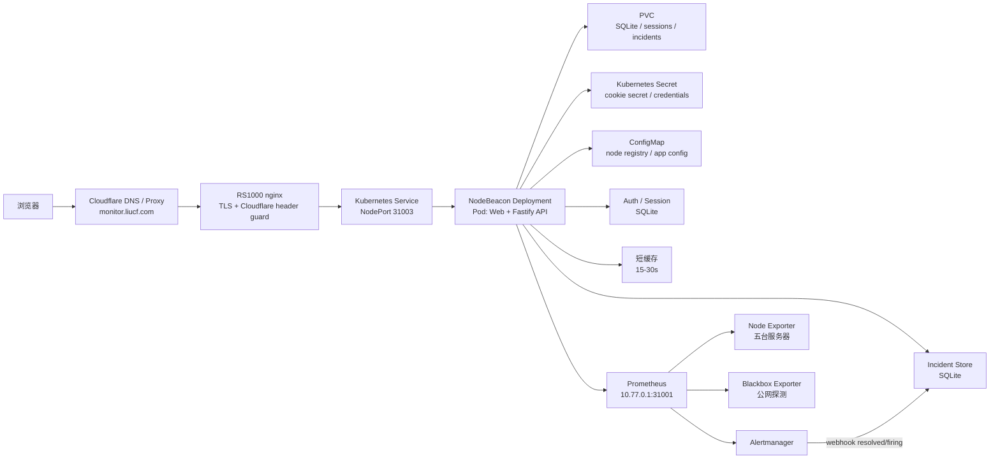
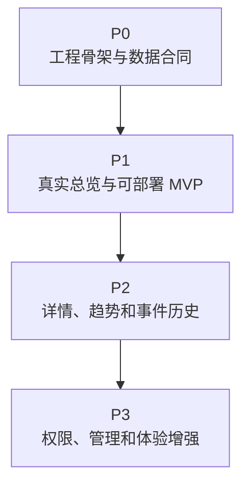

# NodeBeacon 开发文档

最后更新：2026-07-06

## 决策记录

本文件描述 NodeBeacon 当前设计。关键技术选择的原因记录在 ADR 中：

- [ADR-0001: Use RS1000 k3s for Production Deployment](adr/0001-use-rs1000-k3s.md)
- [ADR-0002: Use Fastify as the Backend-for-Frontend API](adr/0002-use-fastify-bff.md)
- [ADR-0003: Query Prometheus Only from the Server Side](adr/0003-query-prometheus-server-side.md)
- [ADR-0004: Use SQLite First for NodeBeacon State](adr/0004-use-sqlite-first.md)
- [ADR-0005: Ship Web and API in One Container First](adr/0005-single-container-first.md)

## 1. 项目定位

NodeBeacon 是给当前五台服务器使用的自托管监控状态页。它不重新发明采集系统，而是复用已经部署好的 Prometheus / Node Exporter / Blackbox Exporter / Alertmanager，把原型里的假数据替换成真实指标，并补上注册登录、权限、缓存和故障事件历史。

当前目标服务器：

| 节点 | 角色 | WireGuard / 指标来源 |
| --- | --- | --- |
| RS1000 | k3s + Prometheus + Grafana + Alertmanager | Prometheus 内部 node-exporter target |
| dmit-uswest | 公网入口 + 被监控节点 | `10.77.0.2:9100` |
| hostbrr-4t | 被监控节点 | `10.77.0.3:9100` |
| netcup-1o | 被监控节点 | `10.77.0.4:9100` |
| huawei-2c1g | 被监控节点 | `10.77.0.5:9100` |

生产入口计划：

- 域名：`https://monitor.liucf.com/`
- 已选部署位置：RS1000 k3s，使用 Kubernetes Pod / Deployment 管理。
- Namespace：`nodebeacon`，和已有 `sre-lab` 学习服务隔离。
- 入口链路：Cloudflare 橙云代理 -> RS1000 nginx -> RS1000 k3s。
- 当前源站：Cloudflare `monitor.liucf.com` 的 IPv4 源站指向 RS1000；dmit-uswest 不再承载 monitor 入口。
- 当前状态（2026-07-06 起）：NodeBeacon 已上线。RS1000 nginx 已从 `204 No Content` 切换为反代 k3s Service（NodePort 31003），`https://monitor.liucf.com/` 展示真实五节点总览。
- 第一版目标（已达成）：替换当前轻量 `monitor-status` 应用，保留现有域名和 Cloudflare 安全边界。

## 2. 总体架构



关键原则：

- 前端不直接访问 Prometheus，避免暴露 Prometheus 地址、Basic Auth、PromQL 查询能力和 CORS 面。
- 后端只开放固定 API，不接受任意 PromQL。所有查询走白名单和服务端参数校验。
- Prometheus 继续负责采集和时序存储，NodeBeacon 后端只做数据适配、缓存、鉴权和业务聚合。
- 五台服务器的元数据放在配置文件或数据库里，不从指标里猜测展示名、区域、国旗、供应商。

## 3. 后端开发方向

推荐第一版后端：`Node.js + TypeScript + Fastify`。

原因：

- API 轻，Fastify 足够快，结构清楚。
- 很适合做 Prometheus BFF：批量请求、缓存、格式化、鉴权。
- 与当前 k3s 部署、单容器交付和 Prometheus BFF 方向一致。

建议模块：

| 模块 | 职责 |
| --- | --- |
| `prometheusClient` | 封装 `/api/v1/query` 和 `/api/v1/query_range` |
| `metricsService` | 把 CPU、内存、磁盘、网络、uptime 等 PromQL 聚合成节点数据 |
| `nodeRegistry` | 管理五台服务器的展示名、分组、区域、标签和 Prometheus label 映射 |
| `authService` | 注册、登录、退出、会话校验、密码 hash |
| `adminService` | 管理后台数据聚合、节点展示配置、手动分组和系统设置写入 |
| `incidentService` | 读取当前告警和历史故障事件 |
| `cacheService` | 给总览接口加 15-30 秒缓存，避免前端刷新打爆 Prometheus |
| `config` | 管理 Prometheus URL、密钥、cookie secret、是否允许注册等配置 |

## 4. API 草案

| API | 用途 | 登录要求 |
| --- | --- | --- |
| `GET /api/status` | 五台服务器总览，替换前端卡片假数据 | 公开 |
| `GET /api/nodes` | 节点列表和元数据 | 公开 |
| `GET /api/nodes/:id` | 单台服务器详情 | 登录 |
| `GET /api/nodes/:id/range?metric=cpu&range=4h` | 单指标趋势图 | 登录 |
| `GET /api/latency` | blackbox 公网探测结果 | 公开 |
| `GET /api/incidents` | 故障事件时间线 | 登录 |
| `POST /api/auth/register` | 注册 | 关闭 |
| `POST /api/auth/login` | 登录 | 公开 |
| `POST /api/auth/logout` | 退出 | 登录 |
| `GET /api/auth/me` | 当前用户 | 登录 |
| `GET /api/admin/summary` | 管理后台总览：节点配置、用户、系统状态摘要 | `owner` |
| `GET /api/admin/nodes` | 管理端节点列表，包含展示配置和 Prometheus label 映射 | `owner` |
| `PATCH /api/admin/nodes/:id` | 修改节点展示名、手动分组、区域、标签、排序和可见性 | `owner` |
| `GET /api/admin/users` | 用户和角色列表 | `owner` |

总览接口返回的数据应该接近前端原型的数据结构，但字段改成稳定 JSON：

```json
{
  "generatedAt": "2026-07-03T10:30:00+08:00",
  "summary": {
    "total": 5,
    "online": 5,
    "regions": 3
  },
  "nodes": [
    {
      "id": "dmit-uswest",
      "name": "dmit-uswest",
      "online": true,
      "group": "HK",
      "provider": "DMIT",
      "cpu": { "percent": 12.3 },
      "memory": { "percent": 48.1, "usedBytes": 1024, "totalBytes": 2048 },
      "disk": { "percent": 37.9, "usedBytes": 1024, "totalBytes": 4096 },
      "network": { "rxBytesPerSecond": 12345, "txBytesPerSecond": 6789 },
      "uptimeSeconds": 1234567,
      "load1": 0.21
    }
  ]
}
```

## 5. 注册登录策略

这个项目面向个人监控系统，第一版关闭自由注册：

- 默认 `ALLOW_REGISTER=false`。
- 管理员通过环境变量创建初始账号。
- 密码使用 `argon2id` hash，不保存明文。
- 会话使用 `httpOnly + Secure + SameSite=Lax` cookie。
- 角色先做两个：`owner` 和 `viewer`。
- 公开状态页可展示基础在线状态；敏感信息如完整流量、故障历史、服务器详细配置需要登录。

## 6. Prometheus 数据适配方向

第一版只做必需指标：

| 页面字段 | 数据来源 |
| --- | --- |
| 在线状态 | `up` 或 `probe_success` |
| CPU | `node_cpu_seconds_total` |
| 内存 | `node_memory_MemTotal_bytes` / `node_memory_MemAvailable_bytes` |
| 磁盘 | `node_filesystem_size_bytes` / `node_filesystem_free_bytes` |
| uptime | `node_time_seconds - node_boot_time_seconds` |
| load | `node_load1` |
| 网络速度 | `rate(node_network_receive_bytes_total[1m])` / `rate(node_network_transmit_bytes_total[1m])` |
| 入口延迟 | `probe_duration_seconds` |
| HTTP 状态码 | `probe_http_status_code` |

注意事项：

- RS1000 的 Prometheus target 需要稳定 label，避免展示层依赖 Pod IP。
- 磁盘口径建议继续使用 `free_bytes / size_bytes`，更接近 `df -h /`。
- 所有查询要按节点配置生成，不允许用户把任意 PromQL 传给后端执行。
- `/api/status` 做短缓存，趋势接口按 range 做更长缓存。

## 7. 推荐代码结构

```text
NodeBeacon/
  apps/
    web/                 # 前端应用，复刻 Status Page.dc.html
    api/                 # Fastify API / Prometheus BFF
  config/
    nodes.example.yaml   # 五台服务器展示配置示例，不放密钥
  docs/
    development-plan.md
    reference/            # 旧 monitor-status 的参考副本
  infra/
    k8s/                 # RS1000 k3s 部署清单
    nginx/               # RS1000 nginx 入口配置示例
```

第一版保持 `apps/web` 和 `apps/api` 的源码边界，但交付为一个服务：后端托管静态前端文件，同时提供 `/api/*`。

## 8. 开发阶段规划与优先级清单

第一版开发目标不是一次性做完整监控平台，而是尽快把当前 HTML 原型变成可部署、可访问真实 Prometheus 数据的状态页。优先级按“能否阻塞 MVP 上线”排序：

| 优先级 | 定义 | 处理原则 |
| --- | --- | --- |
| P0 | 基础工程和数据合同，缺失会阻塞所有后续开发 | 先做，必须有清晰交付物 |
| P1 | MVP 上线必需能力，完成后可以替换旧状态页 | 第一轮开发主线 |
| P2 | 让产品从“能看”变成“好用”的核心增强 | MVP 稳定后连续推进 |
| P3 | 管理、扩展和长期体验优化 | 不阻塞第一版上线 |



### P0：工程骨架与数据合同

| 状态 | 任务 | 交付标准 | 备注 |
| --- | --- | --- | --- |
| 已完成 | 初始化前端工程 `apps/web` | React + TypeScript 项目可本地启动；能承载当前状态页原型 | 优先复刻真实页面，不做营销首页 |
| 已完成 | 初始化后端工程 `apps/api` | Fastify + TypeScript 项目可本地启动；暴露 `/healthz` | 第一版后端同时托管静态前端 |
| 已完成 | 定义 `/api/status` 数据合同 | 有 TypeScript 类型、示例 JSON、错误格式和字段说明 | 前后端先围绕这一个接口对齐 |
| 已完成 | 建立节点配置 `config/nodes.example.yaml` | 包含五台节点的 `id/name/provider/group/labels/displayOrder` 示例 | `group` 作为手动展示分组，不从指标自动猜测；不写入任何真实密钥 |
| 已完成 | 建立环境变量样例 `.env.example` | 覆盖 `PROMETHEUS_URL`、cookie secret、注册开关、缓存 TTL | 真实值只放部署环境 |
| 已完成 | 从 HTML 原型拆出 UI 结构 | 明确布局、主题、节点卡片、表格视图、筛选项和状态色 | 以复用当前视觉为主 |
| 已完成 | 配好基础脚本 | 至少有 `dev`、`build`、`typecheck`、`lint` | 没有测试框架前先保证类型检查 |

P0 完成判定：前端和后端都能独立启动，`/api/status` 的返回结构冻结到第一版，后续开发不再围绕字段名反复改动。

P0 验证记录：2026-07-03 已通过 `pnpm install`、`pnpm typecheck`、`pnpm build`、`pnpm lint`；编译后的 API 已验证 `/healthz`、`/api/status` 和静态前端托管；浏览器验证网格卡片、表格视图和主题切换可用；前端首页当前直接承载 `Status Page.dc.html` 原型文件，保证浅色主题、统计条、搜索区、分组切换和节点卡片布局 1:1 呈现，后续再逐步把原型假数据替换成 `/api/status` 数据。

### P1：MVP 上线必需能力

| 状态 | 任务 | 交付标准 | 备注 |
| --- | --- | --- | --- |
| 已完成 | 实现 Prometheus client | 只封装白名单查询；支持超时、错误分类和基础日志 | 不开放任意 PromQL；支持可选 Basic Auth / Bearer Token |
| 已完成 | 实现 `metricsService` | 聚合在线状态、CPU、内存、磁盘、uptime、load、网络速率 | 第一版只服务 `/api/status`；节点指标缺失时降级为 degraded 或 unknown |
| 已完成 | 实现 `/api/status` | 返回五台节点真实数据；单节点失败不拖垮整页 | 配置 `PROMETHEUS_URL` 时走真实 Prometheus；不可用时返回 stale 缓存或 fixture fallback |
| 已完成 | 增加短缓存 | 总览接口缓存 15-30 秒；返回 `generatedAt` | 防止刷新页面打爆 Prometheus；过期缓存可作为 stale 降级返回 |
| 已完成 | 复刻状态页主界面 | 卡片视图、表格视图、分组筛选、明暗主题可用 | 当前通过高保真原型 iframe 保持 1:1 外观；后续再做组件化收敛 |
| 已完成 | 分组筛选接入节点配置 | 首页分组选项从节点手动分组生成；支持 `All` 和自定义分组 | 已通过 `/api/status` + `config/nodes.example.yaml` 驱动原型分组；Prometheus 真指标接入仍单独推进 |
| 已完成 | 接入真实 API 状态 | 前端有 loading、empty、error、stale 数据状态 | 运行页显示 Live/Loading/Fallback/Stale/No data 状态，并保留空节点和筛选无结果反馈 |
| 已完成 | 单容器构建 | API 托管前端静态产物；镜像能本地运行 | 符合 ADR-0005；多阶段 `Dockerfile`，pnpm workspace 构建后裁剪 devDependencies |
| 已完成 | k3s 基础部署清单 | Deployment、Service、Secret/ConfigMap 示例、PVC 占位 | 已部署到 RS1000 `nodebeacon` namespace，`kubectl apply -k infra/k8s` |
| 已完成 | RS1000 nginx 接入说明 | 明确把 `monitor.liucf.com` upstream 指到 NodePort | 已上线：nginx 从 `204 No Content` 切到反代 `10.77.0.1:31003` |

P1 完成判定：`monitor.liucf.com` 可以展示真实五台节点总览；Prometheus 不暴露给浏览器；前端刷新、后端重启和单节点异常都有可接受表现。

P1 进展记录：2026-07-03 已将 `Status Page.dc.html` 原型副本接入 `/api/status`，节点卡片、在线数、更新时间、流量/速率摘要和分组筛选可以从 API 合同数据渲染；浏览器验证可见节点为 `config/nodes.example.yaml` 中的 5 台服务器，旧原型假节点不再显示。

P1 进展记录：2026-07-03 已完成 Prometheus client、`metricsService`、`/api/status` 真实指标适配和短缓存。后端只在服务端生成白名单 PromQL，覆盖 `up`、CPU、内存、根分区磁盘、load、uptime 和网络速率；单节点指标缺失会降级为 `degraded` 或 `unknown`，Prometheus 整体不可用时返回过期缓存或 fixture fallback，并通过 `cache.stale=true` 标记。已通过本地 mock Prometheus 和无 Prometheus fallback 路径验证；生产联调时只需要配置真实 `PROMETHEUS_URL` 和节点 label。

P1 进展记录：2026-07-04 已补齐前端 API 状态反馈。状态页在 `/api/status` 加载中、请求失败并使用 fallback、后端返回 `cache.stale=true`、API 返回空节点列表、分组或搜索无结果时都会显示对应状态；正常数据路径显示 `Live data`。同时将运行页 iframe 版本号升级，避免浏览器继续使用旧原型缓存。

P1 进展记录：2026-07-06 已完成单容器构建、k3s 部署和 nginx 上线，P1 全部收尾，MVP 正式对外。

- **单容器**：新增多阶段 `Dockerfile`（node:20-slim + 固定 pnpm@10.15.0）和 `.dockerignore`。构建 shared → api → web 后 `pnpm install --prod` 裁剪 devDependencies，运行时 API 在 `:3001` 同时托管 `/api/*` 和 `apps/web/dist`。
- **部署清单**：新增 `infra/k8s/`（namespace、node registry ConfigMap、Secret 示例、Deployment、NodePort 31003 Service、SQLite 占位 PVC、kustomization）。Deployment 走只读根文件系统、非 root、就绪/存活探针，`PROMETHEUS_URL` 指向集群内 `monitoring-kube-prometheus-prometheus.monitoring.svc:9090`。
- **Prometheus label 修正**（关键）：核对线上 Prometheus 后发现旧 `config/nodes.example.yaml` 的 `instance: 10.77.0.x:9100` 与真实抓取标签不符，会导致 `/api/status` 全部拿不到真实数据。真实映射：RS1000 = `{job="node-exporter"}`（集群内 DaemonSet，单节点），四台 VPS = `{job="external-vps-node", instance=<名字>}`。已同步修正示例配置和 ConfigMap。
- **镜像交付**：在 RS1000 上 `docker build` 后 `docker save | k3s ctr images import`，Deployment 用 `imagePullPolicy: Never`，不依赖外部 registry。
- **上线切换**：RS1000 nginx 从 `location / { return 204; }` 切换为反代 `http://10.77.0.1:31003`（切换前已备份为 `*.bak.pre-golive-*`）。已验证 `https://monitor.liucf.com/` 返回 200，`/api/status` 返回 `stale=false` 的真实五节点数据（5/5 在线，含真实 CPU/内存/磁盘/负载/网络速率/uptime）。
- 部署与回滚步骤见 [`infra/README.md`](../infra/README.md)。

### P2：核心增强

| 状态 | 任务 | 交付标准 | 备注 |
| --- | --- | --- | --- |
| 待做 | 实现 `GET /api/nodes` 和 `GET /api/nodes/:id` | 节点元数据和单节点详情可查询 | 复用 node registry |
| 待做 | 实现趋势查询接口 | `query_range` 支持 CPU、内存、磁盘、网络、延迟 | 严格限制 `metric` 和 `range` 枚举 |
| 待做 | 节点详情页 | 展示趋势图、近期状态、基础指标和探测结果 | 可从卡片和表格进入 |
| 待做 | Blackbox 延迟和 HTTP 状态 | 展示公网探测延迟、成功率和 HTTP 状态码 | 用于判断入口和节点健康 |
| 待做 | Alertmanager webhook | 接收 firing/resolved 事件并归一化 | 先落 SQLite |
| 待做 | Incident 时间线 | 展示故障开始、恢复、持续时间和影响节点 | 登录前后展示粒度可不同 |
| 待做 | NodeBeacon 自身可观测性 | API 请求量、错误率、Prometheus 查询耗时、缓存命中率 | 指标后续进 Grafana/Loki |

P2 完成判定：用户可以从总览定位问题节点，进入详情页查看最近趋势，并通过 incident 时间线理解故障发生和恢复过程。

### P3：权限、管理和长期体验

| 状态 | 任务 | 交付标准 | 备注 |
| --- | --- | --- | --- |
| 待做 | 登录和会话 | `owner/viewer` 两个角色；cookie 使用 `httpOnly + Secure + SameSite=Lax` | 注册默认关闭 |
| 待做 | 初始管理员创建方式 | 支持通过环境变量创建初始 `owner` 账号 | 避免开放自由注册 |
| 待做 | 管理员后台入口和布局 | `/admin` 仅 `owner` 可访问；包含总览、节点、用户、系统设置入口 | 参考 Komari 的克制组件密度和运维工具布局，不做营销式页面 |
| 待做 | 节点手动分组管理 | 管理后台可修改服务器展示分组、展示名、区域、标签、排序和可见性 | 修改后影响首页分组筛选和节点列表展示 |
| 待做 | 管理端最小闭环 | 可查看用户、节点配置摘要、系统状态，并能保存节点展示配置 | 不做重型后台，先覆盖日常维护路径 |
| 待做 | 管理后台节点配置页 | 表格展示所有节点；详情抽屉或编辑面板修改分组和展示元数据 | 组件布局可参考 Komari：顶部摘要、紧凑表格、分段控件、清晰操作按钮 |
| 待做 | SQLite 备份策略 | 有备份路径、恢复步骤、保留周期和恢复演练说明 | 第一版固定使用 SQLite |
| 待做 | Cloudflare 缓存和 WAF 规则 | `/api/*`、`/auth/*` 不缓存；登录限速 | 和 RS1000 nginx 配置一起记录 |
| 待做 | UI 细节打磨 | 空状态、骨架屏、键盘可访问性、移动端触控区域 | 保证长期使用舒服 |
| 待做 | 文档补齐 | README、部署文档、环境变量、故障排查、ADR 更新 | 每个生产决策都能追溯 |

P3 完成判定：NodeBeacon 不只是能上线，还能长期维护、升级、备份，并且登录态和敏感信息展示边界清晰。

管理后台第一版建议保持轻量，先做一个运维工具式后台，而不是完整 CMS：

- `/admin/overview`：系统健康、数据源连接、缓存命中、最近告警和版本信息。
- `/admin/nodes`：服务器列表、手动分组、标签、区域、排序、是否公开展示。
- `/admin/users`：用户列表、角色、最近登录时间、禁用账号。
- `/admin/settings`：注册开关、缓存 TTL、公开页展示策略和安全提示。

后台视觉延续状态页的设计语言：浅色和深色主题一致、顶部摘要 + 紧凑表格 + 右侧抽屉/面板编辑；组件密度和操作路径可以参考 Komari 的监控后台风格，但 NodeBeacon 只保留当前项目需要的节点展示配置、用户和系统状态管理。

Komari 参考源码链接，供接手开发样式和布局时直接对照：

| 用途 | 参考链接 | NodeBeacon 使用方式 |
| --- | --- | --- |
| Komari 主项目 | [komari-monitor/komari](https://github.com/komari-monitor/komari) | 只参考产品边界和页面入口，不复用远控、agent 或执行类能力 |
| Komari 前端项目 | [komari-monitor/komari-web](https://github.com/komari-monitor/komari-web/tree/radix) | 主要参考对象；当前前端默认分支为 `radix` |
| 首页布局 | [`src/pages/Index.tsx`](https://github.com/komari-monitor/komari-web/blob/radix/src/pages/Index.tsx) | 参考状态页首页的信息密度、节点区域组织和加载入口 |
| 首页节点卡片 | [`src/components/NodeDisplay.tsx`](https://github.com/komari-monitor/komari-web/blob/radix/src/components/NodeDisplay.tsx)、[`src/components/Node.tsx`](https://github.com/komari-monitor/komari-web/blob/radix/src/components/Node.tsx) | 参考卡片内容层级、状态标签、指标条和节点基础信息布局 |
| 首页表格视图 | [`src/components/NodeTable.tsx`](https://github.com/komari-monitor/komari-web/blob/radix/src/components/NodeTable.tsx) | 参考紧凑表格、列密度、节点状态和指标展示方式 |
| 顶部导航和主题 | [`src/components/NavBar.tsx`](https://github.com/komari-monitor/komari-web/blob/radix/src/components/NavBar.tsx)、[`src/components/ThemeSwitch.tsx`](https://github.com/komari-monitor/komari-web/blob/radix/src/components/ThemeSwitch.tsx)、[`src/components/ColorSwitch.tsx`](https://github.com/komari-monitor/komari-web/blob/radix/src/components/ColorSwitch.tsx) | 参考顶部操作区、主题切换、语言/配色入口的组件拆分 |
| 全局样式和节点样式 | [`src/global.css`](https://github.com/komari-monitor/komari-web/blob/radix/src/global.css)、[`src/components/NodeDisplay.css`](https://github.com/komari-monitor/komari-web/blob/radix/src/components/NodeDisplay.css) | 参考变量、基础排版、暗色/浅色过渡和节点列表样式 |
| UI 基础组件 | [`src/components/ui`](https://github.com/komari-monitor/komari-web/tree/radix/src/components/ui) | 参考 button、table、drawer、input、select 等基础组件的 API 和视觉密度 |
| 管理后台布局 | [`src/pages/admin/_layout.tsx`](https://github.com/komari-monitor/komari-web/blob/radix/src/pages/admin/_layout.tsx)、[`src/components/admin/AdminPanelBar.tsx`](https://github.com/komari-monitor/komari-web/blob/radix/src/components/admin/AdminPanelBar.tsx) | 参考后台侧边栏/顶部栏/内容区结构，但菜单项按 NodeBeacon 简化 |
| 管理后台首页 | [`src/pages/admin/index.tsx`](https://github.com/komari-monitor/komari-web/blob/radix/src/pages/admin/index.tsx) | 参考后台总览页的信息卡片和状态摘要 |
| 管理后台节点表 | [`src/components/admin/NodeTable.tsx`](https://github.com/komari-monitor/komari-web/blob/radix/src/components/admin/NodeTable.tsx)、[`src/components/admin/NodeTable`](https://github.com/komari-monitor/komari-web/tree/radix/src/components/admin/NodeTable) | 参考管理端节点表格、批量操作和编辑入口；NodeBeacon 首先实现分组/标签/排序/可见性 |
| 管理后台设置页 | [`src/pages/admin/settings`](https://github.com/komari-monitor/komari-web/tree/radix/src/pages/admin/settings)、[`src/components/admin/SettingCard.tsx`](https://github.com/komari-monitor/komari-web/blob/radix/src/components/admin/SettingCard.tsx) | 参考设置页分组、表单密度和卡片式配置项 |

接手实现时先从 Komari 前端源码看布局和组件拆分，再回到 NodeBeacon 按现有数据合同重写：样式和交互节奏可以参考，API、权限、节点模型和 Prometheus 适配必须按 NodeBeacon 文档实现。

### 第一轮开发顺序

建议第一轮只承诺 P0 + P1，顺序如下：

1. 搭好 `apps/web`、`apps/api` 和基础脚本。
2. 固定 `/api/status` 类型和节点配置格式。
3. 把 HTML 原型迁移成 React 页面，先用 fixture 数据跑通。
4. 实现 Prometheus 白名单查询和 `/api/status`。
5. 前端切到真实 API，并补齐 loading/error/stale 状态。
6. 构建单容器镜像，准备 k3s Deployment / Service / Secret / ConfigMap。
7. 在 RS1000 k3s 试运行，通过 nginx 把 `monitor.liucf.com` 接入 NodeBeacon。

暂缓事项：完整账号体系、管理后台编辑能力、Incident 历史和复杂通知都放到 P2/P3。P1 先保留节点手动分组的数据结构和首页展示路径，后台页面等登录闭环完成后再接入写入能力。这样每一步都能产生可验证结果，也能避免第一版在账号系统和细节优化里失焦。

## 9. 部署决策：RS1000 k3s

生产部署已经确定采用 **RS1000 k3s Pod / Deployment**。Docker 镜像只是交付格式，真正的运行和管理交给 k3s。

| 运行方式 | 结论 | 原因 |
| --- | --- | --- |
| RS1000 k3s Pod / Deployment | 采用 | 最适合学习和长期管理；日志、重启、Secret、ConfigMap、PVC、Service 都标准化 |

第一阶段：部署在 RS1000 k3s，并继续使用 `https://monitor.liucf.com/` 作为生产入口。

```text
monitor.liucf.com
  -> Cloudflare Proxied
  -> RS1000 nginx :443
  -> http://10.77.0.1:31003
  -> RS1000 k3s Service nodebeacon NodePort 31003
  -> Deployment nodebeacon
  -> Prometheus / Alertmanager / SQLite
```

原因：

- 你的 Prometheus、Alertmanager、Loki 都已经在 RS1000 附近，NodeBeacon 放这里最短路径。
- 后端可以直接查 `10.77.0.1:31001` 或集群内 Prometheus service，不需要把 Prometheus API 暴露给公网。
- Alertmanager webhook 可以直接打到 NodeBeacon 的集群内服务，incident 历史更容易做。
- 现有 `monitor.liucf.com` 入口已经切到 Cloudflare -> RS1000 nginx -> RS1000 k3s，替换旧状态页即可。

### Cloudflare 配置判断

当前 `monitor.liucf.com` 已经在 Cloudflare 开启橙云代理，并把 IPv4 源站切到 RS1000。dmit-uswest 上的 monitor Caddy 反代已经移除。旧 `monitor-status` k3s 资源也已移除，参考副本保留在 `docs/reference/legacy-monitor-status/`。2026-07-06 已完成上线：RS1000 nginx 从 `204 No Content` 切换为反代新的 k3s Service（`http://10.77.0.1:31003`），切换前配置备份为 `/etc/nginx/conf.d/monitor.liucf.com.conf.bak.pre-golive-*`。

| 项目 | 当前建议 | 是否需要改 |
| --- | --- | --- |
| DNS 记录 | `monitor.liucf.com` 继续代理到 RS1000 `152.53.171.134` | 已切换 |
| Proxy 状态 | 继续开启橙云代理 | 不需要 |
| Origin 链路 | 已上线：RS1000 nginx 反代到 NodeBeacon Service `http://10.77.0.1:31003` | 已切换 |
| Cloudflare Header Guard | RS1000 nginx 要求 `CF-Connecting-IP`，直连源站返回 404 | 保持 |
| TLS / 证书 | RS1000 nginx 使用 Let’s Encrypt `monitor.liucf.com` 证书 | 保持自动续期 |
| 缓存规则 | `/api/*`、`/auth/*` 不缓存；HTML 短缓存或不缓存；静态资源可长缓存 | 建议补充 |
| WAF / Rate Limit | 对 `/api/auth/login` 做限速，保护登录接口 | 建议补充 |

上线接入动作：

- NodeBeacon Service 使用 NodePort `31003`。
- RS1000 nginx upstream 指向 `http://10.77.0.1:31003`。
- Cloudflare DNS 和代理状态保持现状。

## 10. 安全要求

- 不提交任何真实密码、Token、chat_id、WireGuard private key。
- 生产密钥放 Kubernetes Secret，本地开发使用 `.env`。
- 后端不开放任意 PromQL 查询接口。
- 登录 cookie 必须 `httpOnly`，生产环境必须 `Secure`。
- 对 `/api/auth/login` 做限速。
- 对公开接口做缓存，避免刷新页面时连续打 Prometheus。
- RS1000 nginx 继续保留 Cloudflare header guard，防止绕过 Cloudflare 直连源站。
- Prometheus Basic Auth 只在服务端使用，不出现在浏览器和前端 bundle。
- Cloudflare 侧不要缓存 `/api/*` 和 `/auth/*`，避免状态页、登录态和故障信息出现过期数据。

## 11. 运维要求

- NodeBeacon 自身暴露 `/healthz` 和 `/readyz`。
- NodeBeacon 自身日志进入 Loki。
- 为 API 添加基础指标：请求量、错误率、Prometheus 查询耗时、缓存命中率。
- SQLite 需要定期备份，并保留可执行的恢复步骤。
- 部署文件放 `infra/k8s/`，至少包含 Deployment、Service、Secret 示例和 RS1000 nginx 入口说明。
