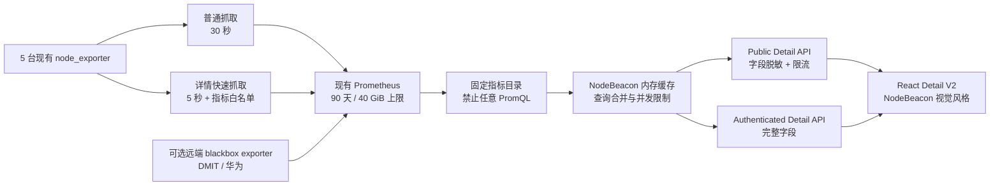

# NodeBeacon 节点详情页 V2：Komari 截图功能等价实施方案

状态：**Core V2 deployed / 核心 V2 已发布生产；v1.0.10 已按 Komari 保存页面与官方源码对齐布局；G2、G3 的 30 分钟门禁、G4/G5、G6 已完成；G3 24 小时观察按用户指示跳过，G7 的长时观察仍未完成**
文档日期：2026-07-15
生产基线最后核验：2026-07-23（Asia/Shanghai）
目标页面：`https://monitor.liucf.com/nodes/:id`
功能参考：[`https://ss.akz.moe/instance/8832553d-a03f-4312-af8b-c5d9ed959c93`](https://ss.akz.moe/instance/8832553d-a03f-4312-af8b-c5d9ed959c93)

> 本文是给后续开发者或 AI Agent 的可执行交接文档。2026-07-15 已完成核心业务代码、公开 API、图表布局、配置模板和测试，并按真实 Prometheus target discovery 完成五节点 fast scrape、registry 迁移和 retention 90d/40GB 变更。2026-07-23 已发布 NodeBeacon 1.0.10：默认五图表组合、统一 Lucide 图标和控件、真实像素响应式坐标轴、双轴指标、dnd-kit 触控与键盘排序、移动端节点选择器、v2 布局迁移，以及按 Komari 保存页面与官方源码对齐的 300px + 16px + 1100px 桌面布局均已完成。`node-detail-fast` 模板已验证可用；24 小时观察按用户指示跳过，不能将其误记为已完成。

### 本次落地范围

- 已实现 `ApiNodeDetailV2Response`、批量趋势查询、自动步长、平均值/最大值/P95、缓存和公开节点鉴权边界。
- 已实现节点画像、实时摘要、历史图表、EWMA、时间范围、拖拽排序、S/M/L、删除/新增图表和 series chip 显隐。
- 已接入节点安全详情配置，并提供 `infra/monitoring/node-detail-fast.example.yaml` 与接入说明。
- 已通过 API 全量测试（75 tests）、workspace lint/typecheck/build、Playwright E2E（19/19），并用真实 Prometheus 只读隧道验证 RS1000 的 detail/series API。
- 生产已运行 NodeBeacon `1.0.10`（应用 commit `68f4a01f5d1e1ca14fd39b95fe6a2b97ff4a14e1`，Deployment revision 46）；5 秒 fast scrape 使用 Helm revision 15，五个 target 均已通过 30 分钟稳定门禁。

## 1. 交付目标

把 NodeBeacon 当前较简单的节点详情页升级为“与参考截图可见功能等价”的详情页，同时继续使用 NodeBeacon 自己的视觉语言和现有基础设施。

“功能等价”具体指：

- 有分组节点列表，可以快速切换节点。
- 有完整的系统画像卡：CPU、GPU、架构、虚拟化、OS、内核、网络、总流量、内存、Swap、磁盘、运行时间和最后上报。
- 有实时、1 天、7 天、60 天和自定义时间范围。
- 有采样算法、EWMA、重置和新增图表。
- 图表支持拖拽排序、S/M/L 尺寸、删除、隐藏和增减 series。
- 默认提供 CPU + Load、RAM + Swap、Disk、Network、Latency 等图表。
- 匿名用户可以查看公开节点的安全详情和趋势，不再因为未登录而看不到趋势。
- 页面继续使用 NodeBeacon 的卡片、状态胶囊、颜色变量、深浅主题、国际化和响应式布局。

不要求也禁止：

- 复制参考站的名称、动漫背景、紫色玻璃主题或其他品牌资产。
- 引入 Komari 的远程命令、Web SSH 或远程终端。
- 让浏览器直接访问 Prometheus 或接受客户端传入的任意 PromQL。
- 为不存在的 GPU、Swap、延迟等能力伪造数据。
- 恢复此前已经移除的全局 `Service Probes` 表格；延迟只在当前节点详情中展示。

## 2. 重要口径：5 秒实时与 1 秒实时

本文默认实施路径采用 **Prometheus 5 秒白名单快速抓取**：

- 用户看到的交互、控制项和图表能力与截图等价。
- 数据采样间隔为 5 秒，而 Komari Agent 默认大约为 1 秒。
- 页面不得把 5 秒数据宣传成“1 秒实时”。产品文案可以使用“实时”，帮助提示应明确“约 5 秒刷新”。

如果项目所有者要求严格的 1 秒采样，必须单独实施本文第 17 节的“只读 Agent 路线”。中心增加一个 Pod 并不能从四台外部 VPS 获得 1 秒主机数据，采集进程必须运行在每台被监控主机上。

## 3. 当前实现与缺口

### 3.1 当前代码行为

关键文件：

- [`apps/web/src/status/NodeDetailPage.tsx`](../apps/web/src/status/NodeDetailPage.tsx)
- [`apps/web/src/status/components/TrendChart.tsx`](../apps/web/src/status/components/TrendChart.tsx)
- [`apps/api/src/routes/nodes.ts`](../apps/api/src/routes/nodes.ts)
- [`apps/api/src/services/trendService.ts`](../apps/api/src/services/trendService.ts)
- [`apps/api/src/services/metricsService.ts`](../apps/api/src/services/metricsService.ts)
- [`packages/shared/src/index.ts`](../packages/shared/src/index.ts)

已确认的限制：

1. 前端已有 CPU、内存、磁盘、网络、负载五类趋势图，但 `!user` 时不会加载趋势。
2. `/api/nodes/:id/range` 使用 `requireAuth`，匿名用户无法访问趋势。
3. 时间范围只有 `1h / 4h / 24h / 7d`。
4. 当前磁盘查询只看 `/` 根分区，无法显示 `hostbrr-4t` 的 `/mnt/data`。
5. 当前负载只有 load1，没有 load5/load15。
6. 当前图表是手写 SVG，能够显示简单折线和 hover，但没有排序、尺寸、增删 series、采样算法和 EWMA。
7. 当前页面每种趋势单独请求一次；扩大指标数量后需要批量接口，避免一次刷新产生十几个 HTTP 请求。

### 3.2 当前生产基础设施

现有数据路径：

```text
5 台 node_exporter
  -> Prometheus
  -> NodeBeacon Fastify API
  -> React Web
```

节点映射见 [`infra/k8s/configmap-nodes.yaml`](../infra/k8s/configmap-nodes.yaml)：

| 节点 | Prometheus selector |
| --- | --- |
| `rs1000` | `{job="node-exporter"}` |
| `dmit-uswest` | `{job="external-vps-node",instance="dmit-uswest"}` |
| `hostbrr-4t` | `{job="external-vps-node",instance="hostbrr-4t"}` |
| `netcup-1o` | `{job="external-vps-node",instance="netcup-1o"}` |
| `huawei-2c1g` | `{job="external-vps-node",instance="huawei-2c1g"}` |

2026-07-15 只读核验快照：

| 项目 | 当前值 |
| --- | --- |
| node_exporter target | 5 个，均为 up |
| 抓取周期 | 30 秒 |
| 抓取超时 | 10 秒 |
| Prometheus 时间保留 | 30 天 |
| Prometheus 大小保留 | 40 GiB |
| Prometheus PVC | 60 GiB |
| TSDB blocks | 约 6.3 GB |
| Head active series | 约 88,402 |
| 全局写入速率 | 约 2,975 samples/s |
| 详情快速任务候选序列 | 约 189 条 |

这些数字是时间点快照，实施前必须重新核验，不能当成永久常量。

本次复核还确认了快速任务的 target 复用方式：四台外部 VPS 的实时 target
分别是 `10.77.0.2:9100`、`10.77.0.3:9100`、`10.77.0.4:9100`、
`10.77.0.5:9100`，可直接复制现有 `external-vps-node` 的静态地址；RS1000
不是固定的 `10.77.0.1:9100`，而是由 Kubernetes `ServiceMonitor`
`monitoring-prometheus-node-exporter` 发现，当前 endpoint 为
`152.53.171.134:9100`，因此模板使用 Kubernetes endpoints discovery，不能写死
RS1000 的 Pod/宿主机地址。

### 3.3 已有与缺失指标

已经存在：

- `node_uname_info`：架构、内核、Linux 版本。
- `node_os_info`：OS 名称和版本。
- `node_dmi_info`：DMI 和虚拟化线索。
- `node_cpu_seconds_total`：CPU 使用率和逻辑核心数。
- `node_memory_*`：RAM 和 Swap。
- `node_load1`、`node_load5`、`node_load15`。
- `node_filesystem_*`：各真实文件系统容量。
- `node_network_receive_bytes_total`、`node_network_transmit_bytes_total`。
- `node_sockstat_*`：TCP/UDP socket。
- `node_procs_running`、`node_procs_blocked`。
- `node_boot_time_seconds`、`node_time_seconds`。
- `probe_duration_seconds`：现有 RS1000 到四个 WireGuard peer 的 TCP 探测耗时。

当前缺失：

- CPU 型号。
- 进程总数；当前只有 running/blocked。
- GPU 信息和 GPU 利用率。
- 从外部视角探测 RS1000 的延迟。

## 4. 目标功能验收矩阵

| 截图功能 | 必须实现 | 数据来源 | 验收口径 |
| --- | --- | --- | --- |
| 分组服务器列表 | 是 | `/api/nodes` + registry | 桌面固定侧栏，移动端抽屉，当前节点高亮 |
| CPU 型号 | 是 | registry override 或 textfile | 缺失时显示 `Unknown`，不得猜测 |
| CPU 核心数 | 是 | `node_cpu_seconds_total` | 与主机逻辑 CPU 数一致 |
| GPU | 是，按能力 | registry/DCGM | 明确无 GPU 显示 `None`；未知和 None 必须区分 |
| 架构 | 是 | `node_uname_info.machine` | 如 `x86_64` 映射为 `amd64` |
| 虚拟化 | 是 | registry/textfile/DMI 推断 | KVM/QEMU 等结果带来源和置信度 |
| OS/内核 | 是 | `node_os_info`/`node_uname_info` | public safe 模式可隐藏精确 build |
| 网络速率 | 是 | 主网卡 counter 的 rate | 不重复计算 CNI/veth/bridge/WireGuard |
| 总流量 | 是 | 主网卡 counter | 显示自本次开机累计；范围流量使用 `increase()` |
| RAM/Swap | 是 | `node_memory_*` | SwapTotal=0 时显示 None/隐藏百分比 |
| 多磁盘 | 是 | `node_filesystem_*` | `hostbrr-4t` 可选择 `/` 和 `/mnt/data` |
| uptime | 是 | `node_boot_time_seconds` | 与主机 uptime 基本一致 |
| 最后上报 | 是 | 最后有效 node metric 时间 | target down 时保持最后一次真实样本时间 |
| 实时 | 是 | 5 秒快速抓取 | 正常数据新鲜度不超过 10–12 秒 |
| 1 天/7 天/60 天/自定义 | 是 | 普通 30 秒数据 | 自定义最大 90 天，图上说明实际数据覆盖范围 |
| 平均/最大/P95 | 是 | 服务端聚合 | 只能选择白名单算法 |
| EWMA | 是 | 前端变换 | 切换无需重新请求 Prometheus |
| 重置 | 是 | localStorage | 恢复默认图表、顺序、尺寸和 series |
| 新增图表 | 是 | chart catalog | 只能添加系统定义的图表 |
| S/M/L | 是 | CSS Grid | 各断点布局不溢出 |
| 拖拽排序 | 是 | dnd-kit | 支持鼠标、触摸和键盘 |
| 删除/隐藏/加 series | 是 | local layout | 删除后可从新增图表恢复 |
| 延迟图 | 是 | blackbox exporter | 必须标明探测源、目标和 TCP/ICMP 类型 |

## 5. 推荐总体架构



主要原则：

1. 继续 Prometheus-first，不建设第二套默认监控中心。
2. 普通任务负责历史，快速任务只负责少量实时指标。
3. 浏览器只使用 NodeBeacon API。
4. 服务端从 registry 生成 selector，客户端永远不能提交 selector 或 PromQL。
5. 公共和认证字段使用明确的可见性策略。
6. 数据缺口用 `null` 表示，不能用 0 填充。

## 6. 数据模型设计

在 [`packages/shared/src/index.ts`](../packages/shared/src/index.ts) 中新增或扩展以下类型。字段名允许在实现时微调，但语义和隐私边界必须保持。

```ts
type DetailVisibility = "safe" | "full" | "authenticated";

interface NodeCapabilities {
  realtime: boolean;
  cpuModel: boolean;
  gpu: boolean;
  swap: boolean;
  multiDisk: boolean;
  processTotal: boolean;
  latency: boolean;
}

interface NodeSystemProfile {
  osName: string | null;
  osVersion: string | null;
  kernelVersion: string | null;
  arch: string | null;
  virtualization: string | null;
  cpuModel: string | null;
  logicalCpuCores: number | null;
  physicalCpuCores: number | null;
  gpuModel: string | null;
}

interface NodeDiskMetric {
  id: string;
  label: string;
  mountpoint?: string;
  usedBytes: number;
  totalBytes: number;
  usedPercent: number;
}

interface NodeLiveMetricsV2 {
  cpuPercent: number | null;
  load1: number | null;
  load5: number | null;
  load15: number | null;
  memoryUsedBytes: number | null;
  memoryTotalBytes: number | null;
  swapUsedBytes: number | null;
  swapTotalBytes: number | null;
  disks: NodeDiskMetric[];
  networkRxBytesPerSecond: number | null;
  networkTxBytesPerSecond: number | null;
  networkRxBytesTotal: number | null;
  networkTxBytesTotal: number | null;
  tcpConnections: number | null;
  udpConnections: number | null;
  processRunning: number | null;
  processBlocked: number | null;
  processTotal: number | null;
  uptimeSeconds: number | null;
  lastReportAt: string | null;
}
```

节点 registry 建议增加：

```yaml
detail:
  enabled: true
  visibility: safe
  networkDevices:
    - eth0
  diskMounts:
    - /
  profileOverride:
    cpuModel: null
    virtualization: null
    gpuModel: null
  latencyVantages:
    - rs1000
```

静态画像字段优先级：

```text
registry 显式 override
  > nodebeacon_host_info textfile metric
  > node_exporter info metric / DMI 推断
  > null
```

`gpuModel: "None"` 表示已经确认没有 GPU；`gpuModel: null` 表示未知，两者不能混淆。

## 7. 指标目录与 PromQL 规则

新增服务端 `detailMetricCatalog`。所有 PromQL 必须由服务端预定义，并通过现有安全 selector builder 生成。

以下 `$selector` 表示从 node registry 生成的受信任 matcher；实际代码不得进行字符串直接拼接。

| 指标 | 查询语义 |
| --- | --- |
| online | `up` |
| CPU | idle counter 的 `rate()`，再计算非 idle 百分比 |
| CPU 核心数 | `count(node_cpu_seconds_total{mode="idle"})` |
| RAM | `MemTotal - MemAvailable` |
| Swap | `SwapTotal - SwapFree` |
| load | `node_load1/5/15` |
| 磁盘 | 每个允许 mountpoint 的 size/avail 或 free |
| 网络实时 | 指定主网卡 receive/transmit counter 的 `rate()` |
| 开机总流量 | 指定主网卡 counter 当前值 |
| 范围流量 | 指定范围上的 `increase(counter[range])` |
| TCP | `node_sockstat_TCP_alloc`，UI 标题应注明语义 |
| UDP | `node_sockstat_UDP_inuse` |
| uptime | `time() - node_boot_time_seconds` |
| 最后上报 | `node_time_seconds` 最后一个真实样本的时间戳 |
| OS/内核 | `node_os_info`、`node_uname_info` labels |
| DMI | `node_dmi_info` labels |
| 延迟 | `probe_duration_seconds` 或 ICMP phase duration |

细节要求：

- CPU 实时 rate window 至少覆盖 2–3 个快速抓取周期，建议 15–30 秒。
- 历史 CPU rate window 随 step 增大，不能固定 15 秒。
- SwapTotal=0 时使用 `null` 百分比，避免除零。
- 文件系统排除 `tmpfs|devtmpfs|overlay|squashfs|nsfs`。
- 网络设备使用 registry allowlist，优先 `device="eth0"`，不要仅依赖正则排除。
- 历史 counter 必须处理主机重启和 counter reset。
- target down 后 Prometheus 仍会写入新的 `up=0`，因此“最后上报”不能简单取 `up` 的样本时间；应取最后一个真实 node metric 样本。
- series 缺口保留为 `null`，图表断线显示。

建议新增文件：

```text
apps/api/src/services/detailMetricCatalog.ts
apps/api/src/services/nodeDetailService.ts
apps/api/src/services/nodeSeriesService.ts
```

不要让现有 `trendService.ts` 继续无限增长；旧接口可以暂时保留兼容，再由新批量接口替代前端调用。

## 8. API 契约

### 8.1 公共详情

```http
GET /api/public/nodes/:id/detail
```

行为：

- 只允许 `public: true` 且 `detail.enabled: true` 的节点。
- 不存在、私有或未启用节点统一返回 404，避免枚举私有节点。
- 返回系统画像、当前指标、能力和安全展示元数据。
- 不返回 Prometheus labels、WireGuard 地址、设备路径、内部 hostname。

示例结构：

```json
{
  "generatedAt": "2026-07-15T06:00:00.000Z",
  "node": {
    "id": "rs1000",
    "name": "RS1000",
    "group": "Core",
    "region": "EU",
    "status": "online",
    "profile": {},
    "capabilities": {},
    "live": {}
  }
}
```

### 8.2 实时快照

```http
GET /api/public/nodes/:id/live
```

- 固定返回快速指标。
- 服务端共享缓存 4 秒。
- 单 IP 建议限制为 60 次/分钟。
- API 仍可保持 `Cache-Control: no-store`，共享缓存放在 NodeBeacon 服务内部，避免 Cloudflare 缓存运维状态。

### 8.3 批量时间序列

```http
GET /api/public/nodes/:id/series
  ?metrics=cpu,load,memory,swap
  &from=2026-07-14T00:00:00.000Z
  &to=2026-07-15T00:00:00.000Z
  &resolution=auto
  &aggregation=avg
```

限制：

- `metrics` 必须来自 `PUBLIC_DETAIL_METRICS` 白名单。
- 单次最多 8 个 chart metric。
- `from < to`，最大跨度 90 天。
- `resolution=auto` 为默认；固定值只能来自枚举，不能任意输入秒数。
- `aggregation` 只允许 `avg|max|p95`。
- 单条 series 最多 1,000 点，推荐目标约 600–800 点。
- 服务端选择 step 和 rate window。
- API 返回实际 `dataFrom`、`dataTo`，让 UI 显示数据覆盖不足。
- 单 IP 建议限制为 20–30 次/分钟。

EWMA 不放入 API 参数。EWMA 在前端对已降采样数据进行显示变换，避免产生额外 Prometheus 查询和缓存维度。

示例结构：

```json
{
  "nodeId": "rs1000",
  "from": "2026-07-14T00:00:00.000Z",
  "to": "2026-07-15T00:00:00.000Z",
  "dataFrom": "2026-07-14T00:00:00.000Z",
  "dataTo": "2026-07-15T00:00:00.000Z",
  "stepSeconds": 120,
  "aggregation": "avg",
  "series": [
    {
      "metric": "cpu",
      "key": "cpu",
      "unit": "percent",
      "labels": {},
      "points": [[1784000000, 3.5], [1784000120, null]]
    }
  ]
}
```

### 8.4 认证详情

保留现有 `/api/nodes/:id` 和 `/api/nodes/:id/range` 兼容行为。后续可增加认证 V2 接口，用于显示：

- 精确内核 build。
- 实际 mountpoint 和 device。
- 内部 hostname。
- 完整诊断信息。

公共 API 和认证 API 复用同一 service，但必须经过不同 serializer，不能先返回完整对象再依赖前端隐藏。

## 9. 查询分辨率、降采样和缓存

建议预设：

| 范围 | 建议 step | rate window | 缓存 TTL |
| --- | ---: | ---: | ---: |
| 实时 15 分钟 | 5 秒 | 15–30 秒 | 4 秒 |
| 1 小时 | 30 秒 | 2 分钟 | 30 秒 |
| 4 小时 | 2 分钟 | 5 分钟 | 1 分钟 |
| 24 小时 | 5–10 分钟 | 15 分钟 | 5 分钟 |
| 7 天 | 30–60 分钟 | 2 小时 | 15 分钟 |
| 30 天 | 2 小时 | 4–6 小时 | 30 分钟 |
| 60–90 天 | 3–4 小时 | 8–12 小时 | 30 分钟 |
| 自定义 | 自动计算 | 随 step 计算 | 5–30 分钟 |

自动 step 规则：

```text
step = max(source scrape interval, ceil(rangeSeconds / targetPointCount))
targetPointCount = 720（推荐）
```

缓存 key 至少包含：

```text
nodeId + metric set + rounded from/to + resolution + aggregation + visibility
```

实现要求：

- 同一个页面的多指标查询在 BFF 中限制并发，建议最多 4 个 Prometheus 请求同时进行。
- 相同缓存 miss 使用 promise deduplication，避免 20 个浏览器同时击穿。
- 记录 cache hit/miss、Prometheus 查询时长、返回点数和错误数。
- 如果 60 天查询 P95 仍超过 1 秒，再增加 recording rules，不在第一步提前复杂化。

## 10. Prometheus 快速抓取任务

快速任务只抓详情需要的动态指标，不重复抓整个 node_exporter 输出。

建议在 RS1000 的 kube-prometheus-stack values 中新增 `additionalScrapeConfigs`，同时把无敏感信息的模板提交到 `infra/monitoring/`。

示意配置，实施者必须根据现有 live values 合并，不能直接覆盖：

```yaml
- job_name: node-detail-fast
  scrape_interval: 5s
  scrape_timeout: 4s
  params:
    collect[]:
      - cpu
      - meminfo
      - loadavg
      - filesystem
      - netdev
      - stat
      - sockstat
  static_configs:
    - targets: ["10.77.0.2:9100"]
      labels:
        node_id: dmit-uswest
    - targets: ["10.77.0.3:9100"]
      labels:
        node_id: hostbrr-4t
    - targets: ["10.77.0.4:9100"]
      labels:
        node_id: netcup-1o
    - targets: ["10.77.0.5:9100"]
      labels:
        node_id: huawei-2c1g
  metric_relabel_configs:
    - source_labels: [__name__]
      regex: >-
        node_(cpu_seconds_total|memory_(MemTotal|MemAvailable|SwapTotal|SwapFree)_bytes|filesystem_(size|avail|free)_bytes|load(1|5|15)|network_(receive|transmit)_bytes_total|boot_time_seconds|time_seconds|sockstat_(TCP_alloc|TCP_inuse|UDP_inuse|sockets_used)|procs_(running|blocked))
      action: keep
```

RS1000 target 应复用现有 node-exporter 的实际 discovery/target 配置，不要把公网地址新写进文档或前端配置。

实施步骤：

1. 保存 `helm get values`、当前 target 列表和 TSDB 状态。
2. 在一台外部节点上验证 `collect[]` 参数与当前 node_exporter 版本兼容。
3. 先只加入一个 target，观察 30 分钟。
4. 检查 `up{job="node-detail-fast"}`、scrape duration、samples post relabeling。
5. 加入剩余节点。
6. 验证总候选 series 和 samples/s 与估算相近。
7. 最后让 NodeBeacon realtime API 使用新 job。

失败回滚：移除 `node-detail-fast` job 并执行 Helm upgrade；普通监控、告警和旧页面不受影响。

## 11. Prometheus 保留期与容量

目标：

```yaml
prometheus:
  prometheusSpec:
    retention: 90d
    retentionSize: 40GiB
```

保持 60 GiB PVC 和 40 GiB size cap。Prometheus 时间和大小保留策略同时存在时，先达到的限制生效。

基于 2026-07-15 快照：

- 当前 6.3 GB blocks，监控栈运行约 25 天。
- 线性估算 90 天约 23 GB，仍低于 40 GiB。
- 快速任务约 189 series / 5 秒，即约 37.8 samples/s。
- 90 天约 2.94 亿 samples；按 Prometheus 官方 1–2 bytes/sample 粗估约 0.3–0.6 GB raw chunks，另有 WAL/index 开销。

这些只是容量预测，必须增加告警：

- PVC 使用率 70% warning。
- PVC 使用率 80% critical。
- `prometheus_tsdb_storage_blocks_bytes / retention_limit` 70% warning。
- 预测 7 天内填满时 warning。

上线后每天记录 7 天增长趋势。如果明显偏离估算，优先缩小快速任务指标，不要先扩大 PVC。

历史数据不能回填。若在 2026-07-15 附近把保留期调整到 90 天，当时大约只有 25 天现存数据，完整 60 天视图仍需继续累计约 35 天。UI 必须显示真实 `dataFrom`。

参考：

- [Prometheus storage](https://prometheus.io/docs/prometheus/latest/storage/)
- [Prometheus query_range API](https://prometheus.io/docs/prometheus/latest/querying/api/)

## 12. 静态画像补充

### 12.1 第一阶段：registry override

为了先完成页面功能，可以把 CPU 型号、明确的 GPU None、虚拟化 override 放到 node registry。它们变化频率极低，且无需改动五台主机。

要求：

- 配置值必须通过只读命令从目标主机核验。
- 不录入公网 IP、主机序列号、云实例 ID 或其他可识别秘密。
- UI 显示数据来源只在管理员诊断中可见。

### 12.2 第二阶段：node_exporter textfile

需要自动维护时，启用 textfile collector，定期生成：

```text
nodebeacon_host_info{cpu_model="...",virtualization="kvm",gpu_model="None"} 1
```

实现要求：

- 脚本只读 `/proc/cpuinfo`、`systemd-detect-virt` 和受控 GPU 探测命令。
- 使用临时文件 + 原子 rename 写入 `.prom`。
- 5–30 分钟运行一次，不需要 5 秒刷新。
- labels 做长度限制和字符清洗，避免意外高基数。

### 12.3 进程总数

当前只有 running/blocked。需要总数时：

1. 在一台测试节点启用 node_exporter `processes` collector。
2. 从实际 installed version 的 `/metrics` 确认 metric 名称，不要假设版本一致。
3. 观察 scrape duration、CPU 和 series 增长。
4. 稳定后逐台启用。

### 12.4 GPU

- 普通 VPS 明确配置 `gpuModel: "None"`。
- NVIDIA k3s 节点使用 DCGM Exporter DaemonSet。
- 外部 GPU 主机运行 exporter 服务并只通过受控网络抓取。
- 没有 GPU 的机器不部署 GPU Pod。

参考：[node_exporter collectors](https://github.com/prometheus/node_exporter)

## 13. 延迟图

### 13.1 第一阶段

现有 RS1000 blackbox exporter 已经探测四个 WireGuard peer 的 node_exporter TCP 端口。可立即用于外部节点详情：

```text
RS1000 -> 当前节点，TCP connect duration
```

UI 必须标注：

- 探测源：RS1000。
- 探测目标：当前节点。
- 类型：TCP，不得写成 ICMP Ping。

### 13.2 RS1000 外部视角

RS1000 探测自己没有意义。完整实现需要：

- 在 `dmit-uswest` 运行一个轻量 blackbox exporter，代表海外视角。
- 在 `huawei-2c1g` 运行一个轻量 blackbox exporter，代表中国大陆视角。
- 中心 Prometheus 通过 WireGuard 调用远端 exporter，由远端 exporter 探测 RS1000。
- metric labels 固定为 `source_node_id`、`target_node_id`、`probe_type`。

优先使用 TCP。若确实需要 ICMP：

- 使用最小化 `CAP_NET_RAW` 或合适的 `ping_group_range`。
- 不以 root 运行整个服务，除非系统限制无法避免。
- 对 exporter 端口使用 WireGuard/防火墙限制。

参考：[Prometheus Blackbox Exporter](https://github.com/prometheus/blackbox_exporter)

## 14. 前端实现

### 14.1 页面结构

建议拆分组件：

```text
apps/web/src/status/NodeDetailPage.tsx
apps/web/src/status/detail/NodeNavigator.tsx
apps/web/src/status/detail/NodeSystemProfile.tsx
apps/web/src/status/detail/NodeLiveSummary.tsx
apps/web/src/status/detail/DetailRangeTabs.tsx
apps/web/src/status/detail/DetailChartToolbar.tsx
apps/web/src/status/detail/DetailChartGrid.tsx
apps/web/src/status/detail/DetailChartCard.tsx
apps/web/src/status/detail/CustomRangeDialog.tsx
apps/web/src/status/detail/chartCatalog.ts
apps/web/src/status/detail/layoutStorage.ts
apps/web/src/status/detail/ewma.ts
```

不要把所有逻辑继续堆积在 `NodeDetailPage.tsx`。

### 14.2 布局

桌面：

```text
+----------------------+---------------------------------------------+
| 分组节点列表          | 节点标题 / 在线状态                         |
| sticky               | 系统画像卡                                  |
|                      | 时间范围                                    |
|                      | 图表工具栏                                  |
|                      | 可排序 S/M/L 图表网格                       |
|                      | 最近 incidents                              |
+----------------------+---------------------------------------------+
```

移动端：

- 节点列表改为抽屉或顶部选择器。
- 系统画像变成单列或两列信息网格。
- 所有图表强制一列，忽略桌面 S/M/L 横向跨度，但保留高度差异。
- 自定义范围使用 modal/bottom sheet。

### 14.3 图表库

建议使用 `uPlot`：

- 专注时间序列。
- Canvas 性能适合 5 秒实时更新和多 series。
- 可以自定义 axis、tooltip、cursor 和多 scale。
- 视觉样式通过 NodeBeacon CSS variables 注入。

图表排序建议使用 dnd-kit sortable：

- 使用独立拖拽 handle，避免与图表 hover/zoom 冲突。
- 同时配置 Pointer、Touch、Keyboard sensors。
- 拖动时保持图表尺寸，不重建所有 canvas。

参考：

- [uPlot](https://github.com/leeoniya/uplot)
- [dnd-kit sortable](https://docs.dndkit.com/presets/sortable)

### 14.4 图表目录

默认 chart catalog：

| chart id | 默认 series | 可选 series | scale |
| --- | --- | --- | --- |
| `cpu` | CPU | load1/load5/load15 | CPU percent + load 双 scale |
| `memory` | RAM | Swap | bytes / percent 可切换，默认 bytes |
| `disk` | 主磁盘 | 其他允许 mountpoint | bytes / percent |
| `network` | RX/TX rate | RX/TX total | rate 与 total 分 scale 或拆分图 |
| `latency` | 默认 vantage | 其他 vantage | milliseconds |
| `connections` | TCP/UDP | running/blocked/process total | count |

不要把 rate 与 cumulative total 强行画在同一个 Y 轴。如果放在同一卡片，应使用双 scale 或明确拆成两个图。

### 14.5 图表交互

每张卡片必须有：

- 标题和最新值。
- 拖拽 handle。
- S/M/L 尺寸按钮。
- 删除按钮。
- series chip，可显示/隐藏。
- 添加 series 下拉菜单。
- hover/cursor 同步时间和值。
- 空数据、错误和节点离线状态。

全局工具栏必须有：

- `avg|max|p95` 采样算法。
- EWMA 开关和说明。
- Reset。
- Add chart。

EWMA：

- 在前端处理已有 points。
- null 会切断平滑段，不能跨离线区间计算。
- alpha 使用固定默认值并在代码中记录；第一版不需要暴露高级参数。

### 14.6 布局持久化

匿名和登录用户第一版都使用：

```text
localStorage["nb-node-detail-layout:v1"]
```

建议结构：

```json
{
  "version": 1,
  "aggregation": "avg",
  "ewma": false,
  "charts": [
    {
      "id": "cpu",
      "size": "s",
      "series": ["cpu", "load1"]
    }
  ]
}
```

加载时必须 schema 校验：

- 删除未知 chart/series。
- 修复重复 ID。
- 缺失字段使用默认值。
- 解析失败则恢复默认布局。

跨设备同步不是第一版目标；以后再使用 SQLite 用户偏好表。

## 15. 视觉与产品约束

保持：

- `status.css` 的颜色变量和 light/dark theme。
- 当前圆角、边框、阴影、状态 pill、字体层级。
- 当前 OS 图标、国旗、标签和 incident 视觉。
- 中文和英文 i18n，不写死中文 UI。

可以借鉴参考页的信息密度和交互层级，但不能复制：

- 背景图。
- Logo/名称。
- 紫色玻璃质感。
- 完整布局像素值。

无数据文案要区分：

| 状态 | 文案示例 |
| --- | --- |
| 明确没有 GPU | `None` / `未安装 GPU` |
| 未采集 GPU | `数据不可用` |
| SwapTotal=0 | `未配置 Swap` |
| 节点离线 | `节点离线，图表保留最后数据` |
| 时间覆盖不足 | `当前仅有 25 天历史数据` |
| 探测未配置 | `此节点尚未配置延迟探测` |

## 16. 公共安全边界

公共 safe 默认可以显示：

- OS 家族和主版本。
- 架构、虚拟化、逻辑核心数。
- CPU 型号（项目所有者可配置为 auth-only）。
- RAM、Swap、磁盘总量和利用率。
- uptime、最后上报。
- 性能趋势和延迟。

默认不公开：

- 公网/内网/WireGuard IP。
- Prometheus job、instance、selector。
- 真实 hostname。
- `/dev/*` 设备名。
- 完整内核 build 和精确补丁版本；如确需公开，通过 visibility 配置开启。
- 云实例 ID、序列号、BIOS UUID。

接口规则：

- 私有节点和不存在节点都返回 404。
- 所有 metric、range、aggregation、resolution 参数枚举校验。
- 限制 URL 长度和 metrics 数量。
- 不记录完整 selector/IP 到公开请求日志。
- 错误响应不携带 Prometheus body。
- 现有公共 nginx 继续阻止 `/metrics`。
- 不增加命令执行、终端或 agent task 通道。

Komari Agent 的官方协议包含远程执行和终端能力；NodeBeacon 不应为了页面功能引入这些能力。参考：[Komari Agent 协议](https://komari-document.pages.dev/dev/agent)。

## 17. 可选：严格 1 秒只读 Agent 路线

只有项目所有者明确要求 1 秒数据时才实施。

### 17.1 推荐方式

开发一个最小化 `nodebeacon-agent`：

- 每台主机本地采样。
- 通过 WSS 向 NodeBeacon 上报。
- token 每节点独立，可撤销。
- 只允许 Agent -> Server 单向 report。
- 不实现服务端下发任务、命令、文件、消息或终端。
- Agent 使用非 root；需要的 host 信息通过最小只读权限获取。
- 默认 1 秒，断线指数退避，恢复后不补发无限历史。
- NodeBeacon 把短期实时数据放入受限 ring buffer 或专用时序存储。

### 17.2 不推荐的快捷方式

直接部署完整 Komari Server/Agent 会导致：

- 第二套节点管理和数据存储。
- 与 Prometheus 数据口径不一致。
- 新增 WebSocket token 管理。
- 默认协议包含远程命令和终端功能，需要额外关闭和审计。

如果为了快速验证临时使用 Komari Agent，必须启用 `--disable-web-ssh`，并把它视为实验分支，不能直接成为 NodeBeacon 生产数据面。

## 18. 测试计划

### 18.1 单元测试

- selector builder 对引号、反斜杠和非法 labels 的处理。
- 公共 metric/range/aggregation 白名单。
- auto step 和最大点数。
- RAM/Swap/disk 百分比和除零。
- counter reset 和 `increase()` 结果。
- offline gaps 保持 null。
- lastReportAt 不被 `up=0` 的新样本覆盖。
- DMI virtualization mapping。
- public serializer 不泄露敏感字段。
- EWMA 对 null 分段。
- localStorage schema 迁移和损坏恢复。

### 18.2 API 测试

- 公开节点 200。
- 私有节点、未知节点均 404。
- 任意 PromQL/selector 注入被拒绝。
- 超过 90 天、超过指标数量、非法算法返回 400。
- Prometheus 不可达返回稳定的 503 错误结构。
- 缓存 hit/miss 行为。
- route-specific rate limit 返回 429。
- 认证接口仍保持原行为。

### 18.3 前端测试

- 默认图表与截图功能矩阵一致。
- 切换节点取消上一节点未完成请求。
- 切换范围不会显示旧范围数据。
- 拖拽、尺寸、删除、添加和 reset。
- EWMA 切换不发新请求。
- 无 GPU、无 Swap、多磁盘、离线和部分数据场景。
- 中文/英文、light/dark。
- 375px、768px、1280px 和 1920px viewport。
- 键盘完成图表重排。

### 18.4 E2E

扩充 Playwright：

- 匿名打开 `/nodes/rs1000` 可以看到趋势，不出现登录门槛。
- 点击侧栏其他节点，URL 和全部数据更新。
- 选择 60 天和自定义范围。
- 新增 latency 图并调整为 L。
- 刷新页面后布局保留。
- Reset 恢复默认布局。
- 私有节点不可公开访问。

### 18.5 性能与容量

- 使用 20 个并发页面，每页 5 秒刷新，持续 10–15 分钟。
- Prometheus 查询量不应随浏览器数量线性增长，验证 promise/cache dedupe。
- live API cache hit P95 目标 <150 ms。
- 历史 cache miss P95 目标 <1 s。
- 浏览器在 6 张图、每张 1,000 点时交互流畅。
- NodeBeacon Pod CPU/内存没有持续异常增长。

## 19. 可观测性与告警

新增 NodeBeacon 自监控指标：

```text
nodebeacon_detail_requests_total{route,status}
nodebeacon_detail_query_duration_seconds{metric,range}
nodebeacon_detail_cache_events_total{cache,result}
nodebeacon_detail_points_returned{metric}
nodebeacon_detail_prometheus_errors_total{metric}
nodebeacon_detail_rate_limited_total{route}
```

新增告警：

- `NodeDetailFastScrapeDown`：任一快速 target 连续失败。
- `NodeDetailPrometheusQueryErrors`：查询错误率持续升高。
- `NodeDetailApiLatencyHigh`：历史接口 P95 超阈值。
- `PrometheusRetentionCapacityWarning/Critical`。
- 远端 blackbox exporter down。

避免高基数：

- API metrics 使用 route pattern，不使用原始 URL。
- nodeId 只有固定五个，可作为 label。
- 不使用 from/to、selector、IP 作为 metric label。

## 20. 发布顺序

### Phase 0：重新核验基线（已完成本地核验）

- [x] 重新获取 Prometheus flags、PVC、TSDB blocks、series 和 samples/s。
- [x] 记录五个 target 的版本、scrape interval 和 collector 能力。
- [x] 确认五台节点的主网卡和允许的真实 mountpoint。
- [x] 记录当前详情页截图和 E2E 基线。

### Phase 1：共享类型和服务端数据层（核心已完成）

- [x] 增加 profile、capabilities、live V2、series V2 类型。
- [x] 增加 registry detail schema 和验证。
- [x] 实现固定 detail metric catalog。
- [x] 实现批量 series service、auto step、缓存和并发限制。
- [x] 完成 unit/API tests。

### Phase 2：公共 API（核心已完成，observability/feature flag 待生产化）

- [x] 增加 public detail/live/series routes。
- [x] 增加 public serializer、404 策略和 route limit。
- [x] 保持旧认证 API 兼容。
- [ ] 增加 API observability。
- [ ] 后端先上线但通过 feature flag 关闭前端入口。

### Phase 3：Prometheus 快速任务和保留期

- [ ] 保存当前 Helm values 和生产验证证据。
- [ ] 单 target 验证快速任务。
- [ ] 推广到五台节点。
- [ ] retention 改为 90d，保留 40GiB size cap。
- [ ] 增加容量和快速 target 告警。
- [ ] 观察至少 24 小时。

### Phase 4：前端 Detail V2

- [ ] 拆分详情页组件。
- [x] 实现节点导航、系统画像和 live summary。
- [ ] 引入 uPlot 和 dnd-kit（当前版本沿用 SVG 图表和原生 drag/drop，不阻塞首发）。
- [x] 实现范围、聚合、EWMA、图表目录和布局持久化。
- [x] 保留 incidents、主题和 i18n。
- [ ] 完成响应式、可访问性和 E2E。

### Phase 5：缺失数据与延迟

- [ ] CPU 型号和 GPU None 使用已核验 registry override。
- [ ] 可选 textfile 自动化。
- [ ] 试点 processes collector。
- [x] 复用现有 RS1000 -> peer TCP latency。
- [ ] 部署 DMIT/Huawei 远端 vantage，补 RS1000 latency。

### Phase 6：灰度与全量

- [ ] 仅为 `rs1000` 开启 Detail V2。
- [ ] 执行 smoke、E2E、负载和容量检查。
- [ ] 推广其他四台节点。
- [ ] 观察 API 错误、Prometheus 查询、PVC 增长和浏览器性能。
- [ ] 更新开发文档、ADR、runbook 和发布记录。

## 21. 灰度、回滚和故障处理

可选的后续 feature flags（**当前实现尚未提供，首轮发布不能依赖它们回滚**）：

```text
NODE_DETAIL_V2_ENABLED=false
PUBLIC_NODE_DETAIL_ENABLED=false
NODE_DETAIL_REALTIME_SOURCE=normal|fast
```

灰度策略：

1. 后端兼容代码先上线，feature flag 关闭。
2. 快速任务独立上线并观察。
3. 仅 `rs1000` registry 开启 `detail.enabled`。
4. 前端 Detail V2 开启。
5. 稳定后推广其他节点。

当前首轮发布的真实回滚边界是：NodeBeacon 使用不可变 Git SHA 镜像执行
`kubectl rollout undo`；快速抓取和 retention 使用 Helm release revision 回滚。
在 feature flag 真正实现并通过测试前，不得把“关闭 flag”写入值班操作步骤。

回滚：

- 前端/API 故障：关闭 `NODE_DETAIL_V2_ENABLED`，恢复旧详情页。
- 公共接口压力：关闭 `PUBLIC_NODE_DETAIL_ENABLED`，不影响登录管理和 `/api/status`。
- 快速任务异常：切回 `NODE_DETAIL_REALTIME_SOURCE=normal`，删除 fast job。
- Prometheus 容量异常：保留 90d 配置前先缩小 fast allowlist；必要时回到 30d。
- 新 collector 异常：只回滚该节点的 collector flag。
- 远端 blackbox 异常：隐藏对应 capability，不影响节点在线状态。

不得使用破坏性方式清理 Prometheus TSDB。若容量紧张，先调整 retention/任务，再等待正常 block 清理。

## 22. 完成定义（Definition of Done）

全部满足才可宣称“与参考截图功能等价”：

- [ ] 匿名访问公开节点能够看到完整安全画像和趋势。
- [ ] 左侧节点列表按 group 展示并能切换。
- [ ] 顶部画像包含截图中的全部字段；不支持字段有明确 None/Unavailable 状态。
- [ ] 有实时、1 天、7 天、60 天、自定义。
- [ ] 有 avg/max/P95、EWMA、Reset、Add chart。
- [ ] 图表支持拖拽、S/M/L、删除、隐藏和增加 series。
- [ ] 默认图表至少包含 CPU+Load、RAM+Swap、Disk、Network、Latency。
- [ ] 5 秒方案的数据新鲜度达标，并在文案中不冒充 1 秒。
- [ ] 多磁盘和主网卡口径正确。
- [ ] 60 天查询受点数、缓存和限流保护。
- [ ] 私有节点和内部数据不泄露。
- [ ] 不存在命令执行、Web SSH 或终端能力。
- [ ] 单元、API、E2E、性能和回滚验证通过。
- [ ] 生产容量、错误率和抓取告警就绪。
- [ ] 页面视觉保持 NodeBeacon 风格，没有复制参考站品牌资产。

## 23. 预估工作量

| 工作项 | 预估 |
| --- | ---: |
| 数据模型、metric catalog、API | 1.5–2 天 |
| 前端详情页和图表 | 2.5–3 天 |
| 快速抓取、保留期、容量告警 | 1 天 |
| CPU 型号、进程和延迟补充 | 1.5–2 天 |
| 测试、文档、灰度发布 | 1 天 |
| 核心 5 秒版本合计 | 约 6–7 个开发日 |
| 包含双视角延迟的完整版本 | 约 8–10 个开发日 |
| 严格 1 秒只读 Agent | 额外约 2–3 天起，另需安全审计 |

## 24. 后续 AI Agent 开始实施前必读

1. 先完整阅读本文、[`docs/development-plan.md`](development-plan.md)、[`infra/README.md`](../infra/README.md) 和 ADR-0002/0003/0005。
2. 先执行 Phase 0，生产基线可能已经变化。
3. 检查工作树并保留用户已有改动，不覆盖无关文件。
4. 不要把 reference theme 当成视觉实现目标；目标是功能等价。
5. 不要取消现有认证接口安全边界；公共详情使用独立、脱敏、白名单 API。
6. 不要把任意 PromQL 暴露给浏览器。
7. 不要一开始部署 Komari 或 VictoriaMetrics；先用现有 Prometheus 路线。
8. 每个 Phase 独立验证，监控配置与页面发布解耦。
9. 对生产的任何 Helm、Kubernetes 或主机服务修改都必须先保存当前状态并准备回滚。
10. 完成后更新本文 checklist、开发文档、ADR、infra runbook 和 release evidence。

## 25. 基于当前状态的完整执行与测试计划

本节是从 **2026-07-15 当前工作区和当前生产状态** 继续执行的唯一操作顺序。
前面的章节保留设计背景；实际发布以本节的 gate、命令、验收值和回滚方式为准。

### 25.1 已确认的起点

| 项目 | 当前真实值 |
| --- | --- |
| 本地核心实现 | V2 API、页面、固定查询目录和 fast scrape 模板已完成 |
| 本地验证 | API 75 tests、workspace lint/typecheck/build、Playwright E2E 13/13 已通过 |
| 生产 NodeBeacon | `1.0.7`，镜像 `nodebeacon:git-4ef7e93c726c` |
| 生产 Deployment revision | `43` |
| 监控 Helm release | `monitoring` revision `16` |
| kube-prometheus-stack | chart `86.3.1`，app `v0.91.0` |
| Prometheus retention | `90d` + `40GB` size cap，PVC `60Gi`（实际 TSDB 约 6.2G） |
| 普通抓取 | 五个 node_exporter target 均 up，`30s` / timeout `10s` |
| RS1000 target | Kubernetes ServiceMonitor 动态发现，当前 `152.53.171.134:9100` |
| 外部 target | `10.77.0.2:9100` 至 `10.77.0.5:9100` |
| 生产 registry | `/data/nodes.yaml` 当前尚无 `detail` 字段 |
| 生产监控 values | `/root/monitoring-stack/values-monitoring.yaml` |

最后一项很重要：ConfigMap 中的新 seed 不会自动覆盖 PVC 中已经存在的
`/data/nodes.yaml`。如果直接发布，页面能依赖默认值运行，但主网卡、多磁盘、延迟
capability 等口径不会完全按新配置生效。因此 registry 迁移属于发布 gate，不能省略。

### 25.2 总体顺序和停止条件

```text
G0 代码缺口补齐
  -> G1 本地测试全绿
  -> G2 fast scrape 单 target 灰度
  -> G3 fast scrape 五节点灰度
  -> G4 NodeBeacon 1.0.7 发布 + registry 迁移
  -> G5 生产功能/负载/安全验收
  -> G6 retention 单独改为 90d
  -> G7 24 小时观察与交付关闭
```

任何 gate 失败都停止在当前 gate，不得同时继续修改应用、fast scrape 和 retention。
每次生产变更只改变一个变量，避免出现故障时无法判断来源。

## 26. G0：发布前必须补齐的代码和测试资产

当前进度：detail 管理写入、public visibility 边界、registry 迁移 CLI、API tests、
Playwright fixture 和依赖零的负载脚本已完成；API 75 tests、Node Detail E2E 13/13、
workspace lint/typecheck/build 和 frozen-lockfile 安装均已通过。未完成生产基线保存和
代码审查前不得进入生产 Helm 灰度。

### 26.1 Registry detail 的完整写入链路

当前 `NodeConfigEntry` 和读取逻辑已经支持 `detail`，但管理写入链路的
`cleanMutation`、`patchNodeEntry`、`toAdminNode` 还没有完整处理该字段。

必须完成：

1. 给 `AdminNode` 响应加入脱敏后的 `detail`。
2. 在 `apps/api/src/routes/admin.ts` 中增加 `detail` 的严格 normalize。
3. 仅允许：`enabled`、`visibility`、最多 8 个 network device、最多 16 个
   mountpoint、最多 8 个 latency vantage 和安全 profile override。
4. PATCH 不带 `detail` 时必须保留原值；显式 `null`/空配置的语义要有测试。
5. 保存后调用 `clearNodeDetailCache()`，避免页面短时间继续使用旧配置。
6. 管理 API 和审计事件不得记录密码、cookie 或任意 PromQL。

必须增加的 API tests：

- owner 能写入并读回合法 `detail`。
- 非 owner 返回 401/403。
- 非法 visibility、超长数组、非字符串 mountpoint 返回 400。
- 两个并发 PATCH 不丢字段。
- public detail 对 `visibility=authenticated` 返回 404。

### 26.2 一次性、可回滚的 registry 迁移工具

建议新增：

```text
apps/api/src/cli/mergeNodeDetailConfig.ts
```

命令接口固定为：

```sh
node apps/api/dist/cli/mergeNodeDetailConfig.js \
  --target /data/nodes.yaml \
  --seed /config/nodes.yaml \
  --check

node apps/api/dist/cli/mergeNodeDetailConfig.js \
  --target /data/nodes.yaml \
  --seed /config/nodes.yaml \
  --apply
```

行为要求：

- 默认或 `--check` 只输出将变化的 node id 和字段，不写文件。
- `--apply` 只按 id 合并 `detail`，不得覆盖 billing、privateNotes、labels、排序等运行时字段。
- 写入前生成带 UTC 时间戳的 `/data/nodes.yaml.pre-detail-v2-*` 备份。
- 使用现有 atomic save/backup 逻辑，失败时原文件保持可解析。
- seed 中出现未知 node id 时告警但不创建节点。
- target 有 node、seed 缺少对应 detail 时不删除 target 原有 detail。

必须增加临时目录 unit tests，覆盖 dry-run、apply、字段保留、损坏 YAML、重复 id 和
重复执行幂等性。

### 26.3 Detail API 边界测试补齐

在现有 71 tests 基础上增加：

- `range=60d` 的 step、点数上限和返回范围。
- custom range 正好 90 天通过，超过 90 天返回 400。
- `avg/max/p95` 三种 PromQL 都由 mock Prometheus 接受。
- fast job 存在时选择 `{job="node-detail-fast",node_id="..."}`。
- fast job 不存在/down 时回退普通 selector。
- detail/series cache 命中与清空。
- 8 个 metrics 通过，9 个或未知 metric 返回 400。
- Prometheus timeout/5xx 返回稳定的 503，不泄露上游 URL 或 PromQL。
- 返回单条 series 不超过 1,000 点，缺口保留 `null`。

### 26.4 浏览器 E2E 补齐

新增 `e2e/node-detail-v2.spec.ts`。因为现有 E2E 明确禁用了 Prometheus，测试文件应
使用 Playwright route fixture 返回固定 detail/series JSON；服务端 PromQL 正确性由
API tests 负责。

至少覆盖：

1. 匿名进入 `/nodes/rs1000`，系统画像和趋势可见，无登录门槛。
2. 左侧切换节点后 URL、标题和 series 全部更新。
3. 实时、1d、7d、30d、60d、自定义范围生成正确请求。
4. avg/max/p95 会重新请求；EWMA 只在前端变化，不新增请求。
5. 图表拖拽、S/M/L、删除、新增和 series chip 显隐。
6. 刷新后 localStorage 布局恢复；Reset 回到默认。
7. 无 Swap、无 latency、多磁盘、离线和空 series 不崩溃。
8. `375x812`、`768x1024`、`1440x1000` 三个 viewport 不横向溢出。
9. light/dark 和中英文基本 smoke。
10. detail 503 时仍能显示总览 snapshot，并给出明确的 unavailable 状态。

### 26.5 可重复负载脚本

新增 `scripts/load-node-detail.mjs`，禁止依赖未安装的全局 `hey`/`wrk`。

建议接口：

```sh
node scripts/load-node-detail.mjs \
  --base-url http://10.77.0.1:31003 \
  --node rs1000 \
  --clients 10 \
  --duration 10m
```

脚本接受 `1s`/`10m`/`1h` 时长，输出请求数、2xx/429/5xx、P50/P95/P99、最大响应体和
series 点数；禁止依赖未安装的全局 `hey`/`wrk`。脚本必须遵守生产 route limit；429
应单独统计，不能当作 5xx。

## 27. G1：本地 release gate

在 Windows 工作区执行：

```powershell
pnpm install --frozen-lockfile
pnpm lint
pnpm typecheck
pnpm test
pnpm build
$env:CI = "true"
pnpm test:e2e
Remove-Item Env:CI
git diff --check
git status --short
```

通过标准：

- 所有命令退出码为 0。
- API 旧测试与新增 V2 测试全部通过。
- E2E 不依赖已经运行的 5173/3001 进程；`CI=true` 会让现有 Playwright config
  使用 `reuseExistingServer=false`。如果端口已被其他进程占用，先确认归属并停止本次
  测试创建的进程，不能误杀用户服务。
- build 后 production bundle 能由 Fastify 直接服务。
- 没有 secret、cookie、生产 values 备份或测试数据库进入 Git。

发布版本使用下一个 patch `1.0.7`。必须同步修改：

```text
package.json
infra/k8s/deployment.yaml
infra/k8s/restore-pod.example.yaml
```

然后重新执行全部 gate。`scripts/deploy.sh --plan` 会校验三个版本是否一致。

提交前检查：

```powershell
git diff --stat
git diff --check
git status --short
```

将代码、测试、文档和模板放入同一个可审查 commit；生产部署必须使用该 commit 的
明确 SHA，不能从未提交的工作树构建。

## 28. G2：Prometheus fast scrape 单 target 灰度

### 28.1 保存基线

在 RS1000 执行，所有证据保存在主机私有目录，不提交仓库：

```sh
export KUBECONFIG=/etc/rancher/k3s/k3s.yaml
stamp="$(date -u +%Y%m%dT%H%M%SZ)"
evidence="/root/monitoring-stack/evidence/node-detail-v2-${stamp}"
mkdir -p "${evidence}"
chmod 700 "${evidence}"

cp /root/monitoring-stack/values-monitoring.yaml \
  "${evidence}/values-monitoring.before.yaml"
chmod 600 "${evidence}/values-monitoring.before.yaml"

helm -n monitoring list -o json > "${evidence}/helm-list.before.json"
kubectl -n monitoring get prometheus monitoring-kube-prometheus-prometheus -o yaml \
  > "${evidence}/prometheus-cr.before.yaml"
curl -fsS http://10.77.0.1:31001/api/v1/targets?state=active \
  > "${evidence}/targets.before.json"
```

记录 `monitoring` 当前 revision。现有基线是 `13`，但执行时必须重新获取，不能假设
仍然为 13。

### 28.2 Canary 内容

第一步只给 `dmit-uswest` 增加 fast job。它使用已验证的
`10.77.0.2:9100`，不会涉及 Kubernetes discovery，故障影响面最小。

从 [`infra/monitoring/node-detail-fast.example.yaml`](../infra/monitoring/node-detail-fast.example.yaml)
复制 job 到 candidate values，但 canary 时：

- 暂时删除 `kubernetes_sd_configs` 和全部 `relabel_configs`。
- `static_configs` 只保留 `10.77.0.2:9100`。
- 保留 `node_id: dmit-uswest`、5s interval、4s timeout、collect 参数和 metric allowlist。
- 将 job 追加到现有 `additionalScrapeConfigs`，不得替换
  `external-vps-node` 或 `blackbox-http-public`。

### 28.3 Helm 预演

锁定现有 chart `86.3.1`，避免一次 scrape 变更意外升级监控栈：

```sh
export KUBECONFIG=/etc/rancher/k3s/k3s.yaml
candidate=/root/monitoring-stack/values-monitoring.node-detail-canary.yaml

helm upgrade monitoring prometheus-community/kube-prometheus-stack \
  --namespace monitoring \
  --version 86.3.1 \
  --values "${candidate}" \
  --dry-run=server \
  --debug > /tmp/node-detail-fast-canary.dry-run.txt
```

预演必须满足：

- 无 schema、PrometheusRule、Secret 或 RBAC 错误。
- chart 仍为 `86.3.1`。
- candidate 中仍包含原有两个 additional jobs。
- 没有修改 retention、PVC、Alertmanager、Grafana 或 node exporter DaemonSet。

### 28.4 应用 Canary

```sh
helm upgrade monitoring prometheus-community/kube-prometheus-stack \
  --namespace monitoring \
  --version 86.3.1 \
  --values "${candidate}" \
  --atomic \
  --timeout 10m
```

验证：

```sh
PROM=http://10.77.0.1:31001

curl -fsS "${PROM}/api/v1/targets?state=active" | jq '
  .data.activeTargets[]
  | select(.labels.job == "node-detail-fast")
  | {instance: .labels.instance, node_id: .labels.node_id,
     health, scrapeInterval, scrapeTimeout, lastError}'

curl -fsSG "${PROM}/api/v1/query" \
  --data-urlencode 'query=up{job="node-detail-fast",node_id="dmit-uswest"}' \
  | jq '.data.result'

curl -fsSG "${PROM}/api/v1/query" \
  --data-urlencode 'query=scrape_samples_post_metric_relabeling{job="node-detail-fast"}' \
  | jq '.data.result'
```

Canary 通过标准：

- 恰好 1 个 fast target。
- `up == 1`、interval `5s`、timeout `4s`、`lastError` 为空。
- scrape duration 持续小于 4 秒，建议 P95 小于 1 秒。
- allowlist 后每 target 候选 series 建议约 20–100；突然出现数千条立即回滚。
- 原 `external-vps-node` 的四个 target 继续全部 up。
- Prometheus Pod 无 restart/OOM，CPU 和内存无持续异常。

观察至少 30 分钟再进入 G3。

Canary 回滚：

```sh
helm -n monitoring history monitoring
helm -n monitoring rollback monitoring <变更前revision> --wait --timeout 10m
```

回滚后必须确认 `count(up{job="node-detail-fast"}) == 0`，普通 job 仍为 5 个 up。

## 29. G3：fast scrape 扩展到五个节点

使用仓库中的完整 [`node-detail-fast.example.yaml`](../infra/monitoring/node-detail-fast.example.yaml)：

- 四台外部 VPS 使用已验证的 `10.77.0.2` 至 `10.77.0.5`。
- RS1000 使用 Kubernetes endpoints discovery。
- 不得将 RS1000 写死为 `10.77.0.1:9100` 或当前的
  `152.53.171.134:9100`。
- `node_id` 必须恰好为 registry 中的五个 id。

仍然先执行固定 chart `86.3.1` 的 `--dry-run=server`，再执行 `--atomic` upgrade。

验收查询：

```promql
count(up{job="node-detail-fast"})
count(up{job="node-detail-fast"} == 1)
count by (node_id) ({job="node-detail-fast"})
max by (node_id) (scrape_duration_seconds{job="node-detail-fast"})
max by (node_id) (scrape_samples_post_metric_relabeling{job="node-detail-fast"})
rate(prometheus_tsdb_head_samples_appended_total[5m])
```

通过标准：

- target 数和 up 数都为 5。
- 每个 node_id 只对应一个 target。
- RS1000 target 来自 `monitoring-prometheus-node-exporter` Service discovery。
- 普通 30s job 与 fast 5s job 同时存在且互不替换。
- 总新增写入速率接近当前估算的约 38 samples/s；超过 100 samples/s 先检查 allowlist。
- 30 分钟无 scrape timeout；随后继续观察 24 小时。

不要在这次 Helm revision 中改 retention。

## 30. G4：发布 NodeBeacon 1.0.7 并迁移 registry

### 30.1 同步明确 commit

在 RS1000 的仓库中：

```sh
git fetch --all --prune
git checkout <已审核分支或tag>
git pull --ff-only
git rev-parse HEAD
git status --short
./scripts/deploy.sh --plan
```

确认 SHA 与本地通过 gate 的 SHA 完全相同，版本为 `1.0.7`，tracked tree 干净。

### 30.2 发布应用

```sh
./scripts/deploy.sh
```

脚本会构建 version/Git SHA 双 tag、导入 k3s、使用 Recreate rollout、执行 smoke 并
保存 acceptance record。

额外验证新接口：

```sh
BASE=http://10.77.0.1:31003

curl -fsS "${BASE}/api/public/nodes/rs1000/detail" \
  | jq '{node: .node.id, profile, capabilities, live}'

curl -fsS "${BASE}/api/public/nodes/rs1000/series?metrics=cpu,memory,network&range=realtime&aggregation=avg" \
  | jq '{nodeId, stepSeconds, aggregation, series: [.series[] | {metric,key,points:(.points|length)}]}'
```

### 30.3 Registry dry-run 和迁移

```sh
kubectl -n nodebeacon exec deploy/nodebeacon -- \
  node apps/api/dist/cli/mergeNodeDetailConfig.js \
  --target /data/nodes.yaml \
  --seed /config/nodes.yaml \
  --check
```

人工确认输出只有五个节点的 `detail` 字段后再执行：

```sh
kubectl -n nodebeacon exec deploy/nodebeacon -- \
  node apps/api/dist/cli/mergeNodeDetailConfig.js \
  --target /data/nodes.yaml \
  --seed /config/nodes.yaml \
  --apply
```

迁移后验证：

```sh
kubectl -n nodebeacon exec deploy/nodebeacon -- \
  node apps/api/dist/cli/mergeNodeDetailConfig.js \
  --target /data/nodes.yaml \
  --seed /config/nodes.yaml \
  --check
```

第二次 check 必须报告“无变化”。随后逐个调用五个 public detail API，确认网络设备、
磁盘和 latency capability 与 seed 一致。

Registry 迁移回滚：将工具生成的最新
`/data/nodes.yaml.pre-detail-v2-*` 通过同目录原子替换恢复，然后重新请求 detail API。
不得删除 SQLite/PVC，也不得用 `git checkout` 覆盖 `/data`。

应用回滚：

```sh
kubectl -n nodebeacon rollout undo deploy/nodebeacon
kubectl -n nodebeacon rollout status deploy/nodebeacon --timeout=180s
```

回滚后检查 Deployment image 回到上一个不可变 SHA，并执行 `/readyz`、`/healthz`、
`/api/status` 和管理员 401 guard。

## 31. G5：生产功能、安全和性能验收

### 31.1 API contract

逐个节点验证：

- detail 返回 200、无 `labels`、IP、privateNotes、billing、任意 PromQL。
- series 的 realtime/1d/7d/30d/60d/custom 返回结构稳定。
- avg/max/p95 均返回，custom >90d 返回 400。
- 未知 metric/aggregation 返回 400。
- 未知、private、authenticated-only node 返回 404。
- 匿名旧管理 API 仍为 401/403。
- 连续超限请求产生 429，不产生 500。

### 31.2 页面验收

用桌面和移动端浏览器检查：

- 五个节点均可切换，URL 正确。
- 系统画像没有敏感数据；缺失 CPU/GPU 显示 Unknown/Unavailable。
- CPU、Load、RAM、Swap、Disk、Network、Latency、Connections 图表不串节点。
- 拖拽、S/M/L、删除、新增、series 显隐、EWMA、Reset 和刷新持久化工作。
- 60d 在 retention 尚未积累时明确显示实际 `dataFrom/dataTo`，不能伪造 60 天数据。
- Service Probes 全局表格没有被恢复。
- 控制台无未处理异常；预期的匿名 `/api/auth/me` 401 不视为页面错误。

### 31.3 性能验收

```sh
node scripts/load-node-detail.mjs \
  --base-url http://10.77.0.1:31003 \
  --node rs1000 \
  --clients 10 \
  --duration 10m
```

同时观察：

```promql
histogram_quantile(0.95,
  sum by (le,route) (rate(nodebeacon_http_request_duration_seconds_bucket[5m])))

rate(nodebeacon_http_requests_total{status=~"5.."}[5m])
rate(nodebeacon_prometheus_queries_total{outcome!="success"}[5m])
```

通过标准：

- detail cache hit P95 < 250ms；生产隧道/跨机测试不使用本地 <150ms 目标。
- realtime series cache hit P95 < 500ms。
- cache miss 在 Prometheus timeout 5s 内完成；无持续 5xx。
- NodeBeacon Pod 不重启、不 OOM，内存持续低于 256Mi limit 的 80%。
- Prometheus 不出现 query timeout、scrape timeout 或明显 CPU 饱和。

## 32. G6：Retention 单独从 30d 调整到 90d

标准流程要求 fast job 五节点稳定运行至少 24 小时后才执行。2026-07-15 本次按用户明确指示跳过等待窗口，
仍保持“只改一个变量”的边界：单独创建 candidate values，只修改：

```yaml
prometheus:
  prometheusSpec:
    retention: 90d
    retentionSize: 40GB
```

PVC 仍为 `60Gi`，本次不扩容。继续锁定 chart `86.3.1`，先 dry-run，再 atomic upgrade。

验证：

```sh
curl -fsS http://10.77.0.1:31001/api/v1/status/flags \
  | jq '.data | {
      retentionTime: .["storage.tsdb.retention.time"],
      retentionSize: .["storage.tsdb.retention.size"]
    }'

kubectl -n monitoring get prometheus monitoring-kube-prometheus-prometheus \
  -o jsonpath='{.spec.retention}{" "}{.spec.retentionSize}'
```

注意：改成 90d 不会凭空补出过去 60 天数据。60d 页面会从变更当天开始逐步积累；同时
`40GB` size cap 优先，若写入增长过快，实际保留时间可能短于 90d。

容量 gate：

- PVC 使用率 <70%：继续观察。
- 70–80%：停止增加 collector/series，评估增长率。
- >80% 或预计 14 天内打满：回滚 retention 或缩小 fast allowlist。
- 禁止手工删除 TSDB blocks。

Retention 回滚只回滚该 Helm revision，恢复 `30d/40GB`；fast job 保持不变。

## 33. G7：24 小时观察和关闭条件

在发布后 0h、1h、6h、24h 保存以下证据：

- NodeBeacon Deployment image、revision、restart count、CPU/内存。
- 五个普通 target 和五个 fast target 的 health、lastError、scrape duration/samples。
- detail/series route P95、2xx/429/5xx。
- Prometheus query errors、head series、samples/s、TSDB/PVC 使用量。
- 五个节点页面截图：桌面至少一张，移动端至少一张。
- 60d 页面实际 data coverage 说明。
- Helm revisions、NodeBeacon Git SHA、release acceptance record 和 registry backup 名称。

完成定义：

- 24 小时内无新增 critical alert、Pod restart、持续 5xx 或 scrape timeout。
- 普通 30s job 未受影响。
- fast 五节点持续 up。
- 匿名安全边界和管理员边界通过。
- 应用与监控两条回滚路径都至少执行过 dry-run/命令核对。
- 文档 checklist、`docs/development-plan.md`、infra README 和 release evidence 已更新。

若任一条件未满足，状态写为“灰度中”或“已回滚”，不得宣称完整上线。

## 34. 执行责任和变更边界

| 变更 | 可在本地完成 | 生产写操作 | 独立回滚 |
| --- | --- | --- | --- |
| API/页面/测试 | 是 | NodeBeacon deploy | Deployment image |
| Registry detail | 工具和测试在本地 | `/data/nodes.yaml` 合并 | timestamp backup |
| Fast scrape | 模板在仓库 | monitoring Helm upgrade | Helm revision |
| Retention | values 方案 | 独立 Helm upgrade | 独立 Helm revision |
| 远端 latency vantage | 后续单独项目 | 新 exporter/防火墙 | 单节点撤回 |

本计划不授权在同一变更窗口部署 Komari、VictoriaMetrics、远程命令、Web SSH、额外
collector 或新的公网端口。它们必须另建方案和安全审计。

## 35. 交给后续 AI/工程师的最短执行清单

- [x] 完成 G0 的 admin detail、迁移 CLI 和 API tests。
- [x] 完成 G0 的 E2E fixture 和 load script。
- [x] 完成 G1 全量本地 gate，版本升至 1.0.7。
- [x] 将代码、测试和文档整理为一个可审查 commit，生产应用固定 SHA `4ef7e93c726c`。
- [x] 保存监控和应用生产基线。
- [x] G2 单 target fast canary，观察 30 分钟。
- [ ] G3 五 target fast rollout，30 分钟门禁已通过；24 小时观察按用户指示跳过，未宣称完成。
- [x] G4 发布应用并 dry-run/apply registry 迁移。
- [x] G5 API、页面、安全、负载验收。
- [x] G6 独立调整 retention 90d/40GB（Helm revision 16）。
- [ ] G7 保存 0h/1h/6h/24h evidence 并完成 24 小时观察记录；本次仅保存 0h，后续长时记录仍待补做。
- [ ] 任一 gate 失败时执行对应回滚，不跨 gate 继续。

## 36. 2026-07-15 执行记录

- NodeBeacon release：`1.0.7`，image `nodebeacon:git-4ef7e93c726c`，Deployment revision `43`；release acceptance record 位于 RS1000 worktree 的 `artifacts/deployments/20260715T082715Z-1.0.7-4ef7e93c726c.txt`。
- Fast scrape：Helm revision `15`、chart `kube-prometheus-stack-86.3.1`；五个 target 全部 `up=1`，30 分钟记录为 30/30，最大 duration `0.669s`、最大 samples `57`、sample-limit/duplicate 增量均为 `0`。
- G3 evidence：`/root/monitoring-stack/evidence/node-detail-v2-20260715T075343Z-g3`；G2 evidence：`/root/monitoring-stack/evidence/node-detail-v2-20260715T072419Z`。
- G7 0h evidence：`/root/monitoring-stack/evidence/node-detail-v2-g7-20260715T083359Z-0h`；后续 1h/6h/24h 记录必须追加到同一 evidence 目录体系。
- Registry：五个 node 的 `detail` 已合并到 `/data/nodes.yaml`；迁移备份为 `/data/nodes.yaml.pre-detail-v2-20260715T082859Z`，并保留现有 `.bak` 链。
- G5：五个 detail/series API、readyz/healthz、匿名 admin 401、未知 node 404 和 1 分钟 10-client 负载均通过；负载中的 429 为预期 route limit，5xx/网络错误为 0。
- G6：2026-07-15 11:12（UTC+2）以独立 Helm revision `16` 将 retention 调为 `90d/40GB`，chart `86.3.1`；dry-run 和 atomic upgrade 通过。Prometheus flags 为 `90d/40GiB`，fast `5/5`、external `4/4`、healthy/ready 通过；PVC 60Gi 中实际目录约 6.2G。证据目录：`/root/monitoring-stack/evidence/node-detail-v2-retention90d-20260715T091246Z`。
- G6 canonical values 已更新为 `/root/monitoring-stack/values-monitoring.yaml`，变更前备份：`/root/monitoring-stack/values-monitoring.yaml.pre-retention90d-20260715T091412Z`；需要时可执行 `helm -n monitoring rollback monitoring 15 --wait --timeout 10m` 恢复 `30d/40GB`，fast job 不变。
- 按用户指示跳过 fast scrape 的 24 小时等待窗口；G3 24h、G7 的 1h/6h/24h evidence 仍是未完成项，不能以本次即时验收替代。

## 37. 参考资料

- [参考实例页面](https://ss.akz.moe/instance/8832553d-a03f-4312-af8b-c5d9ed959c93)
- [Komari repository](https://github.com/komari-monitor/komari)
- [Komari Agent 信息上报与事件处理](https://komari-document.pages.dev/dev/agent)
- [Prometheus HTTP API](https://prometheus.io/docs/prometheus/latest/querying/api/)
- [Prometheus storage](https://prometheus.io/docs/prometheus/latest/storage/)
- [Prometheus node_exporter](https://github.com/prometheus/node_exporter)
- [Prometheus blackbox_exporter](https://github.com/prometheus/blackbox_exporter)
- [uPlot](https://github.com/leeoniya/uplot)
- [dnd-kit sortable](https://docs.dndkit.com/presets/sortable)
